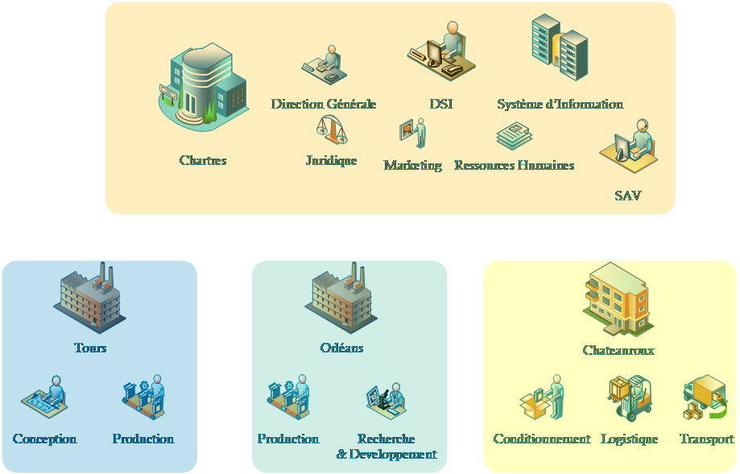

# Présentation

## SportLudique

Tout au long de l'année, vous allez travailler sur le système d'information d'une entreprise fictive : **SportLudique**.

SportLudique conçoit et fabrique des équipements destinés aux activités sportives et de loisirs. L'entreprise emploie environ **450 personnes**, réparties sur quatre sites : Chartres, Orléans, Tours et Bourges.

Son siège social est situé à Chartres. Il regroupe notamment la direction, les ressources humaines et la direction des systèmes d'information.

Les autres sites ont chacun une fonction particulière :

* **Chartres** siège de l'organisation;
* **Orléans** accueille une partie de la production ;
* **Tours** regroupe des activités de production et de tests ;
* **Bourges** est consacré principalement au stockage et à la logistique;
* **Blois** est le nouveau site acquis en 2026.

Cette répartition géographique implique de nombreux besoins informatiques : les utilisateurs doivent pouvoir communiquer, accéder aux ressources de l'entreprise et utiliser les applications nécessaires à leur activité, quel que soit leur site.

C'est cette infrastructure que vous allez progressivement découvrir, administrer et faire évoluer au cours de votre formation.

## Votre rôle

Vous intégrez la **Direction des Systèmes d'Information de SportLudique** en tant que technicien informatique.

Au fil des situations professionnelles proposées, vous serez amenés à intervenir sur différents éléments du système d'information : postes de travail, serveurs, réseau, services, sécurité et outils d'administration.

Vous ne disposerez pas immédiatement de toutes les informations nécessaires.

Comme dans une véritable entreprise, vous devrez comprendre l'existant, rechercher de la documentation, faire des choix techniques, les tester et être capables de les justifier.
