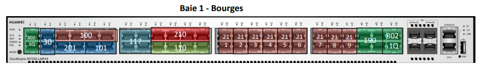
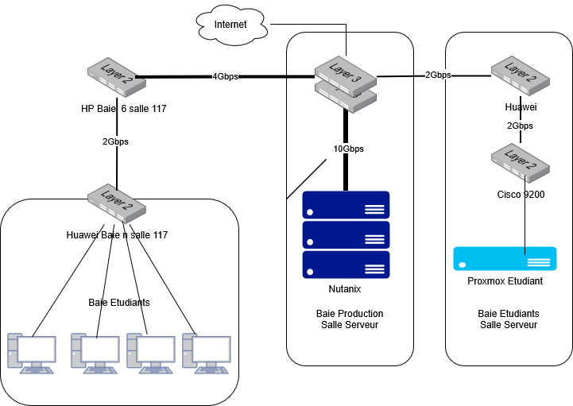
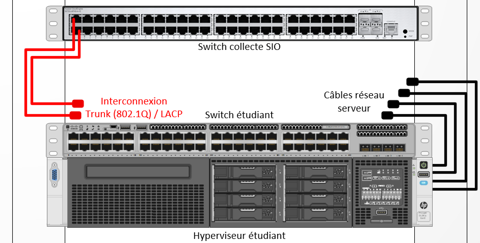

# Infrastructure

## Infrastructure du lycée Fulbert simulant le réseau SportLudique

L'infrastructure du laboratoire permet de simuler les différents sites de **SportLudique** tout en utilisant les équipements physiques et les services mis à disposition au lycée Fulbert.

Chaque groupe dispose de son propre environnement et devra progressivement construire et administrer l'infrastructure correspondant à son site.

## Organisation des postes du laboratoire

Les machines physiques utilisées par les étudiants sont reliées aux prises Ethernet murales du laboratoire.

Les prises **paires** (`2`, `4`, `6`, `8`) sont brassées vers les équipements dont vous avez la responsabilité et permettent de connecter les postes à votre infrastructure SportLudique.

Les prises **impaires** (`1`, `3`, `5`, `7`) permettent de conserver la connexion au réseau pédagogique habituel du BTS. Elles ne doivent pas être déconnectées du switch HP ou Huawei et sont associées au VLAN `117`.

Exemple pour la baie 1:



### Schéma général



### Travailler sur l'infrastructure SportLudique

Chaque site correspond à un îlot du laboratoire et dispose de son propre environnement réseau :

* **Chartres** ;
* **Tours** ;
* **Orléans** ;
* **Bourges** ;
* **Blois**.

Les systèmes clients seront principalement exécutés dans des machines virtuelles locales avec **VirtualBox**, configurées en mode **bridge** afin d'utiliser la connexion réseau de la machine physique.

La machine physique doit cependant rester intégrée au domaine pédagogique auquel elle a été affectée en début d'année.

!!! important "Brassage des postes"
    **Au début de chaque séance**, ouvrez d'abord votre session Windows en utilisant le réseau pédagogique habituel, puis brassez votre poste sur une prise murale **paire** afin de rejoindre votre infrastructure SportLudique.

    **À la fin de chaque séance**, reconnectez impérativement le poste à sa prise **impaire** afin de rétablir sa connexion au réseau pédagogique du BTS.

## Gestion des serveurs

Les serveurs nécessaires au fonctionnement de votre infrastructure seront principalement déployés sous forme de machines virtuelles sur l'infrastructure **Proxmox VE** mise à disposition par vos enseignants.

Chaque site disposera également de ressources matérielles permettant d'expérimenter l'installation et l'administration de sa propre solution de virtualisation.

Les ressources physiques disponibles étant partagées et limitées, chaque machine virtuelle devra être correctement dimensionnée en fonction de son rôle.

Il est inutile d'attribuer une quantité importante de processeurs, de mémoire ou de stockage à une machine qui ne les utilisera pas.

Certaines applications, notamment les solutions de centralisation des journaux ou les SIEM, pourront en revanche nécessiter davantage de ressources. Le dimensionnement devra donc toujours être **justifié par les besoins du service**.

### Convention de nommage

Chaque machine virtuelle doit posséder un nom permettant d'identifier immédiatement le site auquel elle appartient.

| Site     | Préfixe |
| -------- | ------- |
| Chartres | `CHA`   |
| Tours    | `TRS`   |
| Orléans  | `ORL`   |
| Bourges  | `BRG`   |
| Blois    | `BLO`   |

!!! danger "Convention de nommage obligatoire ☠️"
    Toutes les machines virtuelles devront commencer par le préfixe correspondant à votre site : `CHA-`, `TRS-`, `ORL-`, `BRG-` ou `BLO-`.

    Toute VM ne respectant pas cette convention pourra être considérée comme non identifiée et **supprimée de l'infrastructure sans préavis**.


### Gestion de votre matériel physique dans la salle des serveurs

Chaque groupe dispose d'équipements physiques dédiés à son site, notamment d'un **serveur** et d'un **commutateur**.

Il appartient au groupe de configurer et d'administrer ces équipements.

Le commutateur permet notamment de connecter votre infrastructure aux différents réseaux mis à disposition à travers les équipements de collecte administrés par vos enseignants.

Pour chaque site, le matériel mis à disposition est organisé comme suit :



Le matériel des différents sites étant installé dans la même baie informatique, son accès physique doit rester organisé.

Comme dans un datacenter, toute intervention physique devra faire l'objet d'une demande auprès d'un enseignant. L'accès pourra être limité à un groupe à la fois afin d'éviter les interventions simultanées sur les équipements.

## Comptes techniques

Certains comptes techniques communs pourront être utilisés lors de la mise en place initiale des équipements.

Ces comptes ne doivent pas devenir les comptes d'administration utilisés quotidiennement. Au cours de l'année, vous mettrez en place des comptes nominatifs ou adaptés aux différents besoins d'administration.

Les mécanismes permettant de sécuriser et de tracer l'utilisation des comptes privilégiés seront étudiés progressivement.

!!! warning "Un mot de passe connu n'est pas un secret"
    Les identifiants techniques communiqués à l'ensemble de la promotion sont destinés à faciliter certaines opérations de mise en service ou de récupération.

    Ils ne doivent jamais être considérés comme une protection suffisante pour un service réellement exposé.


## Organisation générale du réseau

Le réseau SportLudique comprend plusieurs types de réseaux et périmètres :

* les réseaux locaux des différents sites ;
* les différents VLAN nécessaires à la segmentation ;
* le réseau d'interconnexion entre les sites ;
* les réseaux Wi-Fi ;
* la DMZ de chaque site ;
* les réseaux permettant de simuler les accès à Internet.

Une partie de cette infrastructure est administrée par vos enseignants afin de fournir l'interconnexion et les services communs.

Chaque groupe reste responsable de la construction, de la segmentation et de la sécurisation du réseau de son propre site.

## Plan d'adressage IP

Le réseau général de SportLudique utilise le bloc :

```text
172.28.0.0/16
```

Ce bloc permet de construire les différents sous-réseaux nécessaires aux sites et aux services de l'entreprise.

Les réseaux de DMZ utilisent des sous-réseaux appartenant au plan :

```text
192.168.x.0/24
```

Le découpage du réseau devra permettre de séparer les différents usages et de limiter les communications inutiles entre les zones.

La gestion du plan d'adressage devra être tenue à jour dans la solution [**phpIPAM**](https://ipam.sio.lyceefulbert.fr/index.php?page=login) mise à disposition par vos enseignants.


Les plages d'adresses réservées aux équipements utilisant une configuration statique seront placées dans les adresses les plus hautes des sous-réseaux concernés.

## Accès Internet simulés

Chaque site dispose de **deux accès opérateurs simulés** afin de permettre l'étude de la redondance et de la haute disponibilité de l'accès à Internet.

Afin d'isoler les connexions de chaque site, les deux accès disposent désormais de VLAN spécifiques à chaque baie.

| Site     | Baie |      FAI 1 |      FAI 2 |
| -------- | ---: | ---------: | ---------: |
| Chartres |    1 | VLAN `101` | VLAN `201` |
| Tours    |    2 | VLAN `102` | VLAN `202` |
| Orléans  |    3 | VLAN `103` | VLAN `203` |
| Bourges  |    4 | VLAN `104` | VLAN `204` |
| Blois    |    5 | VLAN `105` | VLAN `205` |

!!! important "Infrastructure opérateur"
    Ces VLAN appartiennent à l'infrastructure simulant les réseaux des opérateurs.

    Ils sont fournis par l'infrastructure commune du laboratoire et **ne doivent pas être confondus avec les VLAN que vous mettrez en place à l'intérieur de votre site**.

Les passerelles actuellement définies pour les différents accès sont les suivantes :

|       | Chartres          | Tours             | Orléans           | Bourges           | Blois             |
| ----- | ----------------- | ----------------- | ----------------- | ----------------- | ----------------- |
| FAI 2 | `183.44.28.1/30`  | `183.44.37.1/30`  | `183.44.45.1/30`  | `183.44.18.1/30`  | `183.44.41.1/30`  |
| FAI 1 | `221.87.128.2/30` | `221.87.137.2/30` | `221.87.145.2/30` | `221.87.118.2/30` | `221.87.141.2/30` |

!!! warning "Passerelle ou adresse de votre équipement ?"
    Les adresses indiquées dans le tableau correspondent aux **passerelles fournies par les opérateurs simulés**.

    Vous devrez déterminer l'adresse appartenant au même sous-réseau à configurer sur votre propre équipement.


!!! warning "Cas particulier : Blois"
    Le site de **Blois** ne dispose pas d'une baie dédiée identique à celles des quatre autres sites.

    Ses équipements sont raccordés à travers un **switch intermédiaire situé dans une baie qui n'est normalement pas accessible aux étudiants**. Le groupe ne dispose donc pas directement d'un switch Huawei comme les autres sites.

    Il devra adapter son infrastructure à cette contrainte et trouver une solution permettant de transporter correctement les différents VLAN nécessaires, notamment en utilisant les mécanismes de **trunk 802.1Q** et d'**agrégation de liens (LACP)**.

    La topologie de Blois sera donc légèrement différente de celle des autres sites : **à vous de l'étudier et de proposer une configuration adaptée.**

## Accès Internet et DMZ

Chaque site devra disposer d'un périmètre permettant de séparer :

* le réseau interne ;
* la **DMZ** ;
* les accès opérateurs simulant Internet.

Le pare-feu placé entre ces différentes zones devra contrôler les communications et assurer les mécanismes nécessaires à la publication des services.

Les services devant être accessibles depuis l'extérieur seront placés dans la DMZ et pourront notamment comprendre des services **Web**, de **transfert de fichiers** ou d'autres services mis en œuvre au cours de l'année.

!!! danger "Pas de PASS ALL"
    La présence d'un pare-feu n'apporte aucune sécurité si celui-ci autorise tous les échanges.

    Les règles définitives devront autoriser **uniquement les flux nécessaires** au fonctionnement des services.

    Chaque règle devra pouvoir être expliquée et justifiée.

Les mécanismes de **NAT/PAT** et de redirection de ports permettront, lorsque cela est nécessaire, de publier certains services de la DMZ vers l'extérieur.

La mise en place de plusieurs accès opérateurs permettra également d'étudier les mécanismes assurant la continuité de l'accès à Internet en cas de défaillance d'un lien.

## Services réseau

Au cours de l'année, votre infrastructure devra permettre le fonctionnement de différents services.

Les services **DNS** et **DHCP** seront notamment indispensables au fonctionnement normal des postes et des serveurs.

La disponibilité de ces services devra être prise en compte dans l'architecture mise en place.

Les autres services seront ajoutés progressivement en fonction des situations professionnelles.

## Messagerie électronique

Des services de messagerie pourront être mis en œuvre afin de permettre les échanges entre utilisateurs et l'envoi de notifications par les différents outils de l'infrastructure.

Les adresses respecteront l'organisation DNS définie pour SportLudique :

```text
utilisateur@<ville>.sportludique.fr
```

Les choix techniques nécessaires à la mise en œuvre de ces services seront étudiés au cours de l'année.

## Réseau Wi-Fi

L'infrastructure prévoit la séparation de deux usages Wi-Fi :

* un réseau destiné aux **visiteurs**, permettant l'accès à Internet sans donner accès au réseau interne ;
* un réseau destiné aux **employés**, permettant l'accès aux ressources correspondant à leurs besoins.

Ces réseaux devront être isolés et les règles de filtrage devront empêcher les utilisateurs du réseau visiteurs d'accéder au réseau interne.

Les mécanismes d'authentification et de sécurisation du réseau destiné aux employés seront étudiés lors des situations professionnelles correspondantes.

## Administration, diagnostic et supervision

L'administration de l'infrastructure nécessitera la mise en place d'outils et de protocoles permettant de diagnostiquer les problèmes et de surveiller son fonctionnement.

Vous serez notamment amenés à utiliser :

* **Wireshark** pour analyser les communications réseau ;
* le **port mirroring** des commutateurs pour observer certains flux ;
* **SSH** pour administrer à distance les équipements compatibles ;
* **SNMP** pour collecter des informations sur les équipements ;
* une solution de **supervision** pour surveiller l'état du réseau, des serveurs et des services.

La supervision ne devra pas se limiter à vérifier qu'une machine répond au réseau. Elle devra permettre de déterminer si les **services réellement proposés aux utilisateurs fonctionnent correctement**.

Une solution de **gestion du parc et des incidents** devra également permettre de suivre les équipements et les demandes des utilisateurs.

## Une infrastructure partagée

Chaque groupe est administrateur de son propre site, mais les différents sites font partie d'une infrastructure commune.

Une mauvaise configuration peut donc perturber votre propre environnement, mais également avoir des conséquences sur les autres groupes ou sur les services communs.

Avant toute modification importante, vous devrez comprendre **sur quel équipement vous intervenez, à quel réseau il appartient et quelles peuvent être les conséquences de votre configuration**.
