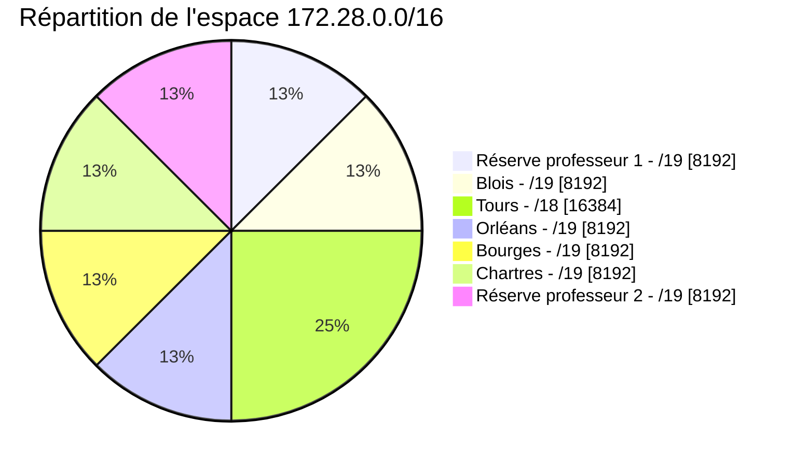

# Plan d'adressage inter-sites

L'espace d'adressage retenu est le réseau privé :

`172.28.0.0/16`

Il est découpé entre les différents sites du projet.

Deux plages sont volontairement réservées et **ne doivent pas être utilisées par les étudiants** :

- `172.28.0.0/19` : réserve professeur 1 ;
- `172.28.224.0/19` : réserve professeur 2.

Les étudiants disposent donc uniquement des plages attribuées à leur site.

## Synthèse du plan d'adressage

| Zone | Réseau | Masque | Nombre total d'adresses | Hôtes utilisables | Première adresse utilisable | Dernière adresse utilisable | Broadcast |
| --- | --- | --- | ---: | ---: | --- | --- | --- |
| Réserve professeur 1 | `172.28.0.0/19` | `255.255.224.0` | 8 192 | 8 190 | `172.28.0.1` | `172.28.31.254` | `172.28.31.255` |
| Blois | `172.28.32.0/19` | `255.255.224.0` | 8 192 | 8 190 | `172.28.32.1` | `172.28.63.254` | `172.28.63.255` |
| Tours | `172.28.64.0/18` | `255.255.192.0` | 16 384 | 16 382 | `172.28.64.1` | `172.28.127.254` | `172.28.127.255` |
| Orléans | `172.28.128.0/19` | `255.255.224.0` | 8 192 | 8 190 | `172.28.128.1` | `172.28.159.254` | `172.28.159.255` |
| Bourges | `172.28.160.0/19` | `255.255.224.0` | 8 192 | 8 190 | `172.28.160.1` | `172.28.191.254` | `172.28.191.255` |
| Chartres | `172.28.192.0/19` | `255.255.224.0` | 8 192 | 8 190 | `172.28.192.1` | `172.28.223.254` | `172.28.223.255` |
| Réserve professeur 2 | `172.28.224.0/19` | `255.255.224.0` | 8 192 | 8 190 | `172.28.224.1` | `172.28.255.254` | `172.28.255.255` |

!!! warning "Plages réservées"
    Les réseaux `172.28.0.0/19` et `172.28.224.0/19` sont réservés à l'infrastructure pédagogique.

    Ils ne doivent être utilisés ni pour les VLAN, ni pour les serveurs, ni pour les équipements réseau des différents groupes.

## Représentation de l'espace d'adressage

Le réseau `172.28.0.0/16` contient 65 536 adresses.

Un `/19` représente 8 192 adresses, soit **1/8 de l'espace disponible**.

Un `/18` représente 16 384 adresses, soit **1/4 de l'espace disponible**.

```text
172.28.0.0/16
│
├── 172.28.0.0/18
│   │
│   ├── 172.28.0.0/19
│   │   └── Réserve professeur 1
│   │
│   └── 172.28.32.0/19
│       └── Blois
│
├── 172.28.64.0/18
│   └── Tours
│
├── 172.28.128.0/18
│   │
│   ├── 172.28.128.0/19
│   │   └── Orléans
│   │
│   └── 172.28.160.0/19
│       └── Bourges
│
└── 172.28.192.0/18
    │
    ├── 172.28.192.0/19
    │   └── Chartres
    │
    └── 172.28.224.0/19
        └── Réserve professeur 2
```

## Répartition de l'espace d'adressage

Le réseau `172.28.0.0/16` contient **65 536 adresses IPv4**.

- un réseau `/19` contient **8 192 adresses**, soit **12,5 %** du `/16` ;
- un réseau `/18` contient **16 384 adresses**, soit **25 %** du `/16`.



Le découpage utilise l'intégralité de l'espace `172.28.0.0/16`.

Tours dispose d'un `/18`, soit **deux fois l'espace d'adressage** attribué à chacun des autres sites.

Les deux plages situées aux extrémités du plan d'adressage représentent ensemble **25 % de l'espace total** et restent réservées à l'infrastructure pédagogique.

!!! warning "Une adresse disponible n'est pas nécessairement une adresse utilisable"
    Les plages `172.28.0.0/19` et `172.28.224.0/19` existent bien dans le plan d'adressage, mais elles sont **hors du périmètre attribué aux étudiants**.

    Vous ne devez donc pas les utiliser pour résoudre un problème de manque d'adresses dans votre propre plage.

## Vue linéaire du découpage

```mermaid
flowchart LR
    A["PROF 1<br/>172.28.0.0/19<br/>12,5 %"]
    B["Blois<br/>172.28.32.0/19<br/>12,5 %"]
    C["Tours<br/>172.28.64.0/18<br/>25 %"]
    D["Orléans<br/>172.28.128.0/19<br/>12,5 %"]
    E["Bourges<br/>172.28.160.0/19<br/>12,5 %"]
    F["Chartres<br/>172.28.192.0/19<br/>12,5 %"]
    G["PROF 2<br/>172.28.224.0/19<br/>12,5 %"]

    A --- B
    B --- C
    C --- D
    D --- E
    E --- F
    F --- G

    style A fill:#ef9a9a,stroke:#b71c1c,stroke-width:3px,color:#000
    style B fill:#90caf9,stroke:#1565c0,stroke-width:2px,color:#000
    style C fill:#a5d6a7,stroke:#2e7d32,stroke-width:4px,color:#000
    style D fill:#ffe082,stroke:#f9a825,stroke-width:2px,color:#000
    style E fill:#ce93d8,stroke:#7b1fa2,stroke-width:2px,color:#000
    style F fill:#ffcc80,stroke:#ef6c00,stroke-width:2px,color:#000
    style G fill:#ef9a9a,stroke:#b71c1c,stroke-width:3px,color:#000
```



!!! question "À vérifier"
    Sans reprendre les valeurs du tableau, expliquez pourquoi l'adresse `172.28.127.255` appartient à Tours alors que l'adresse `172.28.128.0` appartient à Orléans.

    Votre réponse doit s'appuyer sur le masque utilisé et non uniquement sur le tableau ci-dessus.
