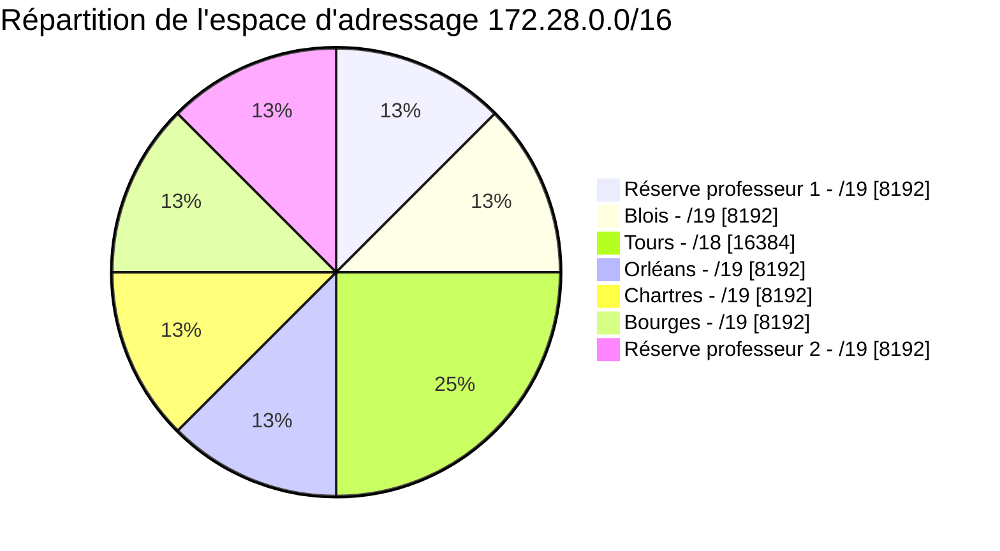

# Plan d'adressage inter-sites

L'espace d'adressage retenu pour l'infrastructure de SportLudique est le réseau privé :

`172.28.0.0/16`

Il est découpé entre les différents sites du projet.

Deux plages sont volontairement réservées et **ne doivent pas être utilisées par les étudiants** :

- `172.28.0.0/19` : réserve professeur 1 ;
- `172.28.224.0/19` : réserve professeur 2.

Les étudiants disposent donc uniquement de la plage attribuée à leur site.

## Synthèse du plan d'adressage

| Zone | Réseau | Masque | Nombre total d'adresses | Hôtes utilisables | Première adresse utilisable | Dernière adresse utilisable | Broadcast |
| --- | --- | --- | ---: | ---: | --- | --- | --- |
| Réserve professeur 1 | `172.28.0.0/19` | `255.255.224.0` | 8 192 | 8 190 | `172.28.0.1` | `172.28.31.254` | `172.28.31.255` |
| Blois | `172.28.32.0/19` | `255.255.224.0` | 8 192 | 8 190 | `172.28.32.1` | `172.28.63.254` | `172.28.63.255` |
| Tours | `172.28.64.0/18` | `255.255.192.0` | 16 384 | 16 382 | `172.28.64.1` | `172.28.127.254` | `172.28.127.255` |
| Orléans | `172.28.128.0/19` | `255.255.224.0` | 8 192 | 8 190 | `172.28.128.1` | `172.28.159.254` | `172.28.159.255` |
| Chartres | `172.28.160.0/19` | `255.255.224.0` | 8 192 | 8 190 | `172.28.160.1` | `172.28.191.254` | `172.28.191.255` |
| Bourges | `172.28.192.0/19` | `255.255.224.0` | 8 192 | 8 190 | `172.28.192.1` | `172.28.223.254` | `172.28.223.255` |
| Réserve professeur 2 | `172.28.224.0/19` | `255.255.224.0` | 8 192 | 8 190 | `172.28.224.1` | `172.28.255.254` | `172.28.255.255` |

!!! warning "Plages réservées"
    Les réseaux `172.28.0.0/19` et `172.28.224.0/19` sont réservés à l'infrastructure pédagogique.

    Ils ne doivent être utilisés ni pour les VLAN, ni pour les serveurs, ni pour les équipements réseau des différents groupes.

## Organisation de l'espace d'adressage

Le réseau `172.28.0.0/16` contient **65 536 adresses IPv4**.

Un réseau `/19` contient **8 192 adresses**, soit **12,5 %** de l'espace disponible.

Un réseau `/18` contient **16 384 adresses**, soit **25 %** de l'espace disponible.

Le réseau attribué à Tours est donc deux fois plus grand que celui attribué à chacun des autres sites.

### Découpage hiérarchique

```text
172.28.0.0/16
│
├── 172.28.0.0/18
│   │
│   ├── 172.28.0.0/19
│   │   └── Réserve professeur 1
│   │
│   └── 172.28.32.0/19
│       └── Blois
│
├── 172.28.64.0/18
│   └── Tours
│
├── 172.28.128.0/18
│   │
│   ├── 172.28.128.0/19
│   │   └── Orléans
│   │
│   └── 172.28.160.0/19
│       └── Chartres
│
└── 172.28.192.0/18
    │
    ├── 172.28.192.0/19
    │   └── Bourges
    │
    └── 172.28.224.0/19
        └── Réserve professeur 2
```

Cette représentation permet notamment de constater qu'un `/18` correspond exactement à l'espace occupé par deux réseaux `/19`.

Tours dispose directement d'un `/18`, tandis que les autres sites ne disposent que d'une moitié de `/18`.

## Répartition de l'espace `172.28.0.0/16`



Le découpage utilise l'intégralité de l'espace `172.28.0.0/16`.

Tours représente à lui seul **25 %** de l'espace disponible. Chaque autre plage `/19` représente **12,5 %**.

Les deux plages réservées aux enseignants représentent ensemble **25 % de l'espace total**.

!!! info "Pourquoi conserver une marge ?"
    L'intégralité du réseau `172.28.0.0/16` n'est volontairement pas mise à disposition des groupes.

    Les deux réseaux réservés permettent de conserver de l'espace pour l'infrastructure pédagogique, de futurs services, des besoins d'interconnexion ou des évolutions du projet.

    Un groupe ne doit donc pas considérer qu'une adresse est utilisable simplement parce qu'elle appartient au réseau `172.28.0.0/16`.

## Vue du découpage par site

Le schéma suivant représente l'ordre des différentes plages dans l'espace `172.28.0.0/16`.

```mermaid
%%{init: {
    "theme": "base",
    "themeVariables": {
        "primaryTextColor": "#000000",
        "secondaryTextColor": "#000000",
        "tertiaryTextColor": "#000000"
    }
}}%%

flowchart LR
    A["PROF 1<br/>172.28.0.0/19<br/>12,5 %"]
    B["Blois<br/>172.28.32.0/19<br/>12,5 %"]
    C["Tours<br/>172.28.64.0/18<br/>25 %"]
    D["Orléans<br/>172.28.128.0/19<br/>12,5 %"]
    E["Chartres<br/>172.28.160.0/19<br/>12,5 %"]
    F["Bourges<br/>172.28.192.0/19<br/>12,5 %"]
    G["PROF 2<br/>172.28.224.0/19<br/>12,5 %"]

    A --- B
    B --- C
    C --- D
    D --- E
    E --- F
    F --- G

    style A fill:#ef9a9a,stroke:#b71c1c,stroke-width:3px,color:#000000
    style B fill:#90caf9,stroke:#1565c0,stroke-width:2px,color:#000000
    style C fill:#a5d6a7,stroke:#2e7d32,stroke-width:4px,color:#000000
    style D fill:#ffe082,stroke:#f9a825,stroke-width:2px,color:#000000
    style E fill:#ffcc80,stroke:#ef6c00,stroke-width:2px,color:#000000
    style F fill:#ce93d8,stroke:#7b1fa2,stroke-width:2px,color:#000000
    style G fill:#ef9a9a,stroke:#b71c1c,stroke-width:3px,color:#000000

    linkStyle default stroke:#555555,stroke-width:2px
```



!!! warning "Une adresse disponible n'est pas nécessairement une adresse utilisable"
    Les plages `172.28.0.0/19` et `172.28.224.0/19` existent bien dans le plan d'adressage, mais elles sont **hors du périmètre attribué aux étudiants**.

    Vous ne devez donc pas les utiliser pour résoudre un problème de manque d'adresses dans votre propre plage.