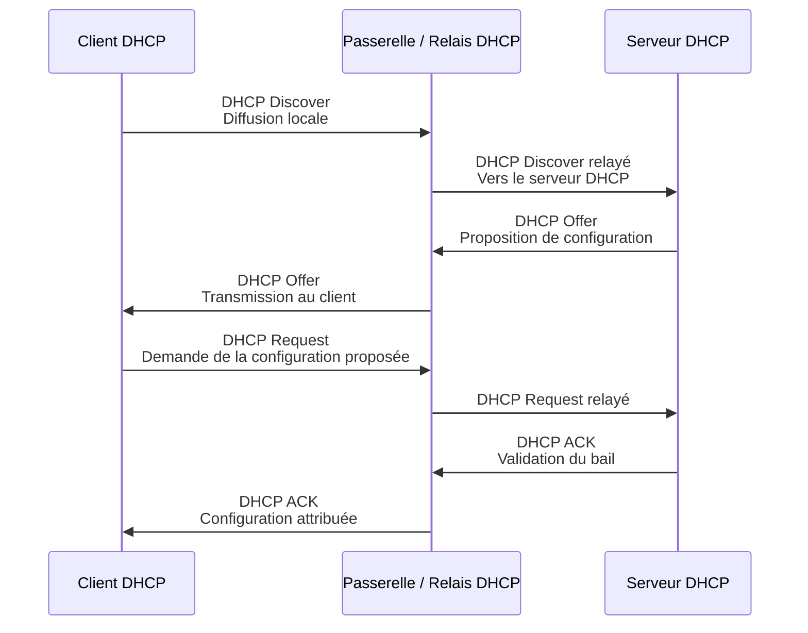
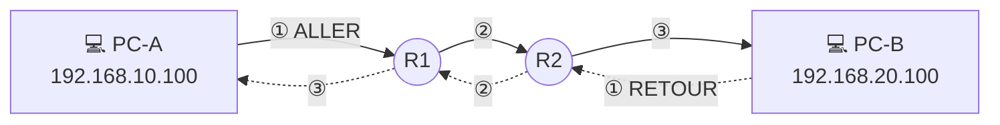
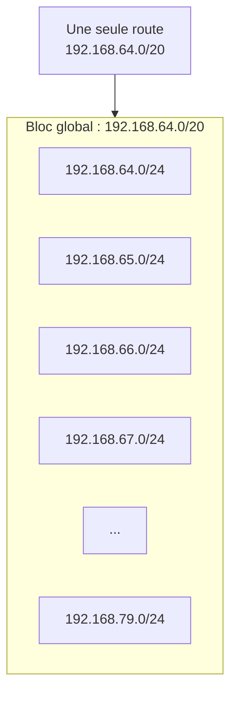

# Rappels réseau de première année

!!! danger "Niveau SOCLE — prérequis obligatoires"

    Les notions présentées sur cette page ont été étudiées en **première année de BTS SIO**.

    Elles constituent le **minimum requis** pour travailler sur l'infrastructure SportLudique.

    Vous devez notamment maîtriser :

    - les VLAN et les trunks 802.1Q ;
    - le routage inter-VLAN ;
    - DHCP et le relais DHCP ;
    - les ACL ;
    - le routage statique ;
    - les flux aller et retour ;
    - les routes globalisantes ;
    - la lecture d'une table de routage ;
    - les méthodes élémentaires de diagnostic réseau.

    Cette page constitue un **rappel et un aide-mémoire**. Elle ne remplace pas le cours de première année.

    Vous n'avez pas à connaître toutes les commandes d'un constructeur par cœur. En revanche, vous devez **comprendre ce que vous cherchez à réaliser**, savoir vérifier le résultat et être capables de retrouver une syntaxe oubliée dans une documentation.

---

## Diagnostic réseau

### Observer avant de configurer

Avant de modifier une configuration, commencez par observer l'état de l'équipement.

État des interfaces :

```text
show ip interface brief
```

VLAN :

```text
show vlan brief
```

Trunks :

```text
show interfaces trunk
```

Table de routage :

```text
show ip route
```

ACL :

```text
show access-lists
```

Configuration active :

```text
show running-config
```

!!! warning "Une commande de configuration n'est pas un diagnostic"

    Ajouter des commandes jusqu'à ce que cela fonctionne n'est pas une méthode de dépannage.

    Avant de modifier quelque chose, vous devez être capable d'expliquer :

    - ce qui ne fonctionne pas ;
    - à quel endroit le problème semble se produire ;
    - ce que vous souhaitez vérifier ;
    - pourquoi la modification envisagée pourrait résoudre le problème.

### Diagnostic côté client

Les commandes suivantes permettent de vérifier **différents éléments de la configuration et de la communication réseau**. Elles ne sont pas interchangeables : chaque commande répond à une question précise.

Sous Windows :

```text
ipconfig        → vérifier la configuration IP de la station
route print     → consulter la table de routage locale
ping            → tester la connectivité IP avec une destination
tracert         → observer l'itinéraire suivi vers une destination
nslookup        → tester la résolution DNS
arp -a          → consulter le cache ARP (correspondances IPv4 / MAC)
```

Sous Linux :

```text
ip a            → vérifier la configuration IP des interfaces
ip route        → consulter la table de routage locale
ping            → tester la connectivité IP avec une destination
traceroute      → observer l'itinéraire suivi vers une destination
nslookup  / dig → tester et analyser la résolution DNS
ip neigh        → consulter les voisins connus (notamment le cache ARP)
```

!!! warning "Utiliser le bon outil"

    Une commande répond à une question précise.

    - **La machine possède-t-elle la bonne configuration IP ?** → `ipconfig` / `ip a`
    - **Quelle passerelle ou quelle route va-t-elle utiliser ?** → `route print` / `ip route`
    - **La communication IP fonctionne-t-elle ?** → `ping`
    - **Par quels routeurs le trafic passe-t-il ?** → `tracert` / `traceroute`
    - **La résolution DNS fonctionne-t-elle ?** → `nslookup` / `dig`
    - **Quelle adresse MAC est associée à une adresse IPv4 locale ?** → `arp -a` / `ip neigh`

    Un échec de `ping` ne signifie pas nécessairement que la destination est inaccessible : **ICMP peut être filtré**.

    De même, réussir un `ping` vers une adresse IP ne permet pas de conclure que **DNS fonctionne**.

---

## VLAN

### Principe

Un VLAN permet de créer plusieurs **domaines de diffusion Ethernet** sur une infrastructure commutée.

Deux machines appartenant à des VLAN différents ne peuvent pas communiquer directement au niveau 2.

Une communication entre VLAN nécessite donc un équipement assurant le **routage de niveau 3**.

!!! important "À retenir"

    **VLAN = segmentation de niveau 2.**

    **Routage = communication entre réseaux IP.**

    Un `trunk` ne réalise pas de routage.

### Création d'un VLAN

Exemple Cisco :

```text
configure terminal

vlan 20
 name serviceA

vlan 30
 name serviceB
```

Vérification :

```text
show vlan brief
```

### Port ACCESS

Un port ACCESS appartient à un VLAN.

```text
interface GigabitEthernet0/1
 switchport mode access
 switchport access vlan 20
```

Vérification :

```text
show interfaces GigabitEthernet0/1 switchport
```

### Port TRUNK

Un trunk permet de transporter plusieurs VLAN entre deux équipements.

```text
interface GigabitEthernet0/24
 switchport mode trunk
```

Vérification :

```text
show interfaces trunk
```

!!! warning "TRUNK ≠ routage"

    Un trunk transporte les trames de plusieurs VLAN sur une même liaison physique.

    Il ne permet pas aux machines appartenant à ces VLAN de communiquer entre elles.

---

## Routage inter-VLAN

### Principe

Pour permettre la communication entre plusieurs VLAN, **un équipement de niveau 3 doit disposer d'une interface dans chacun des réseaux IP concernés.**

Sur un switch de niveau 3, on utilise généralement des **SVI**.

### Configuration d'une SVI

Exemple :

```text
interface vlan 20
 ip address 192.168.20.254 255.255.255.0
 no shutdown

interface vlan 30
 ip address 192.168.30.254 255.255.255.0
 no shutdown
```

Activation du routage IPv4 :

```text
ip routing
```

Une station du réseau `192.168.20.0/24` pourra alors utiliser `192.168.20.254` comme passerelle par défaut.

Vérification :

```text
show ip interface brief
show ip route
```

### Décision prise par une station

Une station détermine grâce à **son propre masque** si l'adresse IP destination appartient à son réseau.

Si la destination est locale :

```text
Station ──────────────► Destination
```

La station recherche directement l'adresse MAC de la destination.

Si la destination est distante :

```text
Station ──► Passerelle ──► ... ──► Destination
```

La station transmet la trame Ethernet à **sa passerelle par défaut**.

L'adresse IP destination du paquet reste celle de la destination finale.

---

## DHCP

### Principe

DHCP permet notamment de fournir automatiquement à une station :

- une adresse IPv4 ;
- un masque ;
- une passerelle par défaut ;
- un ou des resolveurs DNS.

### Architecture retenue dans SportLudique

!!! note "DHCP dans SportLudique"

    Un routeur ou un switch Cisco peut assurer lui-même le rôle de serveur DHCP.

    Cette possibilité est rappelée ici car elle a été étudiée en première année.

    **Ce n'est cependant pas l'architecture retenue dans SportLudique.**

    Le service DHCP doit être installé sur un **serveur**.

    **Socle :** mise en œuvre d'un service DHCP fonctionnel sur serveur.

    **Expertise :** mise en œuvre d'une solution DHCP avec **haute disponibilité**.

### Rappel d'un pool DHCP Cisco

À titre de rappel :

```text
ip dhcp pool VLAN20
 network 192.168.20.0 255.255.255.0
 default-router 192.168.20.254
 dns-server 192.168.10.10
```

Vérification :

```text
show ip dhcp pool       → afficher les pools DHCP configurés et vérifier l'utilisation des plages d'adresses
show ip dhcp binding    → afficher les adresses IP effectivement attribuées aux clients DHCP
```

---

## Relais DHCP

### Pourquoi faut-il un relais ?

Lorsqu'une station démarre, elle ne dispose pas encore de configuration IPv4 utilisable.

Elle émet notamment un message **DHCP Discover en diffusion**.

Or un routeur ne transmet normalement pas les diffusions IPv4 d'un réseau vers un autre.

Si le serveur DHCP se trouve dans un autre réseau, un **relais DHCP** est donc nécessaire.

### Échanges DHCP avec un relais

Le serveur DHCP étant situé dans un autre réseau, la passerelle du réseau client assure le rôle de **relais DHCP**.



!!! info "DORA"

    La séquence initiale d'attribution d'une configuration DHCP peut être mémorisée avec **DORA** :

    **D**iscover → **O**ffer → **R**equest → **A**cknowledgement

    Le client commence par rechercher un serveur DHCP avec un **DHCP Discover en diffusion**.

    Lorsque le serveur DHCP se trouve dans un autre réseau, cette diffusion ne traverse pas directement le routeur. Le **relais DHCP** reçoit la requête du client et la transmet au serveur.

!!! question "À comprendre"

    Le relais DHCP doit donc être configuré sur l'interface de niveau 3 qui **reçoit les diffusions DHCP des clients**.

    Sur un switch de niveau 3, il s'agit typiquement de la **SVI servant de passerelle au VLAN client**.


### Configuration du relais

Sur Cisco :

```text
interface vlan 20
 ip helper-address 192.168.10.10
```

Le serveur DHCP se trouve ici à l'adresse :

```text
192.168.10.10
```

!!! question "Où placer le relais ?"

    `ip helper-address` doit être configuré sur l'interface de niveau 3 qui **reçoit les diffusions DHCP émises par les clients**.

    Ne recopiez pas simplement la commande : identifiez le réseau des clients et l'interface qui joue le rôle de passerelle pour ce réseau.

---

## ACL

### Principe

Une ACL permet de filtrer les paquets traversant un équipement.

Une règle peut notamment prendre en compte :

- l'adresse IP source ;
- l'adresse IP destination ;
- le protocole ;
- les ports TCP ou UDP.

### Wildcard mask

Les ACL Cisco utilisent traditionnellement un **wildcard mask**.

Pour :

```text
192.168.20.0/24
```

on utilise :

```text
192.168.20.0 0.0.0.255
```

Pour un `/26` :

```text
255.255.255.192
```

le wildcard correspondant est :

```text
0.0.0.63
```

### Sens IN et OUT

Le sens est toujours considéré **par rapport à l'interface sur laquelle l'ACL est appliquée**.

`in` signifie que le paquet entre dans l'équipement par cette interface.

`out` signifie que le paquet quitte l'équipement par cette interface.

Il faut donc connaître **le chemin du paquet** avant de choisir le sens d'application.

### Deny implicite

Toute ACL possède implicitement à sa fin :

```text
deny ip any any
```

Un paquet ne correspondant à aucune règle `permit` est donc rejeté.

Vérification :

```text
show access-lists
```

Les compteurs associés aux règles sont particulièrement utiles lors du diagnostic.

---

## Routage statique

### Principe fondamental

Un routeur prend une décision à partir de **l'adresse IP destination du paquet et de sa table de routage**.

Pour chaque paquet, il recherche la meilleure route correspondant à l'adresse destination.

Il détermine ensuite :

- l'interface de sortie ;
- éventuellement le prochain routeur, appelé **next-hop**.

### Réseaux directement connectés

Un routeur connaît automatiquement les réseaux associés à ses interfaces actives.

Exemple :

```text
R1
 ├── 192.168.10.254/24
 └── 10.0.0.1/30
```

R1 connaît automatiquement :

```text
192.168.10.0/24
10.0.0.0/30
```

Il ne connaît en revanche **pas automatiquement les réseaux situés derrière les autres routeurs**.

### Route statique

Syntaxe générale :

```text
ip route RESEAU MASQUE NEXT-HOP
```

Exemple :

```text
ip route 192.168.20.0 255.255.255.0 10.0.0.2
```

Cela signifie :

> Pour atteindre une adresse appartenant au réseau `192.168.20.0/24`, transmettre le paquet au routeur `10.0.0.2`.

---

## Flux aller et flux retour

### Principe

Considérons :

| Équipement | Interface | Adresse IPv4 | Masque / Préfixe | Passerelle |
|---|---|---|---|---|
| **PC-A** | Carte réseau | `192.168.10.100` | `/24` | `192.168.10.254` |
| **R1** | LAN | `192.168.10.254` | `/24` | — |
| **R1** | Vers R2 | `10.0.0.1` | `/30` | — |
| **R2** | Vers R1 | `10.0.0.2` | `/30` | — |
| **R2** | LAN | `192.168.20.254` | `/24` | — |
| **PC-B** | Carte réseau | `192.168.20.100` | `/24` | `192.168.20.254` |

Les trois réseaux présents dans cette architecture sont donc :

| Réseau | Rôle |
|---|---|
| `192.168.10.0/24` | Réseau de PC-A |
| `10.0.0.0/30` | Réseau de transit entre R1 et R2 |
| `192.168.20.0/24` | Réseau de PC-B |




PC-A souhaite joindre PC-B.

### Flux aller

R1 doit savoir atteindre :

```text
192.168.20.0/24
```

Par exemple, sur R1 il faut ajouter cette route pour joindre R2 :

```text
ip route 192.168.20.0 255.255.255.0 10.0.0.2
```

Le paquet peut alors atteindre PC-B.

### Flux retour

PC-B doit maintenant répondre à :

```text
192.168.10.100
```

R2 doit donc savoir atteindre :

```text
192.168.10.0/24
```

Par exemple, sur R2 il faut ajouter cette route pour joindre R1 :

```text
ip route 192.168.10.0 255.255.255.0 10.0.0.1
```

!!! danger "ALLER + RETOUR"

    Une communication IP nécessite un chemin fonctionnel dans **les deux sens**.

    Pour chaque diagnostic, étudiez :

    **SOURCE → DESTINATION**

    puis :

    **DESTINATION → SOURCE**

    Une route correcte sur le trajet aller ne garantit absolument pas que la réponse puisse revenir.

### Chaque routeur décide indépendamment

Un routeur ne mémorise pas le chemin aller afin de créer automatiquement une route retour.

À chaque routeur traversé, il faut donc poser la même question :

> **Que va faire ce routeur avec cette adresse IP destination ?**

Puis consulter sa table de routage.

```text
show ip route
```

---

## Routes globalisantes

### Principe

Lorsqu'un routeur doit atteindre plusieurs réseaux situés dans la même direction, il n'est pas toujours nécessaire de créer une route pour chacun d'eux.

Considérons :

```text
192.168.64.0/24
192.168.65.0/24
192.168.66.0/24
192.168.67.0/24
```

Si ces réseaux appartiennent au même bloc d'adressage et sont tous accessibles par le même **next-hop**, une route plus générale peut être utilisée.

Par exemple :

```text
ip route 192.168.64.0 255.255.240.0 10.0.0.2
```

soit :

```text
192.168.64.0/20
```

Ce préfixe couvre les adresses comprises entre :

```text
192.168.64.0
      ↓
192.168.79.255
```



### Intérêt de la globalisation

Au lieu de maintenir de nombreuses routes :

```text
172.28.192.0/24 → R2
172.28.193.0/24 → R2
172.28.194.0/24 → R2
172.28.195.0/24 → R2
...
```

on peut disposer d'une seule route :

```text
172.28.192.0/19 → R2
```

La table de routage devient :

- plus courte ;
- plus lisible ;
- plus simple à maintenir.

!!! warning "Globaliser intelligemment"

    Une route globalisante ne consiste pas simplement à choisir un masque plus court.

    Vous devez déterminer précisément **quelles adresses sont couvertes par le préfixe** et vérifier que la route obtenue correspond à l'architecture.

---

## Choix d'une route

### Route la plus précise

Un routeur peut connaître simultanément :

```text
172.28.192.0/19 → R2
```

et :

```text
172.28.200.0/24 → R3
```

Pour une destination :

```text
172.28.200.50
```

les deux routes correspondent.

Mais `/24` est plus précis que `/19`.

Le routeur utilisera donc :

```text
172.28.200.0/24 → R3
```

C'est le principe du **Longest Prefix Match** :

> parmi toutes les routes correspondant à la destination, le routeur utilise celle possédant le préfixe le plus long.

### Route par défaut

Une route par défaut correspond au préfixe :

```text
0.0.0.0/0
```

Exemple :

```text
ip route 0.0.0.0 0.0.0.0 10.0.0.1
```

Elle est utilisée lorsqu'aucune route plus précise ne correspond à la destination.

!!! warning "La route par défaut n'est pas une solution magique"

    Ajouter une route par défaut jusqu'à ce que la communication fonctionne n'est pas une méthode de routage.

    Vous devez être capable d'expliquer **pourquoi les destinations inconnues doivent être envoyées vers ce next-hop**.

---

## Routage, filtrage et service

### Distinguer les problèmes

Lorsqu'une communication échoue, plusieurs causes sont possibles.

```text
ROUTAGE
   │
   └── Le paquet sait-il où aller ?
            │
            ▼
FILTRAGE
   │
   └── Le paquet a-t-il le droit de passer ?
            │
            ▼
SERVICE
   │
   └── Le service attendu répond-il réellement ?
```

Un `ping` qui échoue ne signifie donc pas automatiquement que « le réseau ne fonctionne pas ».

Il faut déterminer **où le flux est interrompu et pourquoi**.

### Méthode de diagnostic

Pour chaque communication qui échoue :

1. relevez l'adresse IP et le masque de la source ;
2. relevez l'adresse IP de la destination ;
3. déterminez si la destination est **locale ou distante** ;
4. identifiez la passerelle utilisée ;
5. consultez la table de routage ;
6. suivez le **flux aller routeur par routeur** ;
7. suivez le **flux retour routeur par routeur** ;
8. vérifiez les ACL et les pare-feu ;
9. vérifiez enfin le service concerné.

À chaque routeur, posez-vous la même question :

> **Que va faire ce routeur lorsqu'il reçoit un paquet ayant cette adresse IP destination ?**

---

## Compétences attendues

### Validation du niveau Socle

!!! success "Minimum requis"

    À l'issue de la première année, vous devez être capables de :

    - expliquer le rôle d'un VLAN ;
    - configurer un port ACCESS ;
    - configurer et vérifier un trunk ;
    - comprendre le routage inter-VLAN ;
    - identifier la passerelle utilisée par une station ;
    - comprendre le fonctionnement général de DHCP ;
    - expliquer pourquoi un relais DHCP est nécessaire ;
    - positionner correctement un relais DHCP ;
    - comprendre une ACL et son sens d'application ;
    - lire une table de routage ;
    - créer une route statique ;
    - déterminer le next-hop approprié ;
    - raisonner sur le **flux aller et le flux retour** ;
    - comprendre et construire une route globalisante ;
    - appliquer le principe de la **route la plus précise** ;
    - distinguer un problème de routage, de filtrage et de service ;
    - utiliser les commandes de diagnostic adaptées.

    **Ces compétences constituent le niveau SOCLE nécessaire pour poursuivre le projet SportLudique.**