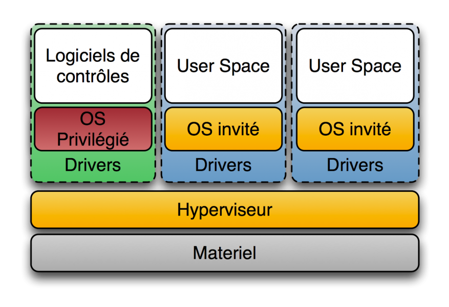
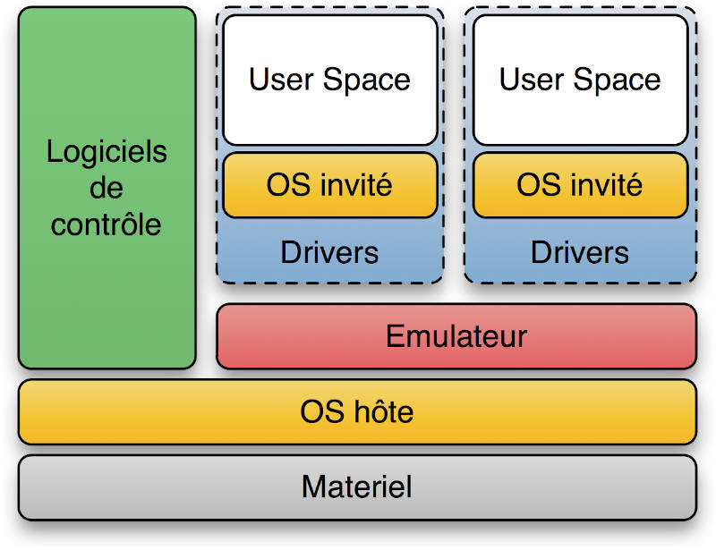

# Virtualisation

## Type d'hyperviseurs

Les hyperviseurs sont des logiciels qui permettent de créer et de gérer des machines virtuelles (VMs) sur un matériel physique. Il existe deux types principaux d'hyperviseurs : le type 1 (bare-metal) et le type 2 (hosted). Voici un aperçu des différences entre ces deux types d'hyperviseurs :

### Hyperviseur de Type 1 (Bare-Metal) :

1. **Exécution directe** : Les hyperviseurs de type 1 s'exécutent directement sur le matériel physique du serveur, sans nécessiter un système d'exploitation hôte intermédiaire. Cela signifie qu'ils ont un accès plus direct aux ressources matérielles.

2. **Performances** : En raison de leur accès direct au matériel, les hyperviseurs de type 1 ont tendance à offrir de meilleures performances que les hyperviseurs de type 2. Ils sont généralement utilisés dans des environnements où les performances sont essentielles, tels que les datacenters d'entreprise.

3. **Exemples** : VMware vSphere/ESXi, Microsoft Hyper-V (dans sa version pour serveurs), et KVM sont des exemples d'hyperviseurs de type 1.

4. **Utilisation** : Les hyperviseurs de type 1 sont généralement utilisés dans des environnements de production, où la virtualisation est une composante essentielle de l'infrastructure.

### Hyperviseur de Type 2 (Hosted) :

1. **Exécution au-dessus d'un système d'exploitation** : Les hyperviseurs de type 2 s'exécutent au-dessus d'un système d'exploitation hôte existant, ce qui signifie qu'il y a une couche logicielle supplémentaire entre l'hyperviseur et le matériel physique.

2. **Facilité d'utilisation** : Les hyperviseurs de type 2 sont généralement plus faciles à installer et à utiliser, car ils s'appuient sur un système d'exploitation existant. Ils sont souvent utilisés pour le développement, le test et l'apprentissage.

3. **Performances moindres** : En raison de la couche logicielle supplémentaire, les hyperviseurs de type 2 ont tendance à avoir des performances légèrement inférieures par rapport aux hyperviseurs de type 1. Cependant, pour de nombreuses charges de travail, cette différence de performance peut ne pas être significative.

4. **Exemples** : VirtualBox, VMware Workstation, Parallels Desktop (pour macOS) sont des exemples d'hyperviseurs de type 2.

5. **Utilisation** : Les hyperviseurs de type 2 sont souvent utilisés dans des environnements de développement, de test, d'émulation, et par des utilisateurs individuels qui souhaitent exécuter des systèmes d'exploitation invités sur leur propre machine.

En résumé, la principale différence entre les hyperviseurs de type 1 et de type 2 réside dans leur relation avec le matériel. Les hyperviseurs de type 1 s'exécutent directement sur le matériel, tandis que les hyperviseurs de type 2 s'exécutent au-dessus d'un système d'exploitation hôte. Le choix entre les deux dépend des besoins spécifiques de virtualisation et des performances de votre environnement.

## Définition de l’hyperconvergence

L’hyperconvergence est une approche d’architecture informatique qui consiste à intégrer dans une seule plateforme logicielle les trois piliers traditionnels d’un datacenter :

- le calcul (CPU et mémoire pour exécuter les machines virtuelles),
- le stockage (disques locaux mutualisés et gérés comme une seule ressource partagée),
- et le réseau (communications internes entre les nœuds du cluster).

Contrairement à une infrastructure traditionnelle où ces éléments sont gérés séparément (serveurs, SAN/NAS, commutateurs spécialisés fiber channel), l’hyperconvergence repose sur un hyperviseur et du stockage défini par logiciel (SDS) pour combiner toutes ces ressources au sein d’un même cluster.

??? info "Exemple : Ceph"

    **Proxmox VE peut s'appuyer sur Ceph** pour mettre en œuvre un stockage distribué dans une infrastructure hyperconvergée.

!!! important "Ceph"

    **Ceph** est une solution de stockage distribué open source conçue pour offrir une grande scalabilité et une tolérance aux pannes.

    Il agrège les disques présents dans plusieurs serveurs, appelés **nœuds**, afin de fournir un espace de stockage distribué et résilient.

    Ceph est notamment utilisé dans des environnements de cloud et de virtualisation comme **Proxmox VE**, OpenStack ou Kubernetes.

    **Ceph n'est cependant pas obligatoire avec Proxmox VE.**

**Avantages :**

- Simplification de la gestion (administration unifiée via une console unique).
- Scalabilité linéaire : on ajoute simplement des nœuds pour augmenter la capacité.
- Réduction des coûts et de la complexité (moins de matériel spécialisé comme les SAN).
- Haute disponibilité et résilience intégrées.

## Solutions techniques

Il existe de nombreuses solutions de virtualisation. Certaines sont destinées à une utilisation locale sur un poste de travail, d'autres à des infrastructures de production composées de plusieurs serveurs.

### VirtualBox

**Type d'hyperviseur** : VirtualBox, que vous avez utilisé l'an dernier, est un hyperviseur de **type 2**. Il s'exécute au-dessus d'un système d'exploitation hôte existant (Windows, macOS ou Linux).

**Caractéristiques** : VirtualBox est particulièrement adapté aux environnements de développement, de test et d'apprentissage.

**Concurrents :**

- **VMware Workstation** et **VMware Fusion** : hyperviseurs de type 2 destinés respectivement aux postes de travail Windows/Linux et macOS ;
- **Hyper-V** : intégré à Windows, il peut également être utilisé pour virtualiser des systèmes sur un poste de travail.

### VMware

VMware propose plusieurs solutions de virtualisation :

- **VMware ESXi** : hyperviseur de type 1 destiné aux infrastructures de production ;
- **VMware Workstation / Fusion** : hyperviseurs destinés aux postes de travail.

Dans les infrastructures professionnelles, VMware propose notamment :

- la migration à chaud des machines virtuelles ;
- la haute disponibilité ;
- la réplication ;
- la gestion centralisée avec **vCenter Server**.

VMware propose également **vSAN**, une solution de stockage défini par logiciel permettant de construire une infrastructure hyperconvergée.

### Hyper-V

**Hyper-V** est l'hyperviseur de Microsoft. Il est notamment intégré à Windows Server et à certaines éditions de Windows.

Il permet notamment :

- d'exécuter des machines virtuelles Windows et Linux ;
- la migration en direct ;
- la mise en cluster ;
- la gestion à distance avec Hyper-V Manager ou PowerShell ;
- la mise en œuvre de mécanismes de haute disponibilité.

Microsoft propose également des solutions d'infrastructure hyperconvergée basées sur ses technologies de virtualisation.

### Nutanix

**Nutanix** est une plateforme d'**infrastructure hyperconvergée (HCI)**.

Elle regroupe les ressources de **calcul** et de **stockage** de plusieurs serveurs dans un cluster administré comme un ensemble cohérent.

Nutanix propose notamment son propre hyperviseur, **AHV (Acropolis Hypervisor)**, mais peut également fonctionner avec d'autres hyperviseurs.

!!! info "Nutanix au lycée Fulbert"

    Le lycée a utilisé pendant plusieurs années une infrastructure **Nutanix** pour héberger les services du BTS SIO.

    Elle constituait un exemple concret d'**infrastructure hyperconvergée**.

    Cette infrastructure a depuis été remplacée par un **cluster Proxmox**, notamment pour des raisons de coût.

### Proxmox

**Proxmox VE** est une plateforme de virtualisation de type 1 (*bare-metal*) basée principalement sur :

- **KVM (Kernel-based Virtual Machine)** pour les machines virtuelles ;
- **LXC (Linux Containers)** pour les conteneurs Linux.

**Caractéristiques :**

- gestion centralisée des machines virtuelles et des conteneurs via une interface web ;
- regroupement de plusieurs serveurs au sein d'un cluster ;
- migration des machines virtuelles entre les nœuds ;
- haute disponibilité (HA) ;
- prise en charge de différentes solutions de stockage ;
- sauvegarde et restauration des machines virtuelles et des conteneurs.

!!! important "KVM"

    **KVM (Kernel-based Virtual Machine)** est une technologie de virtualisation intégrée au noyau Linux.

    Elle utilise les extensions matérielles **Intel VT-x** ou **AMD-V** pour exécuter des machines virtuelles avec des performances proches du matériel natif.

    KVM est notamment utilisé par **Proxmox VE** et différentes plateformes de cloud open source.

!!! important "Notre infrastructure Proxmox"

    Notre infrastructure pédagogique est constituée de plusieurs nœuds **Proxmox** regroupés en cluster.

    Nous n'utilisons **pas Ceph** : chaque nœud possède son propre stockage local basé sur **ZFS**.

    La disponibilité de certaines machines virtuelles repose sur deux mécanismes :

    - la **réplication ZFS**, programmée pour copier régulièrement les données d'une VM vers un autre nœud ;
    - la **haute disponibilité (HA)**, qui permet de redémarrer automatiquement une VM sur un autre nœud lorsqu'un nœud devient indisponible.

    Contrairement à une infrastructure utilisant **Ceph**, le stockage n'est donc pas distribué et partagé en permanence entre les nœuds.

    La réplication ZFS étant périodique, les dernières modifications effectuées depuis la dernière réplication peuvent être perdues en cas de panne brutale.

### Xen

**Xen** est un hyperviseur open source de **type 1 (bare-metal)**.

Il a notamment été utilisé dans différentes infrastructures de datacenter et de cloud.

!!! note "Culture générale"

    Xen ne sera pas mis en œuvre dans le cadre du BTS. Nous privilégierons les solutions basées sur **KVM**, notamment **Proxmox VE**.