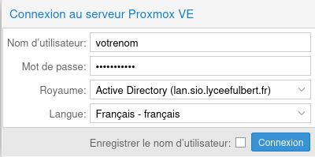
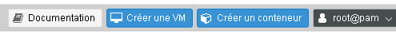
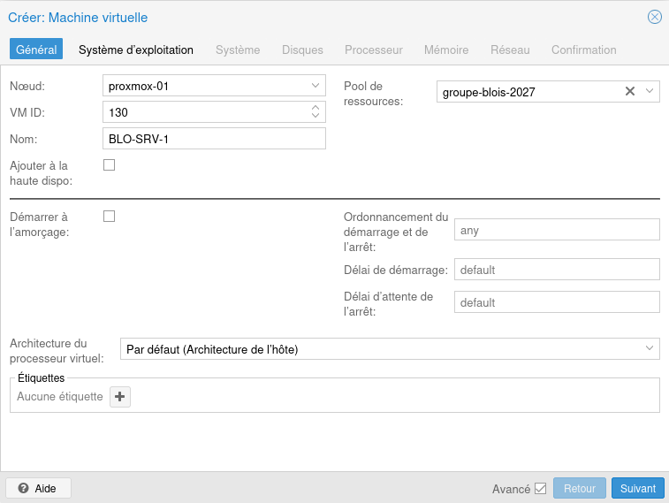
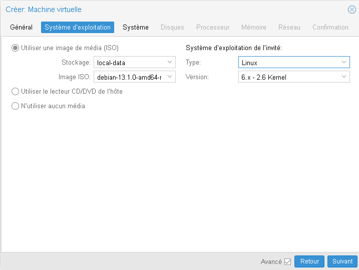
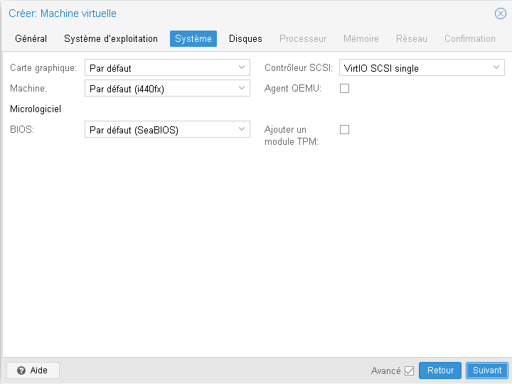
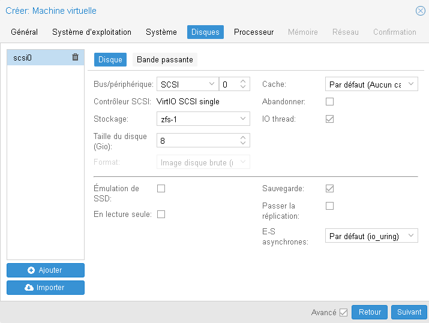
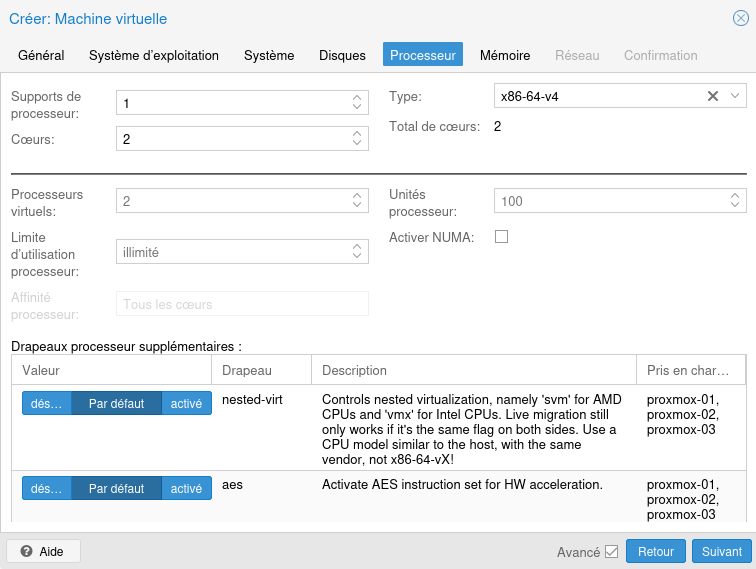
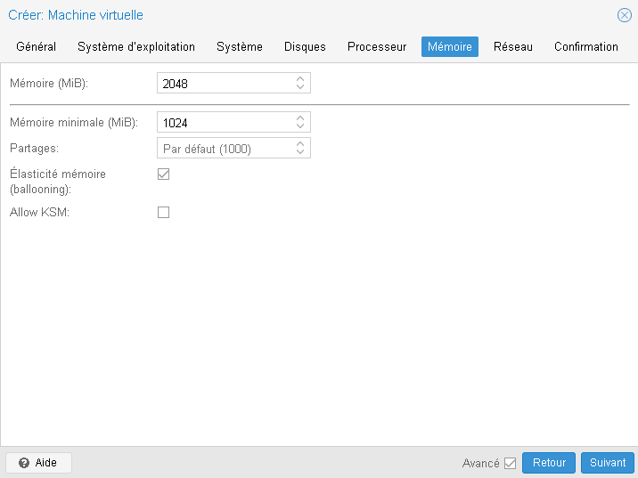
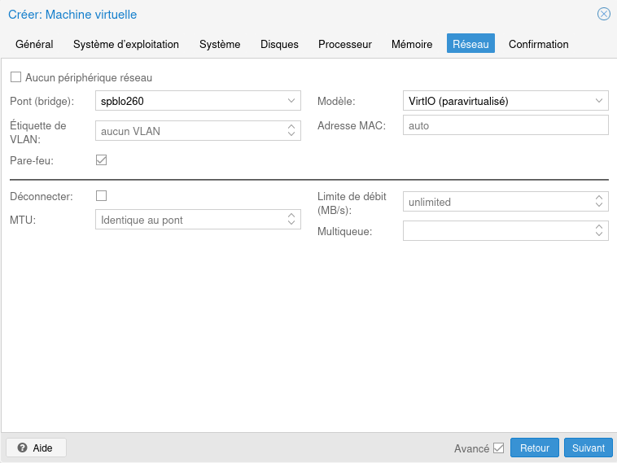
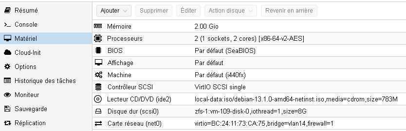

# Création d’une VM sous Proxmox

## Gestion des VMs hébergées sur le cluster SIO

Afin de pouvoir héberger vos machines virtuelles, un cluster proxmox mutualisé vous est mis à disposition. Ce Cluster étant utilisé par plusieurs groupes de travails, le nom de vos VMs devra correspondre à la **convention de nommage** précisée dans la partie "01 Infrastructure > Infrastructure".

**Avant de commencer** à créer une VM sur le cluster Proxmox mis à votre disposition, il est important de réfléchir au préalable aux ressources nécessaires et à leur répartition sur les différents noeuds. Les ressources n'étant pas illimitées, vous devrez dimensionner vos VMs au strict nécessaire et porter une attention particulière l'emplacement de vos machines virtuelles sur les différents noeuds afin de répartir équitablement les différentes ressources allouées.

Afin d'avoir une vision sur les ressources allouées, il est primordial de référencer vos VMs pour pouvoir les placer efficacement  sur les bons noeuds.
Pour réaliser cet inventaire, vous utiliserez l'outil de votre choix. Ce dernier devra référencer au minimum :

- L'id de la VM
- Le nom de la VM
- Le noeud sur lequel est présent la VM
- Le nombre de CPU allouées
- La RAM allouées
- L'espace disque alloué

!!! warning "Gardez votre inventaire de VMs à jour!"
    A tout moment, vous devez pouvoir rendre compte à votre hébergeur (ici les profs) des ressources que vous utilisez sur chacun des différents noeuds du cluster Proxmox mis à votre disposition.
    

## Connexion au cluster Proxmox mutualisé
    
L'accès à ce cluster est https://proxmox:8006 . Vous utiliserez les identifiants déjà utilisés pour vous connecter aux postes de travail avec le royaume "Active Directory (lan.sio.llyceefulbert.fr)" :

    
## Création

Cliquez sur un le centre de données ou l'un des nœud dans la partie gauche, et cliquez sur « Créer une VM » en haut à droite de l’interface : 

### Configurations générales

Dans l’onglet « général », le **nœud** sélectionné sera celui sur lequel la VM sera initialement créée. Cette dernière pourra être déplacée par la suite sur un autre. Sélectionnez bien le **pool de votre groupe**.
Laissez l’id de la VM tel qu’il a été généré et donnez un nom à la VM selon votre convention de nommage.

Laissez les **autres paramètres par défaut**.

!!! warning "Attention au pool!"
    Prenez garde à bien sélectionner un pool sur lequel vous avez les droits, sinon vous ne pourrez plus gérer votre VM!
    

### Système d'exploitation

Dans l’onglet « Système d’exploitation », sélectionnez l’**ISO** et le système d’exploitation voulu.

​​Les images proposées dans le champ « Image ISO » dépendent des images stockées sur le nœud sélectionné dans l’onglet « Général ».

### Système

Dans l’onglet « Système », laissez le **matériel proposé par défaut**. Vous pouvez simuler un module TPM si besoin grâce à la case « Ajouter un module TPM », cela est particulièrement utile pour les systèmes Windows : 

### Disques

Dans la partie « Disques », un disque par défaut est déjà créé (« scsi0 »), ajustez sa taille.

Laissez le bus, le contrôleur SCSI et le cache par défaut.
Sélectionnez le **stockage ZFS (« zfs-1 »)** et cochez la case « IO Thread » pour dédier un thread aux entrées/sorties du disque virtuel.
Laissez le paramètre par défaut pour les entrées sorties asynchrones.

!!! warning "Attention au stockage!"
    Vérifiez bien que le stockage du disque de la VM corresponde bien au **stockage ZFS (« zfs-1 »)** et non local-data !

    
### Processeur

Dans l’onglet « Processeur », sélectionnez le nombre de processeurs selon la formule « Support de Processeurs » X « Cœurs » (« Total de cœurs »). L’augmentation du nombre de cœurs est à privilégier par rapport au nombre de socket.

Sélectionnez le type **x86-64-v4**.

### Mémoire

L’onglet « Mémoire » permet d’affecter la mémoire allouée à la VM selon deux cas :

- Réservation de la totalité de la RAM par l’hyperviseur
- Allocation dynamique de la RAM sur l’hyperviseur en fonction des besoins

L’activation du « ballooning » permet l’activation de l’allocation dynamique. Dans ce cas, une réservation de la quantité de mémoire indiquée dans le champ « Mémoire minimale » sera réalisée, et le reste de la mémoire pourra être allouée jusqu’à la mémoire totale paramétrée automatiquement si besoin.

Dans tous les cas, le système invité verra toujours la valeur indiquée dans le champ « Mémoire ».

### Réseau

L’onglet « Réseau » permet de paramétrer la première carte réseau de la machine virtuelle. D’autres cartes réseaux peuvent être ajoutés une fois la VM créée.

Sélectionnez votre réseau dans le champ « Pont », et **ne sélectionnez pas d’étiquette de VLAN**, les VLANs étant déjà gérés directement par l'hyperviseur.

Laissez les autres paramètres par défaut.

### Confirmation

Une fois la configuration initiale de la VM terminé, l’onglet « Confirmation » permet de passer en revue les différents paramètres avant de créer la machine grâce au bouton « Terminer ».

## Modification du matériel d’une VM

Cliquez sur la machine virtuelle dans la partie gauche et allez dans la partie « Matériel ». Vous pouvez modifier ou supprimer certains éléments en cliquant sur le matériel concerné et en cliquant sur « Editer » ou « Supprimer ».

En cliquant sur le bouton « Ajouter » vous pouvez ajouter du matériel, notamment des cartes réseau et des disques virtuels.

Lorsque qu’un disque est sélectionné, le bouton « Action Disque » vous permet de déplacer son emplacement de stockage, de le détacher de la VM ou d’augmenter sa taille.
