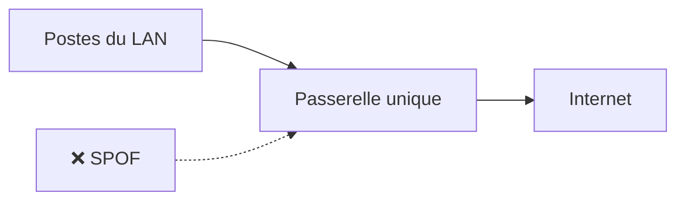
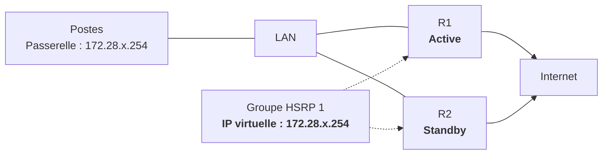
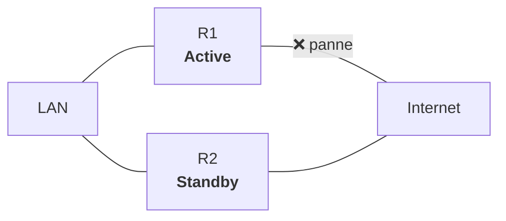
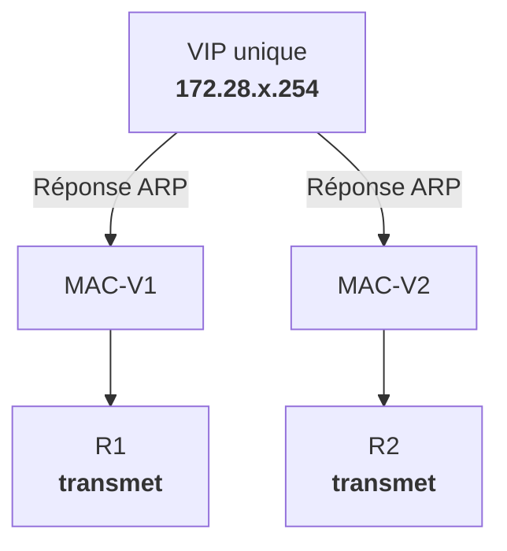
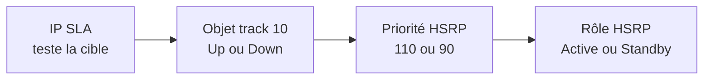

# 02 - Haute disponibilité de l'accès Internet

## Objectifs

À la fin de cette partie, vous devez être capable de :

- expliquer pourquoi deux équipements ne suffisent pas à assurer une haute disponibilité ;
- distinguer une **adresse IP réelle** d'une **adresse IP virtuelle** ;
- expliquer le rôle des routeurs **Active** et **Standby** avec HSRP ;
- distinguer clairement **basculement** (*failover*) et **répartition de charge** (*load balancing*) ;
- expliquer le fonctionnement général de GLBP ;
- prévoir le comportement du réseau lors d'une panne ;
- diagnostiquer une configuration de redondance incomplète.

!!! warning "Le but n'est pas de recopier une configuration"

    Une configuration n'a de sens que si vous savez répondre à trois questions :

    1. Quel équipement transmet les paquets en fonctionnement normal ?
    2. Quelle panne est réellement détectée ?
    3. Que se passe-t-il précisément après cette panne ?


## Socle commun

### Le problème : une passerelle unique

Un poste peut disposer d'une adresse IP, d'un masque et d'un serveur DNS corrects, mais il ne peut joindre Internet que si sa **passerelle par défaut** fonctionne.



!!! definition "SPOF — Single Point of Failure"

    Un **SPOF** (*Single Point of Failure*) est un composant dont la panne suffit, à elle seule, à provoquer l'indisponibilité d'un service.

    Ici, la **passerelle unique** est un SPOF : si elle tombe en panne, les postes du LAN ne peuvent plus accéder à Internet.

Si la passerelle tombe en panne, les postes restent capables de communiquer dans leur propre réseau, mais ils ne peuvent plus joindre les réseaux distants.

Ajouter un second routeur ne résout pas encore le problème : les postes ne peuvent avoir qu'une passerelle par défaut effectivement utilisée à un instant donné. Il faut leur présenter une **passerelle logique commune**.

<quiz>
Un second routeur est ajouté sur le LAN. La passerelle configurée sur tous les postes reste l'adresse réelle de R1. R1 tombe en panne. Internet reste-t-il accessible ?

- [ ] Oui, car R2 prend automatiquement le relais.
- [x] Non, car les postes continuent d'envoyer leurs paquets à l'adresse de R1.
- [ ] Oui, car les postes découvrent automatiquement R2 avec ARP.
- [ ] Oui, à condition que R2 possède une route par défaut.
</quiz>

---

### Le principe d'une passerelle virtuelle

Deux équipements partagent une **adresse IP virtuelle**, appelée aussi **VIP** (*Virtual IP address*).

| Élément | Adresse | Rôle |
|---|---:|---|
| R1 | `172.28.x.251/24` | adresse réelle de R1 |
| R2 | `172.28.x.252/24` | adresse réelle de R2 |
| Passerelle virtuelle | `172.28.x.254/24` | passerelle configurée sur les postes |

Les postes ne connaissent pas le routeur actuellement actif. Ils utilisent toujours :

```text
Passerelle par défaut : 172.28.x.254
```

Le protocole de redondance détermine quel équipement répond pour cette adresse virtuelle.

!!! note "IP virtuelle ne signifie pas machine virtuelle"

    La VIP n'appartient pas définitivement à un équipement. Elle représente le **service de passerelle** fourni par plusieurs équipements.

---

### HSRP : un actif et un secours

**HSRP** (*Hot Standby Router Protocol*) est un protocole **propriétaire Cisco** de redondance de la passerelle par défaut.

Dans un groupe HSRP :

- le routeur **Active** transmet les paquets envoyés à la passerelle virtuelle ;
- le routeur **Standby** surveille l'Active et se tient prêt à prendre le relais ;
- les autres routeurs éventuels restent à l'état **Listen** ;
- les postes utilisent une seule **adresse IP virtuelle** et une seule **adresse MAC virtuelle**.

!!! info "Et avec des équipements non Cisco ?"

    **VRRP** (*Virtual Router Redundancy Protocol*) répond au même besoin : fournir une **passerelle virtuelle redondante**.

    Contrairement à HSRP, VRRP est un **standard ouvert** défini par l'IETF et peut être utilisé par différents constructeurs.

    La logique est très proche : un équipement assure le rôle principal et un autre peut prendre le relais en cas de panne.

    Dans ce cours, nous utiliserons **HSRP** sur les équipements Cisco.



En fonctionnement normal, **R1 transmet les paquets**. R2 ne partage pas le trafic de ce groupe : il attend une panne.

#### Élection du routeur Active

Le choix s'effectue principalement selon :

1. la **priorité HSRP** la plus élevée ;
2. en cas d'égalité, l'adresse IP réelle la plus élevée.

La priorité par défaut est `100`.

!!! example "Exemple"

    R1 possède une priorité de `110` et R2 une priorité de `100`. R1 est donc élu **Active**.

#### Le rôle de `preempt`

La commande `preempt` autorise un routeur devenu plus prioritaire à reprendre le rôle **Active**.

Sans `preempt`, après le retour de R1, R2 peut rester Active même si sa priorité est plus faible. Ce comportement évite une nouvelle bascule, mais ne rétablit pas automatiquement le rôle habituel des équipements.

---

#### Configuration HSRP minimale

##### R1

```cisco
interface GigabitEthernet0/0
 description LAN
 ip address 172.28.x.251 255.255.255.0
 standby 1 ip 172.28.x.254
 standby 1 priority 110
 standby 1 preempt
```

##### R2

```cisco
interface GigabitEthernet0/0
 description LAN
 ip address 172.28.x.252 255.255.255.0
 standby 1 ip 172.28.x.254
 standby 1 priority 100
 standby 1 preempt
```

Les paramètres suivants doivent être cohérents sur les deux équipements :

- le même numéro de groupe HSRP : `1` ;
- la même adresse IP virtuelle : `172.28.x.254` ;
- le même sous-réseau IP sur l'interface LAN.
- et forcement le même réseau de niveau 2 (même domaine de diffusion = même vlan)

Les adresses réelles doivent en revanche être différentes.

#### Vérification

```cisco
show standby brief
show standby
show ip interface brief
show ip route
```

Une vérification ne consiste pas seulement à constater `Active` ou `Standby`. Il faut aussi contrôler :

- l'adresse virtuelle ;
- la priorité ;
- l'activation de `preempt` ;
- l'interface suivie ;
- la présence d'une route utilisable vers Internet.

---

### Failover et load balancing : deux objectifs différents

| Notion | Question posée | Fonctionnement |
|---|---|---|
| **Failover** | « Qui prend le relais si l'actif tombe ? » | un équipement transmet, un autre attend |
| **Load balancing** | « Comment utiliser plusieurs chemins en même temps ? » | le trafic est réparti entre plusieurs équipements ou liens |

#### HSRP classique

Pour un groupe HSRP donné :

- un seul routeur est **Active** ;
- le routeur **Standby** ne transmet pas le trafic destiné à la VIP ;
- il s'agit donc principalement de **failover**.

HSRP peut être utilisé pour répartir indirectement la charge en créant plusieurs groupes ou plusieurs VLAN : R1 est Active pour certains groupes, R2 pour les autres. Ce n'est toutefois pas une répartition automatique du trafic à l'intérieur d'un même groupe.

#### Exemple avec deux VLAN

| VLAN | Routeur Active | Routeur Standby |
|---|---|---|
| VLAN 10 | R1 | R2 |
| VLAN 20 | R2 | R1 |

Les deux routeurs travaillent, mais chaque VLAN conserve un seul routeur Active.


### Vérifier sa compréhension — Socle commun

Essayez de répondre **avant** de valider. Lisez la correction : l'objectif est de comprendre le mécanisme, pas seulement de trouver la bonne réponse.

---

#### Quiz 1 — Qui transmet ?

R1 a une priorité HSRP de `110`, R2 une priorité de `100`. Les deux utilisent `preempt` et fonctionnent normalement.

<quiz>
Quel équipement transmet les paquets envoyés à la VIP ?

- [x] R1, car sa priorité HSRP est la plus élevée.
- [ ] R2, car le routeur ayant la priorité la plus faible devient Active.
- [ ] R1 et R2 simultanément, car HSRP répartit la charge.
- [ ] Les deux alternativement selon les paquets.
> **Explication :** R1 est **Active** et transmet les paquets. R2 reste **Standby**. Un groupe HSRP classique ne réalise pas de répartition de charge entre les deux routeurs.
</quiz>

---

#### Quiz 2 — La bonne passerelle

Un poste possède la configuration suivante :

```text
Adresse IP : 172.28.x.20/24
Passerelle : 172.28.x.251
```

La VIP du groupe HSRP est `172.28.x.254`.

<quiz>
La haute disponibilité HSRP est-elle effective pour ce poste ?

- [ ] Oui, car R1 appartient au groupe HSRP.
- [ ] Oui, car R2 prendra automatiquement l'adresse `172.28.x.251`.
- [x] Non, car le poste utilise l'adresse réelle de R1 au lieu de la VIP.
- [ ] Non, car HSRP nécessite deux passerelles configurées sur le poste.
> **Explication :** la passerelle du poste doit être la **VIP `172.28.x.254`**. Si le poste utilise directement `172.28.x.251`, la disparition de R1 rend sa passerelle inaccessible.
</quiz>

---

#### Quiz 3 — Retour de R1

R1, priorité `110`, était Active. Après sa panne, R2 est devenu Active.

R1 redémarre, mais `preempt` n'est configuré sur aucun routeur.

<quiz>
Quel routeur reste Active ?

- [ ] R1, car sa priorité `110` est supérieure à celle de R2.
- [x] R2, car R1 ne peut pas reprendre automatiquement le rôle sans `preempt`.
- [ ] Les deux deviennent Active.
- [ ] Une nouvelle élection choisit aléatoirement R1 ou R2.
> **Explication :** une priorité supérieure ne suffit pas à reprendre le rôle à un routeur déjà **Active**. `preempt` permet au routeur ayant la priorité supérieure de reprendre le rôle Active.
</quiz>

---

#### Quiz 8 — Failover ou load balancing ?

<quiz>
R2 prend le relais après la panne de R1. Quelle notion décrit ce comportement ?

- [x] Failover
- [ ] Load balancing
- [ ] Routage dynamique
- [ ] Agrégation de liens
> **Explication :** le **failover** consiste à faire prendre le relais à un équipement lorsqu'un autre devient indisponible.
</quiz>

<quiz>
R1 et R2 transmettent simultanément du trafic pour des postes différents. Quelle notion décrit ce comportement ?

- [ ] Failover
- [x] Load balancing
- [ ] Preemption
- [ ] Tracking
> **Explication :** le **load balancing** consiste à répartir le trafic normal entre plusieurs équipements disponibles.
</quiz>

---

## Concepts avancés

---

### Le piège : le routeur fonctionne, mais Internet est inaccessible

HSRP surveille naturellement la présence de l'autre membre sur le réseau partagé. Il peut détecter la disparition du routeur Active ou de son interface LAN.

Mais imaginons la situation suivante :



R1 fonctionne toujours et son interface LAN est active. Il reste donc **Active**, alors que sa liaison vers Internet est coupée. La VIP est disponible, mais le service attendu ne l'est plus.

### Suivre la liaison vers Internet

Une solution simple consiste à suivre l'état de l'interface WAN :

```cisco
interface GigabitEthernet0/0
 standby 1 track GigabitEthernet0/1 20
```

Si `GigabitEthernet0/1` tombe, la priorité de R1 diminue de `20` :

```text
110 - 20 = 90
```

R2 possède une priorité de `100`. Avec `preempt`, R2 devient alors Active.

!!! warning "Une interface active ne prouve pas qu'Internet fonctionne"

    Le câble entre R1 et l'équipement opérateur peut être actif alors qu'une panne existe plus loin. Pour tester réellement un chemin, on peut utiliser **IP SLA**, puis associer son résultat à un objet suivi avec `track`.

---

### GLBP : répartition de charge et redondance

**GLBP** (*Gateway Load Balancing Protocol*) est également un protocole propriétaire Cisco. Les postes utilisent une seule IP virtuelle, mais plusieurs routeurs peuvent transmettre simultanément.

GLBP distingue deux rôles :

- **AVG** (*Active Virtual Gateway*) : répond aux requêtes ARP pour la VIP et attribue les adresses MAC virtuelles ;
- **AVF** (*Active Virtual Forwarder*) : transmet les paquets associés à son adresse MAC virtuelle.



Deux postes peuvent donc posséder la même passerelle IP, tout en envoyant leurs trames à des adresses MAC virtuelles différentes. R1 et R2 participent alors simultanément au transfert.

GLBP apporte :

- de la **répartition de charge** en fonctionnement normal ;
- du **failover** si un forwarder devient indisponible.

!!! note "La répartition n'est pas paquet par paquet"

    Avec la méthode courante *round-robin*, l'AVG alterne les adresses MAC dans ses réponses ARP. Un même poste conserve ensuite l'adresse MAC apprise dans son cache ARP pendant un certain temps.

#### Configuration GLBP minimale

##### R1

```cisco
interface GigabitEthernet0/0
 ip address 172.28.x.251 255.255.255.0
 glbp 1 ip 172.28.x.254
 glbp 1 priority 110
 glbp 1 preempt
```

##### R2

```cisco
interface GigabitEthernet0/0
 ip address 172.28.x.252 255.255.255.0
 glbp 1 ip 172.28.x.254
 glbp 1 priority 100
 glbp 1 preempt
```

#### Vérification

```cisco
show glbp brief
show glbp
show arp
```

!!! warning "Ne pas mélanger les protocoles"

    On choisit HSRP **ou** GLBP pour un même service de passerelle virtuelle. Remplacer seulement quelques commandes `standby` par des commandes `glbp` ne constitue pas une configuration valide.

---

### Comparaison synthétique

| Critère | HSRP | GLBP |
|---|---|---|
| Constructeur | Cisco | Cisco |
| Objectif principal | redondance | répartition de charge et redondance |
| Passerelle IP vue par les postes | une VIP | une VIP |
| Transfert normal pour un groupe | un Active | plusieurs AVF possibles |
| Routeur de secours | Standby | autre AVG/AVF capable de reprendre |
| Répartition native dans un groupe | non | oui |
| Complexité | plus faible | plus élevée |

---

### Vérifier sa compréhension — Concepts avancés

---

Essayez de répondre **avant** de valider. Lisez la correction : l'objectif est de comprendre le mécanisme, pas seulement de trouver la bonne réponse.

---

#### Quiz 4 — La fausse haute disponibilité

R1 reste allumé et son interface LAN est active. Sa liaison WAN est coupée.

Aucun suivi d'interface ni IP SLA n'est configuré.

<quiz>
HSRP bascule-t-il nécessairement vers R2 ?

- [ ] Oui, HSRP vérifie automatiquement l'accès à Internet.
- [ ] Oui, toute perte d'une interface de R1 déclenche automatiquement le basculement.
- [x] Non, R1 peut rester Active car HSRP fonctionne toujours sur le LAN.
- [ ] Non, HSRP ne peut basculer qu'après l'arrêt complet du routeur.
> **Explication :** HSRP peut continuer à fonctionner normalement sur le LAN alors que R1 a perdu sa sortie Internet. Il faut mettre en place un **suivi adapté**, par exemple le suivi de l'interface WAN ou un test IP SLA.
</quiz>

---

#### Quiz 5 — Calcul de priorité

R1 possède une priorité de `115`.

Le suivi de son accès Internet prévoit un décrément de `10`.

R2 possède une priorité de `100`.

<quiz>
La panne suivie suffit-elle à faire basculer le groupe vers R2 ?

- [ ] Oui, car toute diminution de priorité provoque un basculement.
- [ ] Oui, car la priorité de R1 devient `95`.
- [x] Non, car la priorité de R1 devient `105` et reste supérieure à celle de R2.
- [ ] Non, car une priorité HSRP ne peut pas être modifiée dynamiquement.
> **Explication :** `115 - 10 = 105`. R1 conserve donc une priorité supérieure à celle de R2 (`100`). Le décrément doit rendre la priorité de R1 inférieure à celle de R2.
</quiz>

---

#### Quiz 6 — HSRP ou GLBP ?

L'administrateur veut que R1 et R2 transmettent **tous les deux du trafic** pour les postes d'un même VLAN, tout en présentant une seule adresse IP de passerelle.

<quiz>
Quel protocole répond directement à ce besoin ?

- [ ] HSRP, car les routeurs Active et Standby transmettent simultanément.
- [x] GLBP, car plusieurs routeurs peuvent transmettre derrière une même VIP.
- [ ] HSRP, à condition d'activer `preempt`.
- [ ] VRRP, car le routeur Backup transmet une partie du trafic.
> **Explication :** GLBP permet à plusieurs **AVF** (*Active Virtual Forwarders*) de transmettre simultanément derrière une même VIP. Dans un groupe HSRP classique, un seul routeur Active transmet pour la passerelle virtuelle.
</quiz>

---

#### Quiz 7 — Une IP, plusieurs MAC

Deux postes utilisent la même passerelle `172.28.x.254`, mais leur cache ARP associe cette IP à deux adresses MAC virtuelles différentes.

<quiz>
Ce résultat est-il cohérent avec HSRP ou avec GLBP ?

- [ ] HSRP, car Active et Standby possèdent chacun une MAC virtuelle utilisée simultanément.
- [x] GLBP, car une même VIP peut être associée à plusieurs MAC virtuelles.
- [ ] HSRP, mais uniquement lorsque `preempt` est activé.
- [ ] Aucun des deux, car une adresse IP ne peut jamais être associée à plusieurs adresses MAC.
> **Explication :** avec GLBP, l'**AVG** (*Active Virtual Gateway*) peut répondre aux requêtes ARP avec différentes adresses MAC virtuelles. Les postes peuvent ainsi envoyer leur trafic vers différents **AVF**.
</quiz>

---

## Expertise

---

### Du suivi d'interface à IP SLA

HSRP sait détecter la disparition du routeur Active ou la perte de son interface LAN. En revanche, il ne vérifie pas naturellement que le chemin utilisé pour sortir vers Internet fonctionne réellement.

Il faut donc distinguer trois mécanismes :

| Mécanisme | Ce qu'il surveille | Limite |
|---|---|---|
| HSRP seul | présence des membres du groupe sur le LAN | ne teste pas l'accès à Internet |
| suivi d'interface | état local d'une interface | ne détecte pas une panne située plus loin |
| IP SLA avec `track` | résultat d'un test actif vers une cible | dépend du choix de la cible et du test |

#### Suivre directement l'interface WAN

Une première solution consiste à diminuer la priorité HSRP lorsque l'interface WAN de R1 tombe :

```cisco
interface GigabitEthernet0/0
 standby 1 track GigabitEthernet0/1 20
```

Dans cet exemple :

- `GigabitEthernet0/0` est l'interface LAN qui porte HSRP ;
- `GigabitEthernet0/1` est l'interface WAN suivie ;
- `20` est le décrément appliqué à la priorité de R1 lorsque l'interface suivie devient indisponible.

Si R1 possède initialement une priorité de `110` :

```text
110 - 20 = 90
```

R2 possède une priorité de `100`. Sa priorité devient donc supérieure à celle de R1. Si `preempt` est configuré sur R2, il peut reprendre le rôle Active.

#### Comprendre la limite du suivi d'interface

Le suivi d'interface ne contrôle que l'état local de celle-ci.


Le câble entre R1 et l'équipement opérateur peut rester connecté et l'interface conserver l'état `up/up`, alors qu'une panne empêche toute communication au-delà de cet équipement.

Dans cette situation, le simple suivi de `GigabitEthernet0/1` considère toujours le WAN comme disponible. R1 conserve sa priorité et peut rester Active alors qu'il ne fournit plus le service attendu.

#### Tester réellement le chemin avec IP SLA

**IP SLA** (*IP Service Level Agreements*) permet au routeur d'exécuter périodiquement un test actif. Ici, R1 envoie une requête ICMP vers une adresse située au-delà de sa liaison WAN :

```cisco
ip sla 10
 icmp-echo 203.0.113.1 source-interface GigabitEthernet0/1
 frequency 5
```

Cette configuration signifie :

- `10` identifie l'opération IP SLA ;
- `icmp-echo 203.0.113.1` définit la cible du test ;
- `source-interface GigabitEthernet0/1` impose l'interface source utilisée ;
- `frequency 5` relance le test toutes les cinq secondes.

L'opération doit ensuite être planifiée :

```cisco
ip sla schedule 10 life forever start-time now
```

- `life forever` maintient l'opération active sans limite de durée ;
- `start-time now` la démarre immédiatement.

!!! warning "Créer une opération ne suffit pas"

    Une opération IP SLA produit un résultat, mais elle ne modifie pas directement le comportement de HSRP. Il faut relier ce résultat à un objet de suivi avec `track`.

#### Associer IP SLA à un objet `track`

L'objet `track 10` surveille le résultat de l'opération IP SLA `10` :

```cisco
track 10 ip sla 10 reachability
```

Le mot-clé `reachability` indique que l'objet doit être considéré :

- **Up** lorsque la cible répond au test ;
- **Down** lorsque la cible n'est plus joignable.

On associe ensuite cet objet à HSRP sur l'interface LAN :

```cisco
interface GigabitEthernet0/0
 standby 1 track 10 decrement 20
```

La chaîne de décision complète devient alors :



Lorsque la cible ne répond plus :

1. l'opération IP SLA échoue ;
2. l'objet `track 10` passe à l'état **Down** ;
3. la priorité HSRP de R1 passe de `110` à `90` ;
4. R2, dont la priorité est `100`, devient plus prioritaire ;
5. avec `preempt`, R2 prend le rôle Active.

Lorsque le chemin redevient disponible, l'objet suivi repasse à l'état **Up**. R1 retrouve sa priorité de `110` et peut reprendre le rôle Active grâce à `preempt`.

#### Configuration complète sur R1

```cisco
ip sla 10
 icmp-echo 203.0.113.1 source-interface GigabitEthernet0/1
 frequency 5
ip sla schedule 10 life forever start-time now

track 10 ip sla 10 reachability

interface GigabitEthernet0/0
 description LAN
 ip address 172.28.x.251 255.255.255.0
 standby 1 ip 172.28.x.254
 standby 1 priority 110
 standby 1 preempt
 standby 1 track 10 decrement 20
```

!!! note "Pour une véritable redondance des deux chemins"

    Dans une architecture complète, chaque routeur peut exécuter son propre test IP SLA et suivre son propre accès WAN. Il faut utiliser des numéros d'opérations et d'objets cohérents sur chaque équipement, sans supposer que les deux routeurs empruntent nécessairement le même chemin.

#### Choisir correctement la cible

La cible doit représenter le chemin ou le service que l'on souhaite réellement surveiller.

Une mauvaise cible peut provoquer de mauvaises décisions :

- une adresse située sur le lien directement connecté ne détecte pas une panne plus éloignée ;
- une adresse qui bloque volontairement ICMP peut être considérée à tort comme indisponible ;
- une cible instable peut provoquer des basculements inutiles ;
- une cible accessible par un autre chemin peut masquer la panne que l'on cherche à détecter.

Il faut donc choisir une cible fiable, stable et située suffisamment loin pour valider le chemin attendu.

!!! warning "L'adresse utilisée dans l'exemple est documentaire"

    `203.0.113.1` appartient à un préfixe réservé à la documentation. Dans votre infrastructure, remplacez-la par une adresse réellement joignable et pertinente pour le test.

#### Vérifier IP SLA, l'objet track et HSRP

Les trois niveaux doivent être vérifiés séparément :

```cisco
show ip sla configuration 10
show ip sla statistics 10
show track 10
show standby brief
show standby
```

| Commande | Vérification attendue |
|---|---|
| `show ip sla configuration 10` | paramètres et planification de l'opération |
| `show ip sla statistics 10` | succès, échecs et temps de réponse du test |
| `show track 10` | état `Up` ou `Down` de l'objet suivi |
| `show standby brief` | rôle et priorité HSRP après application du décrément |
| `show standby` | détail du groupe, de `preempt` et des objets suivis |

#### Tester les scénarios de panne

Une configuration n'est validée qu'après observation de son comportement réel.

| Test | Suivi d'interface | IP SLA avec `track` |
|---|---|---|
| arrêt complet de R1 | basculement | basculement |
| coupure de l'interface LAN de R1 | basculement | basculement |
| coupure physique de l'interface WAN suivie | basculement | basculement |
| panne située au-delà de l'interface WAN | généralement non détectée | détectée si la cible devient injoignable |
| retour du chemin de R1 | priorité restaurée | priorité restaurée après réussite du test |

Le basculement n'est pas nécessairement instantané : il dépend notamment de la fréquence du test, de son délai d'expiration et des mécanismes de convergence de HSRP.

---

### Élargir la haute disponibilité au-delà de la passerelle

!!! info "D'autres solutions de haute disponibilité"

    **VRRP** est un protocole normalisé de redondance de passerelle. <br/>
    **CARP** est notamment utilisé dans l'univers BSD et par des pare-feux comme pfSense ou OPNsense.

    Sous Linux, **Keepalived** utilise notamment VRRP pour assurer la redondance d'adresses IP.

    D'autres outils permettent d'aller plus loin dans la haute disponibilité :

    - **Heartbeat** permet de détecter la disponibilité des nœuds et a historiquement été utilisé pour mettre en place des clusters HA ;
    - **Pacemaker** est un gestionnaire de ressources de cluster : il peut décider sur quel nœud doivent fonctionner une adresse IP, un serveur web, une base de données ou un autre service.

    Ces solutions ne se limitent donc pas à la redondance d'une passerelle : elles permettent d'assurer la **haute disponibilité de services**.

---

### Activité : prédire, vérifier, expliquer

#### Situation initiale

- R1 : `172.28.x.251`, priorité HSRP `110`, `preempt` actif ;
- R2 : `172.28.x.252`, priorité HSRP `100`, `preempt` actif ;
- VIP : `172.28.x.254` ;
- un poste envoie un ping continu vers une adresse située au-delà des routeurs.

Pour chaque test, complétez le tableau **avant** de manipuler.

| Test | Prédiction | Observation | Explication technique |
|---|---|---|---|
| arrêt complet de R1 | | | |
| coupure de l'interface LAN de R1 | | | |
| coupure du WAN de R1 sans suivi | | | |
| coupure du WAN de R1 avec suivi | | | |
| redémarrage de R1 sans `preempt` | | | |
| redémarrage de R1 avec `preempt` | | | |

!!! important "Production attendue"

    Une capture d'écran de commandes n'est pas une explication. Pour chaque test, indiquez :

    - l'état de R1 et R2 avant et après la panne ;
    - l'évolution éventuelle des priorités ;
    - l'équipement qui transmet réellement ;
    - l'impact observé sur le ping ;
    - la raison technique de ce comportement.

---

### Diagnostic final

Un groupe a réalisé la configuration suivante :

#### R1

```cisco
interface GigabitEthernet0/0
 ip address 172.28.x.251 255.255.255.0
 standby 1 ip 172.28.x.254
 standby 1 priority 110
```

#### R2

```cisco
interface GigabitEthernet0/0
 ip address 172.28.x.252 255.255.255.0
 standby 2 ip 172.28.x.254
 standby 2 priority 100
 standby 2 preempt
```

Les postes utilisent `172.28.x.251` comme passerelle. Aucun suivi du WAN n'est configuré.

#### Travail demandé

Identifiez au moins **trois défauts**, puis expliquez pour chacun :

1. le symptôme possible ;
2. la cause ;
3. la correction ;
4. la commande ou le test permettant de vérifier la correction.

??? question "Afficher les éléments de correction"

    - Les deux routeurs n'utilisent pas le même numéro de groupe HSRP (`1` et `2`) : ils ne forment pas le même groupe logique.
    - Les postes utilisent l'adresse réelle de R1 au lieu de la VIP : ils ne bénéficient pas du basculement.
    - `preempt` manque sur R1 : après son retour, il ne reprendra pas automatiquement le rôle Active.
    - Aucun suivi du WAN ou test IP SLA n'est prévu : R1 peut rester Active malgré la perte de sa sortie Internet.
    - Il faut encore vérifier les routes par défaut et le routage retour : HSRP ne les crée pas.

---

## À retenir

- Une **VIP** fournit une passerelle stable aux postes.
- HSRP assure principalement un **failover** : un Active transmet, un Standby attend.
- `preempt` permet au routeur le plus prioritaire de reprendre le rôle Active.
- Une panne située au-delà du LAN nécessite un mécanisme de **suivi** adapté.
- GLBP permet à plusieurs routeurs de transmettre derrière une même VIP : il combine **load balancing** et **failover**.
- La haute disponibilité doit être **testée par des pannes réelles ou simulées**, pas déduite de la seule présence de deux équipements.
