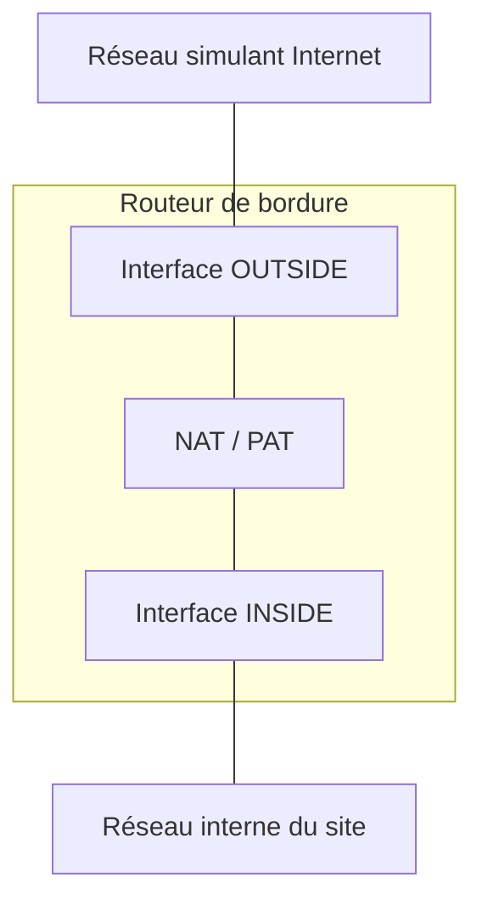

# 01 - NAT/PAT sur un routeur Cisco

## Contexte

Dans le projet **SportLudique**, chaque site possède un réseau local relié à un réseau simulant Internet par un **routeur de bordure**.

Ce routeur assure la liaison entre :

- le réseau interne du site ;
- le réseau simulant Internet.

Il devra également réaliser la **traduction d'adresses IPv4 (NAT/PAT)** afin de permettre aux postes du réseau interne d'accéder au réseau extérieur.



!!! important "Documentation"

    Les adresses IPv4, les VLAN et les interfaces à utiliser ne sont volontairement pas indiqués dans ce support.

    Vous devez les retrouver dans la documentation correspondant à votre site SportLudique.

---

## Test de connaissances

Avant de commencer la configuration, vérifiez quelques connaissances indispensables.

<quiz>
Quelle est la fonction principale d'une passerelle par défaut ?

* [ ] Attribuer automatiquement une adresse IPv4 aux postes.
* [x] Permettre de joindre des réseaux différents du réseau local.
* [ ] Résoudre les noms de domaine.
* [ ] Associer une adresse IPv4 à une adresse MAC.

La passerelle par défaut est utilisée lorsqu'un poste doit envoyer un paquet vers une destination située en dehors de son réseau local.
</quiz>

<quiz>
Laquelle de ces adresses IPv4 appartient à une plage privée ?

* [ ] 8.8.8.8
* [x] 172.20.10.15
* [ ] 193.51.45.10
* [ ] 221.87.128.1

La plage 172.16.0.0/12 fait partie des plages d'adresses IPv4 privées définies par la RFC 1918.
</quiz>

<quiz>
À quoi sert principalement le protocole ARP sur un réseau IPv4 local ?

* [ ] À trouver l'adresse IPv4 d'un serveur DNS.
* [ ] À déterminer la route vers Internet.
* [x] À associer une adresse IPv4 à une adresse MAC.
* [ ] À attribuer automatiquement une adresse IPv4.

ARP permet notamment à un poste de déterminer l'adresse MAC correspondant à une adresse IPv4 située sur son réseau local.
</quiz>

---

## Principe du NAT/PAT

Les adresses IPv4 privées utilisées dans les réseaux locaux ne sont pas utilisées comme adresses globalement routables sur Internet.

Le **NAT (Network Address Translation)** permet à un routeur de modifier les informations d'adressage IPv4 lorsqu'un paquet le traverse.

Dans cette activité, plusieurs postes du réseau interne doivent pouvoir accéder à Internet en utilisant **la même adresse IPv4 extérieure**.

Le routeur traduit alors les adresses IPv4 privées des postes en utilisant cette adresse IPv4 extérieure commune. Pour distinguer les différents flux, il s'appuie notamment sur les **numéros de ports source** des protocoles de transport (couche 4 du modèle OSI).

Sur un routeur Cisco, ce mécanisme de **NAT avec surcharge** est activé avec le mot-clé :

```cisco
overload
```

<quiz>
Plusieurs postes du réseau interne SportLudique utilisent simultanément l'adresse IPv4 extérieure du routeur de bordure. Comment le routeur peut-il distinguer leurs différents flux ?

* [ ] Grâce aux adresses MAC des postes, transmises sur Internet.
* [ ] Grâce aux numéros des VLAN internes.
* [x] Grâce notamment aux numéros de ports associés aux traductions.
* [ ] Grâce aux noms DNS des postes.

Le PAT utilise notamment les numéros de ports pour distinguer plusieurs flux partageant une même adresse IPv4 extérieure.
</quiz>

---

## Préparation de la configuration

Avant de configurer le NAT/PAT, relevez dans la documentation les informations correspondant à votre site SportLudique.

### Réseau interne à traduire

| Information à identifier | Valeur |
|---|---|
| Site SportLudique | |
| Réseau IPv4 interne à traduire | |
| Masque du réseau | |
| VLAN concerné | |

### Routeur de bordure

| Côté | Interface du routeur | Adresse IPv4 | Masque |
|---|---|---|---|
| **INSIDE** — vers le réseau interne | | | |
| **OUTSIDE** — vers le réseau simulant Internet | | | |

### Brassage

| Liaison | Couleur du câble | Switch | Port de brassage / port du switch |
|---|---|---|---|
| Réseau interne → **INSIDE** | | | |
| **OUTSIDE** → réseau simulant Internet | | | |

!!! question "Avant de poursuivre"

    À partir de ces informations, vérifiez que vous êtes capable d'identifier :

    - le réseau IPv4 qui devra être traduit ;
    - l'interface `inside` du routeur de bordure ;
    - l'interface `outside` du routeur de bordure ;
    - le chemin physique emprunté par chacune de ces deux liaisons.

---

## Configuration des interfaces du routeur

Le routeur doit savoir quelle interface se trouve du côté du réseau interne et quelle interface se trouve du côté du réseau extérieur.

### Interface extérieure

L'interface connectée au réseau simulant Internet doit être déclarée comme interface **outside**.

```cisco
interface <interface-vers-reseau-exterieur>
 ip address <adresse> <masque>
 ip nat outside
 no shutdown
```

### Interface intérieure

L'interface ou la sous-interface connectée au réseau interne doit être déclarée comme interface **inside**.

Dans le cas d'une interface classique :

```cisco
interface <interface-vers-LAN>
 ip address <adresse> <masque>
 ip nat inside
 no shutdown
```

Dans le cas d'une sous-interface associée à un VLAN :

```cisco
interface <interface>.<numero>
 encapsulation dot1Q <vlan>
 ip address <adresse> <masque>
 ip nat inside
```

<quiz>
Sur quelle interface doit être configurée la commande `ip nat outside` ?

* [ ] Sur l'interface connectée au réseau interne.
* [ ] Sur toutes les interfaces du routeur.
* [x] Sur l'interface connectée au réseau simulant Internet.
* [ ] Sur l'interface de management uniquement.

`ip nat outside` identifie le côté extérieur de la traduction NAT.
</quiz>

---

## Identifier le réseau à traduire

Le routeur doit ensuite savoir **quelles adresses IPv4 internes doivent être traduites**.

Pour cela, Cisco utilise une **liste de contrôle d'accès (ACL)**.

```cisco
access-list <numero> permit <adresse-reseau> <wildcard>
```

Dans cette configuration, l'ACL ne sert pas à filtrer l'accès à Internet : elle permet d'identifier le réseau IPv4 dont les adresses devront être traduites.

??? info "Rappel : le wildcard mask"

    Dans une ACL Cisco, le **wildcard mask** fonctionne à l'inverse d'un masque de sous-réseau :

    - `0` : le bit doit **correspondre** ;
    - `1` : le bit peut **varier**.

    Il s'obtient en inversant le masque :

    ```text
    Masque   : 255.255.255.0
    Wildcard :   0.  0.  0.255
    ```

    On peut le calculer avec :

    ```text
    255.255.255.255 - masque = wildcard
    ```

    Ainsi, avec `0.0.0.255`, les trois premiers octets doivent correspondre à l'adresse réseau, tandis que le dernier peut varier.

!!! question "À vous de jouer"

    Déterminez le wildcard correspondant au masque du réseau interne de votre site.

<quiz>
Quel est le rôle de l'ACL utilisée dans cette configuration NAT/PAT ?

* [ ] Bloquer les communications vers Internet.
* [x] Identifier les adresses IPv4 internes qui doivent être traduites.
* [ ] Identifier les serveurs accessibles sur Internet.
* [ ] Déterminer l'adresse IPv4 extérieure du routeur.

L'ACL sélectionne les adresses IPv4 internes auxquelles la règle de traduction NAT/PAT sera appliquée.
</quiz>

---

## Configuration du NAT/PAT

Une fois les interfaces `inside` et `outside` identifiées et l'ACL créée, il reste à configurer la règle de traduction.

```cisco
ip nat inside source list <numero-ACL> interface <interface-exterieure> overload
```

Cette commande indique au routeur :

- d'utiliser comme source les adresses sélectionnées par l'ACL ;
- de traduire ces adresses lorsqu'elles passent de `inside` vers `outside` ;
- d'utiliser l'adresse IPv4 de l'interface extérieure ;
- d'autoriser plusieurs flux à partager cette adresse grâce au mot-clé `overload`.

<quiz>
Quel est le rôle du mot-clé `overload` ?

* [ ] Créer automatiquement l'ACL.
* [ ] Activer le routage entre les VLAN.
* [ ] Attribuer plusieurs adresses IPv4 à l'interface extérieure.
* [x] Permettre à plusieurs flux de partager la même adresse IPv4 extérieure.

`overload` active la traduction utilisant notamment les numéros de ports afin de permettre à plusieurs flux de partager une même adresse IPv4 extérieure.
</quiz>

---

## Vérification de la configuration

Une configuration n'est considérée comme terminée que lorsqu'elle a été **testée et vérifiée**.

### 1. Vérifier les interfaces

Contrôlez l'état et l'adressage des interfaces du routeur :

```cisco
show ip interface brief
```

Vérifiez notamment :

- les adresses IPv4 ;
- l'état des interfaces ;
- la cohérence avec le plan d'adressage de votre site.

### 2. Vérifier l'accès au réseau extérieur depuis le routeur

Avant de tester le NAT/PAT depuis un poste du LAN, vérifiez que le routeur de bordure est lui-même capable de joindre le réseau simulant Internet.

Si le routeur ne peut pas communiquer avec le réseau extérieur, le NAT/PAT ne pourra pas résoudre ce problème.

### 3. Observer les traductions

Affichez la table de traduction NAT :

```cisco
show ip nat translations
```

Observez son contenu.

Depuis un poste du réseau interne, générez ensuite du trafic vers le réseau simulant Internet, puis exécutez à nouveau :

```cisco
show ip nat translations
```

Comparez les deux résultats et identifiez :

- l'adresse IPv4 du poste interne ;
- l'adresse IPv4 utilisée côté `outside` ;
- le protocole utilisé ;
- les numéros de ports éventuellement présents.

<quiz>
La table affichée par `show ip nat translations` est vide immédiatement après la configuration. Que peut-on en conclure ?

* [ ] La configuration NAT est nécessairement incorrecte.
* [ ] L'interface `outside` est nécessairement désactivée.
* [x] Aucun trafic correspondant à la règle NAT n'a peut-être encore été généré.
* [ ] L'ACL doit obligatoirement être supprimée.

Une entrée de traduction est créée lorsqu'un trafic correspondant à la règle NAT/PAT traverse le routeur. Une table vide ne suffit donc pas à conclure que la configuration est incorrecte.
</quiz>

### 4. Vider la table de traduction

Il est possible de supprimer les traductions dynamiques présentes dans la table :

```cisco
clear ip nat translation *
```

Après avoir vidé la table :

1. vérifiez qu'elle ne contient plus les traductions précédentes ;
2. générez de nouveau du trafic depuis un poste du réseau interne ;
3. observez la réapparition des traductions.

!!! warning "Attention"

    La suppression des traductions NAT peut perturber les connexions en cours.

---

## Liaison entre le routeur et le switch

Dans notre infrastructure, la liaison entre le routeur de bordure et le switch doit transporter **plusieurs VLAN**.

Elle transporte notamment :

- le VLAN correspondant au réseau interne utilisé pour le NAT/PAT ;
- le **VLAN de management**, afin de pouvoir administrer le routeur depuis le réseau d'administration.

La liaison entre le switch et le routeur doit donc être configurée en **trunk 802.1Q**. Chaque VLAN utilisé par le routeur sera associé à une **sous-interface**.

### Configuration du trunk

Sur le switch :

```cisco
interface <interface-vers-routeur>
 switchport mode trunk
 switchport trunk allowed vlan <liste-des-vlan>
```

Vérifiez ensuite la configuration :

```cisco
show interfaces trunk
```

et la présence des VLAN :

```cisco
show vlan brief
```

!!! important "Attention"

    La commande `switchport trunk allowed vlan` autorise des VLAN sur le trunk, mais **ne crée pas les VLAN** sur le switch.

    Vérifiez leur présence avec :

    ```cisco
    show vlan brief
    ```

<quiz>
Vous ajoutez un numéro de VLAN avec `switchport trunk allowed vlan`. Quelle affirmation est correcte ?

* [ ] Le VLAN est automatiquement créé sur le switch.
* [x] Le VLAN est autorisé sur le trunk mais doit exister sur le switch.
* [ ] Le VLAN devient automatiquement le VLAN de management.
* [ ] Le routeur crée automatiquement une sous-interface correspondante.

La commande `switchport trunk allowed vlan` définit les VLAN autorisés à traverser le trunk. Elle ne crée ni le VLAN sur le switch ni la sous-interface correspondante sur le routeur.
</quiz>

---

## En cas de problème

Ne modifiez pas la configuration au hasard.

Procédez dans l'ordre et vérifiez :

1. la configuration IPv4 du poste ;
2. sa passerelle par défaut ;
3. la communication entre le poste et sa passerelle ;
4. l'état et l'adressage des interfaces du routeur de bordure ;
5. la communication entre le routeur et le réseau simulant Internet ;
6. les rôles `ip nat inside` et `ip nat outside` ;
7. l'ACL sélectionnant le réseau interne ;
8. la règle NAT/PAT ;
9. le contenu de la table de traduction NAT.

!!! question "Diagnostic"

    Le routeur de bordure parvient à joindre le réseau simulant Internet, mais un poste du réseau interne n'y parvient pas.

    Qu'est-ce que cette observation permet déjà d'écarter ?

    Quelles vérifications devez-vous maintenant effectuer ?

---

## Test de connaissances final

<quiz>
Quelle commande permet d'observer les traductions NAT actuellement connues du routeur ?

* [ ] `show ip route`
* [ ] `show vlan brief`
* [x] `show ip nat translations`
* [ ] `show interfaces trunk`

La commande `show ip nat translations` affiche la table des traductions NAT actuellement présentes sur le routeur.
</quiz>

<quiz>
Un poste du réseau interne SportLudique initie une connexion vers le réseau simulant Internet. Que fait le routeur de bordure configuré en NAT/PAT ?

* [ ] Il conserve l'adresse IPv4 source privée du poste sur le réseau extérieur.
* [x] Il remplace l'adresse IPv4 source du poste et mémorise la traduction réalisée.
* [ ] Il attribue définitivement une nouvelle adresse IPv4 au poste.
* [ ] Il modifie l'adresse IPv4 de destination du serveur contacté.

Pour un flux initié depuis le réseau interne, le routeur traduit l'adresse source avant de transmettre les paquets vers l'extérieur. Il conserve cette correspondance dans sa table de traduction afin de traiter correctement le trafic de retour.
</quiz>

<quiz>
Quel élément de la configuration détermine les adresses IPv4 internes auxquelles le NAT/PAT doit être appliqué ?

* [ ] Le VLAN de management.
* [ ] L'adresse IPv4 de l'interface `outside`.
* [x] L'ACL utilisée par la règle NAT.
* [ ] La table ARP du routeur.

L'ACL sélectionne le réseau ou les adresses IPv4 internes concernés par la traduction.
</quiz>

<quiz>
Pourquoi utilise-t-on le PAT dans cette activité ?

* [ ] Pour permettre au switch de transporter plusieurs VLAN.
* [ ] Pour convertir les adresses MAC en adresses IPv4.
* [ ] Pour attribuer automatiquement les adresses IPv4 aux postes.
* [x] Pour permettre à plusieurs flux internes de partager une même adresse IPv4 extérieure.

Le PAT distingue les différents flux, notamment grâce aux numéros de ports, tout en leur permettant de partager une même adresse IPv4 extérieure.
</quiz>

---

## Validation

Avant de faire valider votre travail, vous devez être capable de montrer et d'expliquer :

- le plan d'adressage utilisé ;
- l'identification des interfaces `inside` et `outside` ;
- l'ACL sélectionnant le réseau à traduire ;
- la règle NAT/PAT ;
- le fonctionnement du trunk entre le switch et le routeur ;
- une communication depuis le réseau interne vers le réseau simulant Internet ;
- les traductions obtenues avec `show ip nat translations`.

Vous devez également être capable d'expliquer **ce que vous observez**, et pas uniquement de présenter une configuration fonctionnelle.