# 02 Active Directory, DNS et contrôleurs de domaine

L’objectif de cette partie est de mettre en place le **domaine Active Directory du site** et de comprendre les services qui permettent son fonctionnement.

L’installation d’Active Directory ne consiste pas simplement à ajouter le rôle **AD DS** puis à cliquer sur « promouvoir ce serveur en contrôleur de domaine ».

Avant toute installation, vous devez être capables de répondre à plusieurs questions :

- quel sera le **nom du domaine** ?
- quel serveur assurera le rôle de **contrôleur de domaine** ?
- quel sera le rôle de **DNS** ?
- comment les postes retrouveront-ils le contrôleur de domaine ?
- comment le contrôleur de domaine sera-t-il **administré à distance** ?
- que se passera-t-il si le contrôleur de domaine devient indisponible ?

---

## Socle obligatoire

Le parcours de référence utilise un **contrôleur de domaine Windows Server Core** administré depuis une **machine Windows Server avec interface graphique**.

!!! note "Parcours accompagné"

    Pour les groupes qui ne sont pas encore suffisamment autonomes avec **Windows Server Core**, le contrôleur de domaine pourra être installé sous **Windows Server 2022 avec interface graphique (Desktop Experience)**.

    Les exigences restent les mêmes : nommage, adressage, DNS, domaine et objets Active Directory.

    **Aucune procédure graphique détaillée n’est fournie dans ce support.**

---

### Pourquoi un domaine ?

Sans annuaire centralisé, chaque machine possède sa propre base de comptes :

```text
PC01 ── utilisateurs locaux
PC02 ── utilisateurs locaux
SRV1 ── utilisateurs locaux
SRV2 ── utilisateurs locaux
```

Active Directory permet notamment de centraliser :

- les utilisateurs ;
- les groupes ;
- les ordinateurs ;
- les règles appliquées aux machines et aux utilisateurs ;
- l’authentification au sein du domaine.

**Active Directory Domain Services (AD DS)** est le rôle Windows Server qui fournit cet annuaire.

Un serveur sur lequel AD DS est installé puis promu devient un **contrôleur de domaine** (*Domain Controller*, DC).

Dans le projet, le premier DC assure également le rôle **DNS**, indispensable au fonctionnement du domaine.

<quiz>
Quel est l’un des principaux intérêts d’un domaine Active Directory ?

- [ ] Donner automatiquement un accès Internet aux postes
- [x] Centraliser la gestion des identités et des machines du domaine
- [ ] Remplacer le pare-feu
- [ ] Fournir une adresse IP publique aux serveurs
</quiz>

---

### Architecture du socle

Le premier contrôleur de domaine est installé sous **Windows Server Core**.

Il possède **une seule interface réseau**, dans le **VLAN Serveurs**.

La machine d’administration Windows GUI possède deux interfaces :

- une interface dans le **VLAN Management**, utilisée pour recevoir la connexion RDP ;
- une interface dans le **VLAN Serveurs**, utilisée pour administrer les serveurs.

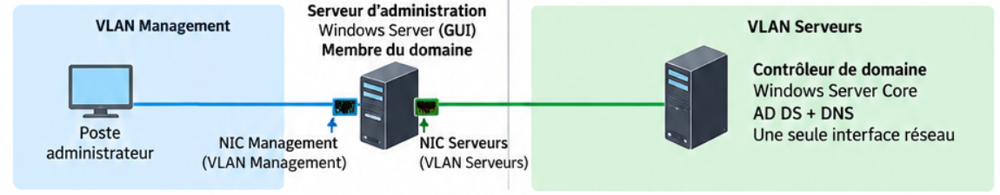

| Machine | VLAN Management | VLAN Serveurs | Fonction |
|---|:---:|:---:|---|
| Machine d’administration Windows GUI | ✓ | ✓ | Administration |
| `PRF-DC01` Server Core | — | ✓ | AD DS + DNS |

!!! important "Le point essentiel"

    Le contrôleur de domaine **n’a pas besoin d’une interface dans le VLAN Management**.

    La machine d’administration possède les deux interfaces, mais **elle ne route pas** le trafic entre les VLAN.

Le déroulement d’une administration est le suivant :

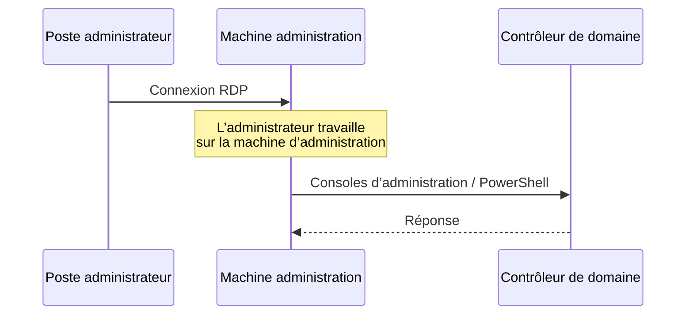

La connexion RDP **s’arrête sur la machine d’administration**. Les outils exécutés sur celle-ci établissent ensuite leurs propres communications avec le DC depuis le VLAN Serveurs.

<quiz>
Comment le DC Core est-il administré ?

- [ ] Il possède une deuxième interface dans le VLAN Management
- [ ] La machine d’administration route la connexion RDP jusqu’au DC
- [x] L’administrateur travaille sur la machine d’administration, dont les outils communiquent ensuite avec le DC
- [ ] Le DC est déplacé temporairement dans le VLAN Management
</quiz>

---

### Pourquoi Windows Server Core ?

Le contrôleur de domaine fournit un **service d’infrastructure**. Il n’a pas besoin d’un environnement graphique complet.

Cette architecture permet de distinguer :

```text
serveur qui fournit le service
            ≠
machine depuis laquelle on l’administre
```

Sur `PRF-DC01`, on installe les **rôles serveur** :

```text
PRF-DC01
├── AD DS
└── DNS
```

Sur la machine Windows GUI, on installe les **fonctionnalités et outils d’administration** nécessaires.

Cette machine doit ensuite être **membre du domaine**.

L’administrateur y utilise principalement :

- les outils graphiques Windows pour Active Directory ;
- la gestion DNS ;
- la gestion des stratégies de groupe ;
- PowerShell.

??? info "RSAT"

    Windows regroupe plusieurs outils d’administration distante sous le nom **RSAT** (*Remote Server Administration Tools*).

    Ce terme n’est pas à mémoriser ici. Retenez surtout : **les rôles sont sur les serveurs ; les outils d’administration sont sur la machine GUI**.

??? info "Proxmox : VirtIO et QEMU Guest Agent"

    Avec Windows Server 2022 sous Proxmox, des pilotes **VirtIO** peuvent être nécessaires pour certains périphériques virtualisés.

    Avec Windows Server 2025, certains pilotes peuvent être directement reconnus, mais il faut toujours vérifier les périphériques réellement disponibles.

    Le **QEMU Guest Agent** reste utile pour les échanges avec l’hyperviseur et la remontée de certaines informations.

    Ce point concerne l’intégration de la VM dans Proxmox, pas Active Directory lui-même.

---

### Nommage et conventions

**Les noms doivent être définis avant toute installation ou promotion du domaine.**

Utilisez le préfixe prévu pour votre infrastructure. Dans les exemples du support, on utilise :

```text
PRF
```

Exemples de noms de machines :

```text
PRF-DC01     → premier contrôleur de domaine
PRF-DC02     → deuxième contrôleur de domaine
PRF-ADM01    → machine d’administration
```

Le domaine Active Directory utilise le **nom DNS prévu dans la documentation du projet**.

Le nom NetBIOS du domaine reprend le préfixe :

```text
Nom DNS du domaine : <nom défini dans la documentation>
Nom NetBIOS        : PRF
```

!!! danger "Pas de domaine en `.local`"

    N’inventez pas un domaine tel que :

    ```text
    prf.local
    entreprise.local
    ad.local
    ```

    Utilisez le **nom de domaine prévu dans la documentation**.

    Le suffixe `.local` est notamment utilisé par **mDNS** et n’est pas conforme à l’architecture demandée.

!!! danger "Vérifiez avant la promotion"

    Une erreur sur le nom d’une VM se corrige facilement.

    Une erreur sur le **nom du domaine Active Directory** au moment de créer la forêt est d’une autre nature.

    Vérifiez donc avant la promotion :

    - le nom du serveur ;
    - le nom DNS du domaine ;
    - le nom NetBIOS ;
    - l’adressage IPv4 ;
    - le VLAN ;
    - la passerelle ;
    - la configuration DNS.

<quiz>
Quel nom de domaine devez-vous utiliser ?

- [ ] `prf.local`
- [ ] Un nom choisi librement au moment de l’installation
- [x] Le nom DNS prévu dans la documentation du projet
- [ ] Le nom du VLAN Serveurs
</quiz>

---

### Préparer le contrôleur de domaine Core

La configuration de base de Windows Server Core a déjà été vue l’année dernière.

Utilisez **SConfig** :

```powershell
SConfig
```

Configurez et vérifiez :

- le nom du serveur ;
- l’adresse IPv4 statique ;
- le préfixe réseau ;
- la passerelle ;
- le DNS ;
- la date et l’heure ;
- les paramètres nécessaires à l’administration distante.

---

### Installer AD DS et créer le domaine

Installez le rôle **Active Directory Domain Services** :

```powershell
Install-WindowsFeature AD-Domain-Services -IncludeManagementTools
```

Vérifiez l’installation :

```powershell
Get-WindowsFeature AD-Domain-Services
```

Le premier contrôleur de domaine crée la **première forêt** et son **premier domaine** :

```powershell
Install-ADDSForest `
    -DomainName "<nom-du-domaine>" `
    -DomainNetbiosName "PRF" `
    -InstallDNS
```

Remplacez `<nom-du-domaine>` par le nom défini dans la documentation.

La commande demande notamment le mot de passe **DSRM** (*Directory Services Restore Mode*), puis le serveur redémarre après la promotion.

Après redémarrage :

```powershell
Get-ADDomain
Get-ADForest
Get-ADDomainController -Filter *
Get-Service DNS
```

<quiz>
Quelle commande crée la première forêt Active Directory ?

- [ ] `New-ADUser`
- [ ] `Install-WindowsFeature DNS`
- [x] `Install-ADDSForest`
- [ ] `Get-ADForest`
</quiz>

---

### Pourquoi Active Directory a besoin de DNS ?

DNS est une brique fondamentale d’Active Directory.

Un poste ne doit pas seulement connaître l’adresse IP d’un contrôleur de domaine : il doit pouvoir **localiser les services du domaine**.

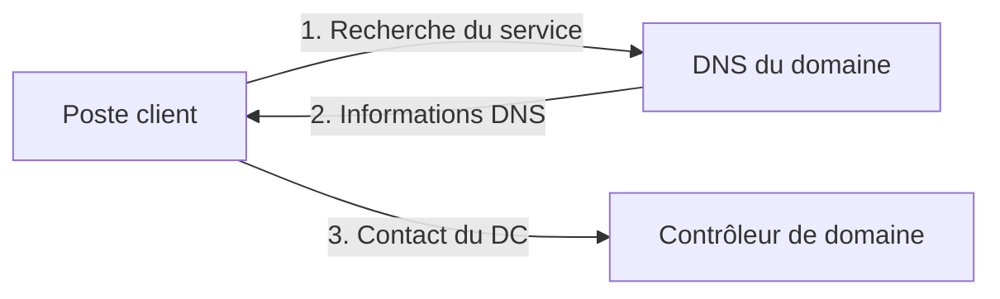

Active Directory publie notamment des enregistrements **SRV** permettant aux clients de localiser ses services.

!!! important "DNS des membres du domaine"

    Les machines membres du domaine doivent utiliser le **DNS Active Directory**.

    Un DNS public comme `8.8.8.8` ou `1.1.1.1` ne connaît pas les informations privées du domaine.

L’architecture attendue est :

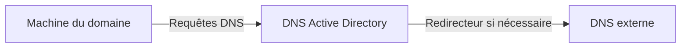

Le DNS AD répond pour les zones qu’il connaît et peut utiliser un **redirecteur** pour les autres requêtes.

!!! danger "Un DNS public n’est pas un DNS de secours pour AD"

    Si un deuxième DNS est configuré sur un membre du domaine, il doit lui aussi être capable de résoudre correctement le domaine Active Directory.

<quiz>
Pourquoi une machine membre du domaine doit-elle utiliser le DNS Active Directory ?

- [ ] Uniquement pour accéder à Internet
- [x] Pour pouvoir notamment localiser les services du domaine
- [ ] Pour recevoir son adresse MAC
- [ ] Pour remplacer DHCP
</quiz>

---

### Joindre la machine d’administration au domaine

Une fois le domaine et DNS fonctionnels, la **machine d’administration Windows GUI** peut rejoindre le domaine.

Avant la jonction, vérifiez :

- son nom : par exemple `PRF-ADM01` ;
- son adressage ;
- son accès au VLAN Serveurs ;
- sa configuration DNS : elle doit utiliser le **DNS Active Directory** ;
- la résolution du nom du domaine ;
- la cohérence de l’heure.

!!! warning "Le ping n'est pas un test suffisant"

    Dans l'architecture SportLudique, le **pare-feu interne bloque par défaut
    les requêtes ICMP Echo**.

    L'absence de réponse à un `ping` vers le contrôleur de domaine ne signifie
    donc pas nécessairement que celui-ci est inaccessible ou en panne.

    Pour faciliter la mise en place et le diagnostic, les requêtes
    **ICMP Echo pourront être autorisées temporairement** entre la machine
    d'administration et le VLAN Serveurs.

    Cette autorisation devra être supprimée lorsque les tests seront terminés.

    Pour rejoindre le domaine, il faut surtout vérifier que la machine :

    - utilise le **DNS Active Directory** ;
    - résout correctement le nom du domaine ;
    - peut joindre les **services Active Directory nécessaires** à travers le pare-feu ;
    - possède une heure cohérente avec le domaine.


Une fois membre du domaine, cette machine devient le **poste de travail d’administration Windows** de l’infrastructure.

---

### Administrer Active Directory

L’administrateur se connecte en **RDP** sur la machine d’administration Windows GUI.

Depuis cette interface graphique, il peut gérer notamment :

- les utilisateurs et les groupes ;
- les ordinateurs ;
- les unités d’organisation ;
- DNS ;
- les stratégies de groupe.

Les rôles **AD DS et DNS restent sur le contrôleur de domaine Core**. La machine d’administration ne fait qu’héberger les outils permettant de les gérer.

Pour certaines opérations, PowerShell peut également être utilisé.

Par exemple, pour ouvrir une session PowerShell distante sur le DC :

```powershell
Enter-PSSession PRF-DC01
```

PowerShell Remoting s’appuie notamment sur **WinRM** :

```text
TCP 5985 → WinRM HTTP
TCP 5986 → WinRM HTTPS
```

!!! warning "WinRM ne résume pas toute l’administration Windows"

    Les outils graphiques d’administration peuvent utiliser d’autres protocoles.

    Ne retenez donc pas : « `5985/5986` sont ouverts, toute l’administration Windows fonctionnera ».

---

### Utilisateurs, groupes, ordinateurs et OU

Active Directory stocke différents types d’objets :

- **utilisateurs** : identités des personnes ;
- **groupes** : regroupement d’identités pour faciliter l’attribution des droits ;
- **ordinateurs** : machines membres du domaine ;
- **OU** (*Organizational Units*) : organisation administrative des objets.

Exemple :

```text
Domaine
├── Utilisateurs
│   ├── Direction
│   ├── Informatique
│   └── Employés
├── Postes
├── Serveurs
└── Groupes
```

!!! warning "Une OU n’est pas un dossier décoratif"

    L’organisation des OU doit répondre à des besoins d’administration.

    Il ne s’agit pas de reproduire mécaniquement tout l’organigramme de l’entreprise.

Une bonne pratique consiste à attribuer les permissions à des **groupes** plutôt que directement à chaque utilisateur.

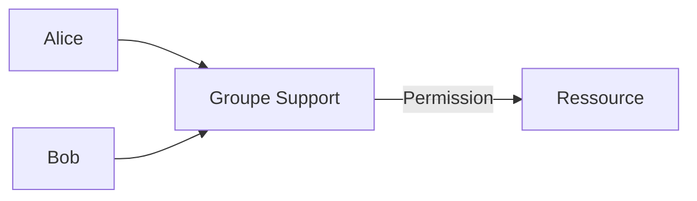

---

### Les stratégies de groupe

Les **GPO** (*Group Policy Objects*) permettent d’appliquer des paramètres aux utilisateurs et aux ordinateurs du domaine.

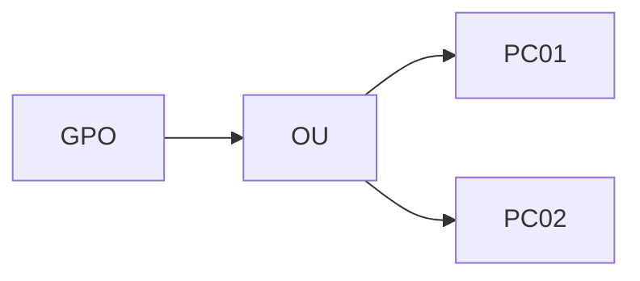

Au niveau Socle, retenez surtout que le domaine permet une **Gestion des Configurations (ITIL)** des configurations.

---

### Authentification centralisée

Lorsqu’un utilisateur utilise un compte du domaine, son identité est vérifiée par l’infrastructure Active Directory.

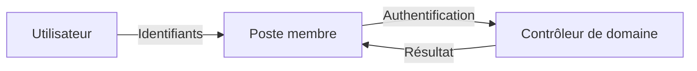

!!! note "Pas encore les tickets"

    Au niveau Socle, vous devez comprendre **qui authentifie qui**.

    Le fonctionnement détaillé de Kerberos et des tickets est étudié au niveau **Expertise**.

---

### Ce que vous devez être capables d’expliquer

À la fin du Socle, vous devez être capables d’expliquer :

- le rôle d’**AD DS**, du **contrôleur de domaine** et de **DNS** ;
- pourquoi le DC Core possède **une seule interface dans le VLAN Serveurs** ;
- le rôle de la **machine d’administration Windows GUI** ;
- pourquoi cette machine doit être **membre du domaine** ;
- la différence entre **rôle serveur** et **outil d’administration** ;
- pourquoi le nom du domaine doit être défini **avant sa création** ;
- pourquoi les membres du domaine utilisent le **DNS Active Directory** ;
- le rôle des utilisateurs, groupes, ordinateurs, OU et GPO ;
- le principe général de l’authentification centralisée.

---

## Concepts avancés

### Le problème d’un seul contrôleur de domaine

Le socle commence volontairement avec un seul DC.

Cela permet de mettre en place et de comprendre l’infrastructure avant d’ajouter de la redondance.

Mais l’architecture possède alors une faiblesse évidente :

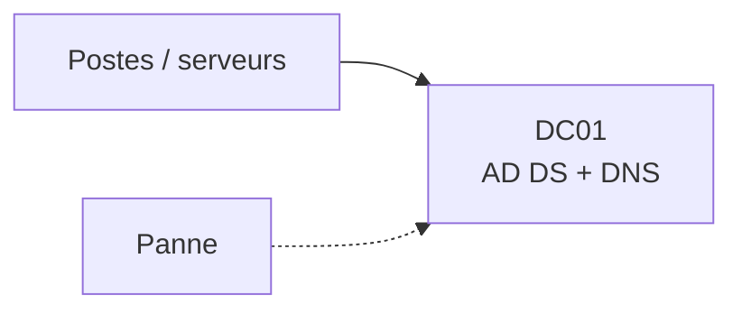

Si ce serveur ou son hyperviseur devient indisponible, les services Active Directory et DNS qu’il fournit sont affectés.

---

### Ajouter un deuxième contrôleur de domaine

Le niveau avancé consiste à ajouter un **deuxième contrôleur de domaine**.

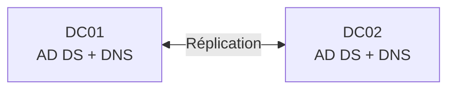

Les contrôleurs de domaine répliquent les informations de l’annuaire.

!!! warning "Pas « principal / secondaire »"

    Active Directory fonctionne en **multi-maître pour la majorité des modifications**.

    Il ne faut donc pas réduire l’architecture à l’ancien modèle :

    ```text
    serveur principal
    serveur secondaire
    ```

---

### Placer les deux DC sur des infrastructures différentes

Deux VM contrôleurs de domaine placées sur le **même hyperviseur** restent dépendantes de cet hyperviseur.

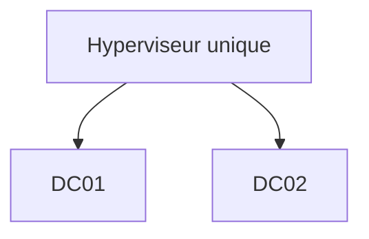

Une panne de l’hyperviseur peut alors rendre les deux DC indisponibles simultanément.

Dans SportLudique, le deuxième contrôleur de domaine doit donc être hébergé sur **l’hyperviseur administré par les étudiants**.

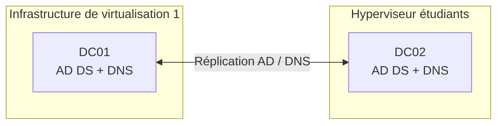

<quiz>
Deux contrôleurs de domaine sont installés sous forme de VM sur le même hyperviseur physique. Quelle limite subsiste ?

- [ ] Les deux DC ne peuvent pas répliquer
- [ ] DNS ne peut fonctionner que sur un seul DC
- [x] La panne de l’hyperviseur peut rendre les deux DC indisponibles
- [ ] Active Directory interdit deux DC virtualisés
</quiz>

---

### Réplication n’est pas sauvegarde

La présence de deux contrôleurs de domaine améliore la disponibilité.

Elle ne remplace pas une stratégie de sauvegarde.

```text
Modification correcte ──► réplication
Suppression accidentelle ──► réplication également
```

!!! danger

    **Réplication ≠ sauvegarde**

    Une donnée supprimée ou modifiée par erreur peut être répliquée sur les autres contrôleurs de domaine.

---

### DNS redondant

Lorsque les deux contrôleurs de domaine assurent également DNS, les clients disposent de plusieurs serveurs DNS capables de résoudre le domaine.

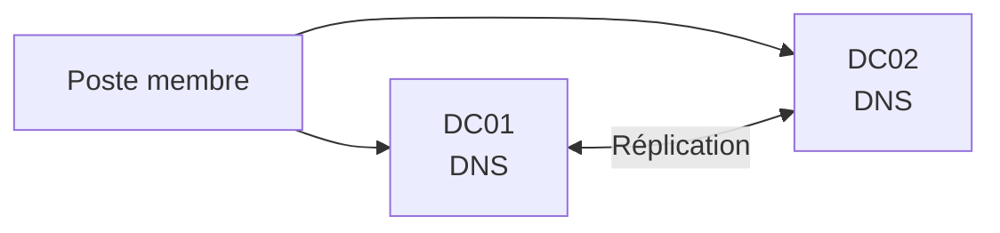

Cette architecture est très différente de :

```text
DNS 1 : DC01
DNS 2 : 8.8.8.8
```

Le deuxième serveur DNS doit lui aussi connaître le domaine Active Directory.

---

### DNS intégré à Active Directory

Les zones DNS utilisées par Active Directory peuvent être **intégrées à l’annuaire**.

Les informations DNS concernées peuvent alors bénéficier du mécanisme de réplication Active Directory.

Cela permet d’éviter de gérer séparément une copie primaire et des copies secondaires traditionnelles pour ces zones.

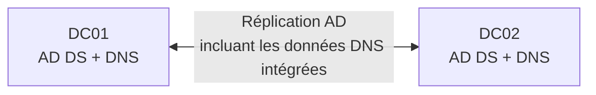

---

### Le catalogue global

Un contrôleur de domaine peut également assurer le rôle de **Global Catalog**.

Le catalogue global contient des informations permettant notamment de rechercher des objets dans une forêt Active Directory.

Dans une infrastructure simple ne contenant qu’un domaine, cette notion peut sembler peu visible.

Elle devient plus importante lorsque l’architecture Active Directory grandit.

---

### Les rôles FSMO

Active Directory fonctionne majoritairement selon un modèle multi-maître.

Certaines opérations doivent cependant rester associées à un contrôleur de domaine particulier.

Ces fonctions sont appelées **rôles FSMO** (*Flexible Single Master Operations*).

Il existe cinq rôles FSMO.

??? info "Les cinq rôles FSMO"

    Au niveau de la forêt :

    - **Schema Master** ;
    - **Domain Naming Master**.

    Au niveau du domaine :

    - **RID Master** ;
    - **PDC Emulator** ;
    - **Infrastructure Master**.

Au niveau avancé, l’objectif n’est pas de mémoriser mécaniquement les cinq noms.

Vous devez surtout comprendre pourquoi :

```text
Active Directory multi-maître
              ≠
absolument toutes les opérations multi-maîtres
```

---

### Organiser les objets pour les administrer

Les OU et les groupes doivent être conçus en fonction des besoins d’administration.

Une arborescence simple et justifiable est préférable à une structure complexe impossible à maintenir.

Exemple :

```text
Domaine
├── Utilisateurs
│   ├── Direction
│   ├── Informatique
│   └── Employés
├── Postes
├── Serveurs
└── Groupes
```

Le choix réel dépendra des besoins de l’organisation et des stratégies à appliquer.

---

### GPO : raisonner sur la portée

Une GPO n’est utile que si l’on comprend **à quels objets elle s’applique**.

Avant de créer une GPO, il faut pouvoir répondre à :

```text
Quel paramètre ?
      ↓
Pour quels objets ?
      ↓
À quel niveau ?
      ↓
Pourquoi ?
```

L’objectif n’est pas de multiplier les GPO, mais d’obtenir une configuration compréhensible et maintenable.

<quiz>
Une GPO doit configurer uniquement les serveurs du domaine. Quelle démarche est la plus cohérente ?

- [ ] Lier systématiquement toutes les GPO à la racine du domaine
- [x] Organiser les objets afin de pouvoir cibler les machines concernées
- [ ] Créer un domaine Active Directory supplémentaire
- [ ] Modifier manuellement chaque serveur
</quiz>

---

### Ce que vous devez être capables d’expliquer

À la fin du niveau avancé, vous devez être capables d’expliquer :

- pourquoi un seul DC constitue une dépendance importante ;
- l’intérêt d’un deuxième contrôleur de domaine ;
- pourquoi les deux DC doivent idéalement dépendre d’infrastructures différentes ;
- le principe de réplication Active Directory ;
- pourquoi réplication et sauvegarde sont deux notions différentes ;
- comment obtenir une meilleure disponibilité DNS ;
- le principe d’une zone DNS intégrée à Active Directory ;
- ce qu’est le Global Catalog ;
- pourquoi des rôles FSMO existent malgré le fonctionnement multi-maître ;
- pourquoi la structure des OU doit être pensée en fonction de l’administration ;
- comment raisonner sur la portée d’une GPO.

---

## Expertise

### Forêt, arbre, domaine et OU

Jusqu'ici, nous avons principalement travaillé avec **un domaine**. Une architecture Active Directory plus importante nécessite de distinguer plusieurs niveaux logiques.

```text
Forêt
└── Arbre
    └── Domaine
        ├── OU
        ├── utilisateurs
        ├── groupes
        └── ordinateurs
```

#### Le domaine

Un **domaine** regroupe des objets Active Directory dans une même structure logique et possède un nom DNS, par exemple :

```text
<nom-du-domaine>
```

Plusieurs contrôleurs de domaine peuvent héberger et répliquer **le même domaine**.

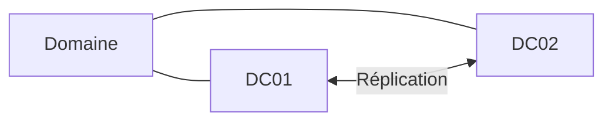

#### La forêt

La **forêt** est la structure logique Active Directory de plus haut niveau.

Lorsque le premier DC est créé avec `Install-ADDSForest`, on crée simultanément :

- une nouvelle forêt ;
- son premier domaine.

Une forêt peut ne contenir qu'un seul domaine.

#### L'arbre

Un **arbre de domaines** correspond à des domaines partageant un espace de noms DNS hiérarchique continu.

Exemple théorique :

```text
exemple.fr
├── france.exemple.fr
└── europe.exemple.fr
```

Comprendre cette notion ne signifie pas qu'il faut multiplier les domaines dans SportLudique.

!!! warning "Site physique ≠ domaine"

    Un nouveau bâtiment, un nouveau VLAN ou une nouvelle ville ne justifie pas automatiquement la création d'un nouveau domaine.

    La **topologie réseau**, les **sites physiques** et la **structure logique Active Directory** sont des notions différentes.

#### Une OU n'est pas un domaine

Les **OU** servent à organiser et administrer les objets **à l'intérieur d'un domaine**.

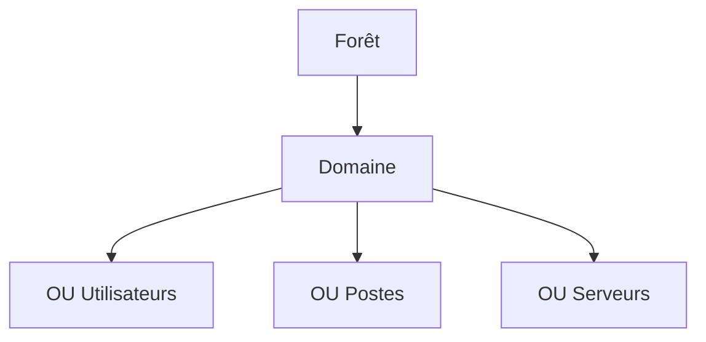

Créer une OU portant le nom d’un site ne crée pas un nouveau domaine.

<quiz>
Une entreprise ouvre un nouveau site physique. Faut-il automatiquement créer un nouveau domaine Active Directory ?

- [ ] Oui, un domaine est obligatoire par ville
- [ ] Oui, un domaine est obligatoire par VLAN
- [x] Non, un domaine supplémentaire doit répondre à un besoin logique ou administratif réel
- [ ] Oui, sinon DNS ne fonctionne pas
</quiz>

<quiz>
Quelle structure constitue le niveau logique le plus élevé ?

- [ ] Une OU
- [ ] Un domaine
- [x] Une forêt
- [ ] Un groupe
</quiz>

---


### Comprendre réellement l’authentification

Au niveau Socle, nous avons résumé l’authentification ainsi :

```text
Utilisateur → poste → contrôleur de domaine
```

Cette représentation est suffisante pour comprendre le rôle général du DC, mais elle masque le mécanisme utilisé.

Dans un domaine Active Directory moderne, **Kerberos** joue un rôle central dans l’authentification.

Pour comprendre Kerberos, il faut introduire la notion de **ticket**.

---

### Pourquoi des tickets ?

Une mauvaise représentation serait d’imaginer que le mot de passe de l’utilisateur est envoyé à chaque serveur auquel il souhaite accéder.

Kerberos utilise au contraire un mécanisme permettant à l’utilisateur authentifié d’obtenir des éléments qu’il pourra présenter pour accéder aux services.

L’idée générale devient :

```text
Je prouve mon identité
        │
        ▼
J’obtiens un moyen de demander
des accès à des services
        │
        ▼
J’obtiens un ticket pour
un service particulier
        │
        ▼
Je présente ce ticket au service
```

---

### Le KDC

Le **KDC** (*Key Distribution Center*) est le service Kerberos chargé de délivrer les tickets.

Dans Active Directory, ce service est assuré par les contrôleurs de domaine.

On distingue notamment deux fonctions :

- **AS** : *Authentication Service* ;
- **TGS** : *Ticket Granting Service*.

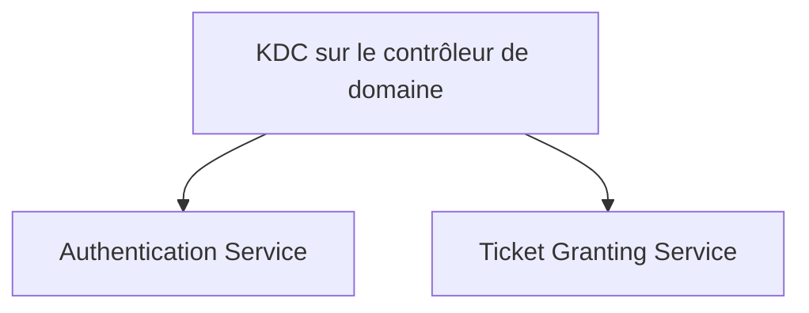

---

### Le TGT

Après l’authentification initiale, l’utilisateur peut obtenir un **TGT** (*Ticket Granting Ticket*).

Ce ticket ne donne pas directement accès à tous les serveurs.

Il permet de demander au KDC des tickets pour des services particuliers.

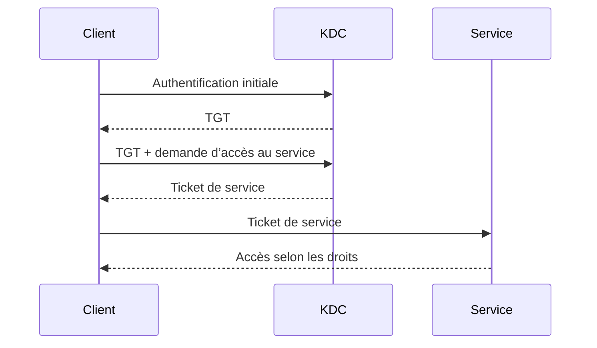

!!! important

    Le TGT n’est pas « le ticket qui ouvre toutes les portes ».

    Il sert à obtenir auprès du KDC les tickets nécessaires pour des services précis.

---

### Ticket de service

Lorsqu’un utilisateur souhaite accéder à un service, son poste demande un ticket correspondant à ce service.

Le client présente ensuite ce ticket au serveur concerné.

On obtient donc trois acteurs essentiels :

```text
Client
  │
  ├──── KDC : obtenir les tickets
  │
  └──── Service : présenter le ticket
```

Cette architecture permet notamment de ne pas transmettre le mot de passe de l’utilisateur à chaque service utilisé.

<quiz>
À quoi sert principalement le TGT dans Kerberos ?

- [ ] À remplacer le serveur DNS
- [ ] À donner directement accès à tous les fichiers du domaine
- [x] À permettre au client de demander des tickets pour différents services
- [ ] À attribuer une adresse IP au client
</quiz>

---

### Kerberos et DNS

Kerberos et Active Directory dépendent fortement d’une résolution DNS correcte.

Avant de contacter les services nécessaires, le client doit être capable de les localiser.

On retrouve donc la chaîne étudiée depuis le Socle :

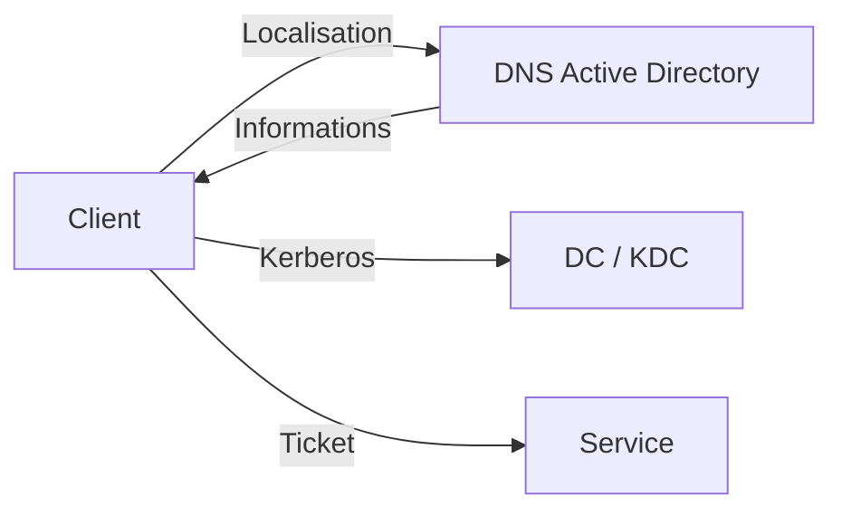

Une mauvaise configuration DNS peut donc produire des symptômes qui ressemblent à des problèmes d’authentification.

---

### Kerberos et l’heure

Kerberos utilise également la notion de temps dans ses mécanismes de sécurité.

Les machines du domaine doivent donc disposer d’horloges correctement synchronisées.

Cela explique pourquoi la synchronisation de l’heure n’est pas un simple détail d’exploitation.

```text
DNS correct
    +
heure cohérente
    +
services AD disponibles
    ↓
conditions nécessaires au bon fonctionnement
de l’authentification du domaine
```

---

### SPN : identifier un service

Kerberos doit pouvoir identifier le service pour lequel un ticket est demandé.

Les **SPN** (*Service Principal Names*) permettent d’identifier des instances de services associées à des comptes Active Directory.

La notion devient importante lorsqu’on cherche à comprendre pourquoi Kerberos fonctionne pour un service mais échoue pour un autre.

??? info "À retenir sur les SPN"

    Au niveau Expertise, retenez surtout :

    - un ticket Kerberos est demandé pour un **service identifié** ;
    - ce service est associé à un **SPN** ;
    - une configuration incorrecte ou dupliquée des SPN peut provoquer des problèmes d’authentification.

---

### LDAP et LDAPS

Active Directory est un **service d’annuaire**. Les applications peuvent interroger cet annuaire avec **LDAP** (*Lightweight Directory Access Protocol*).

LDAP peut notamment servir à :

- rechercher un utilisateur ;
- rechercher un groupe ;
- lire certains attributs de l’annuaire ;
- permettre à une application de s’appuyer sur Active Directory pour l’identification ou l’autorisation.

On rencontre notamment :

```text
LDAP   → TCP 389
LDAPS  → TCP 636
```

Mais il faut distinguer plusieurs notions :

| Mécanisme | Idée générale |
|---|---|
| LDAP | protocole d’accès à l’annuaire |
| LDAPS | LDAP protégé par TLS dès l’établissement de la connexion |
| LDAP + mécanismes de signature/chiffrement | sécurisation possible d’une session LDAP sans simplement raisonner « port 389 = non sécurisé » |

!!! warning "Ne pas retenir une règle trop simpliste"

    `389 = dangereux` et `636 = sécurisé` serait une mauvaise conclusion.

    Il faut s’intéresser au **mécanisme d’authentification**, à la **signature**, au **chiffrement** et à la validation du certificat lorsqu’un canal TLS est utilisé.

#### Pourquoi cette question devient importante avec Windows Server 2025 ?

Les versions récentes de Windows Server renforcent progressivement les exigences de sécurité autour des communications LDAP.

Avec **Windows Server 2025**, il devient particulièrement pertinent de vérifier les applications ou équipements qui utilisent encore des liaisons LDAP insuffisamment protégées.

Avant de connecter une application à Active Directory, vous devez donc vous demander :

```text
Application
    │
    ├── Quel protocole utilise-t-elle ?
    ├── Comment s’authentifie-t-elle ?
    ├── La communication est-elle signée ?
    ├── Est-elle chiffrée ?
    └── Si TLS est utilisé, le certificat est-il valide ?
```

Cela concerne par exemple :

- une application Web utilisant l’annuaire ;
- GLPI ;
- un hyperviseur ;
- un pare-feu ;
- un NAS ;
- un outil de supervision ;
- une application métier.

#### LDAPS et certificats

Pour proposer LDAPS, le contrôleur de domaine doit disposer d’un certificat adapté.

On introduit alors une nouvelle dépendance :

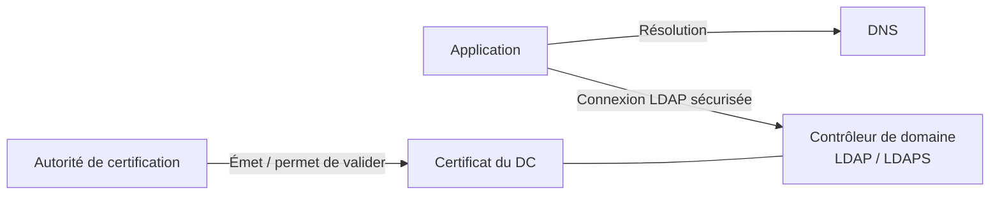

Cela permet de faire le lien avec une future infrastructure **PKI / AD CS**.

!!! note "Ce qu’il faut comprendre"

    Utiliser LDAPS ne consiste pas simplement à remplacer `389` par `636`.

    Il faut également que le client puisse **faire confiance au certificat présenté par le contrôleur de domaine**.

<quiz>
Une application utilise LDAP pour interroger Active Directory. Quelle démarche est la plus pertinente ?

- [ ] Autoriser TCP 389 depuis tous les VLAN
- [ ] Remplacer systématiquement 389 par 636 sans autre vérification
- [x] Identifier le mécanisme d’authentification et vérifier la protection de la communication
- [ ] Installer un deuxième contrôleur de domaine
</quiz>

<quiz>
Une application tente une connexion LDAPS vers un contrôleur de domaine mais refuse son certificat. Quel élément faut-il notamment vérifier ?

- [ ] Le serveur DHCP
- [x] La chaîne de confiance et le certificat présenté par le contrôleur de domaine
- [ ] Le nombre d’OU du domaine
- [ ] Le rôle FSMO RID Master
</quiz>

---

### Comptes de service

Certaines applications et certains services doivent eux-mêmes s’exécuter avec une identité.

Créer un compte utilisateur classique avec un mot de passe qui n’expire jamais est une solution simple mais peu satisfaisante.

Active Directory propose des mécanismes plus adaptés aux **comptes de service**.

??? info "gMSA"

    Les **gMSA** (*Group Managed Service Accounts*) permettent notamment à Active Directory de gérer automatiquement certains aspects du mot de passe d’un compte de service.

    Cette notion est particulièrement intéressante lorsque plusieurs serveurs ou services doivent utiliser une identité gérée proprement.

---

### RODC

Dans certaines architectures, un site distant peut avoir besoin d’un contrôleur de domaine local sans que l’on souhaite y placer une copie modifiable classique de l’annuaire.

Un **RODC** (*Read-Only Domain Controller*) fournit une copie en lecture seule de l’annuaire.

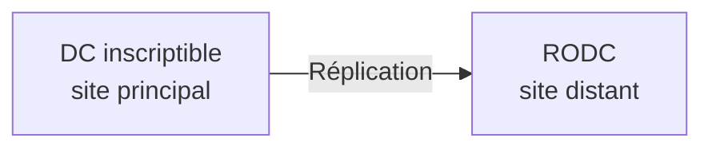

Le RODC répond à des besoins particuliers.

Il ne doit pas être ajouté simplement pour pouvoir dire que l’architecture contient « un type de DC supplémentaire ».

---

### Diagnostiquer plutôt que redémarrer

Au niveau Expertise, le diagnostic doit relier les différentes briques.

Lorsqu’un utilisateur ne parvient pas à accéder à une ressource du domaine, on peut raisonner sur la chaîne :

```text
Configuration IP
      ↓
DNS
      ↓
Localisation du domaine
      ↓
Synchronisation de l’heure
      ↓
Authentification Kerberos
      ↓
Ticket du service
      ↓
Droits sur la ressource
```

L’objectif est de déterminer **à quelle étape le fonctionnement attendu s’interrompt**.

<quiz>
Un utilisateur ouvre correctement sa session sur le domaine mais l’accès à un service utilisant Kerberos échoue. Quelle conclusion est la plus rigoureuse ?

- [ ] Active Directory est forcément totalement en panne
- [ ] Le mot de passe de l’utilisateur est forcément faux
- [x] L’authentification initiale fonctionne ; il faut poursuivre le diagnostic sur la localisation, le ticket du service et les droits
- [ ] Il faut immédiatement recréer le domaine
</quiz>

---

### Ce que vous devez être capables d’expliquer

À la fin du niveau Expertise, vous devez être capables d’expliquer :

- le rôle général de Kerberos ;
- pourquoi Kerberos utilise des tickets ;
- le rôle du KDC ;
- la différence entre TGT et ticket de service ;
- pourquoi le mot de passe n’est pas envoyé à chaque service ;
- le lien entre DNS et Kerberos ;
- l’importance de la synchronisation de l’heure ;
- le principe d’un SPN ;
- le rôle de LDAP et la différence générale avec LDAPS ;
- pourquoi les comptes de service nécessitent une gestion particulière ;
- le principe d’un gMSA ;
- le rôle possible d’un RODC ;
- comment construire une démarche de diagnostic reliant DNS, Kerberos et les droits.

---

## Synthèse

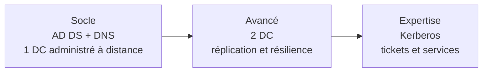

| Niveau | Objectif principal |
|---|---|
| **Socle obligatoire** | Comprendre et déployer un domaine AD DS/DNS administré proprement |
| **Concepts avancés** | Rendre AD/DNS plus disponible et comprendre sa réplication |
| **Expertise** | Comprendre les mécanismes d’authentification et les services avancés |

!!! success "Le point à retenir"

    Un contrôleur de domaine n’a pas besoin d’être directement connecté au VLAN Management pour être administrable.

    Dans l’architecture SportLudique :

    **l’administrateur entre sur le serveur d’administration par le VLAN Management ; le serveur d’administration contacte ensuite le DC par le VLAN Serveurs.**

    Le DC conserve ainsi **une seule interface réseau**, dédiée au réseau des serveurs.
