# 02- Active Directory, DNS et contrôleurs de domaine

L’objectif de cette partie est de mettre en place le **domaine Active Directory du site** et de comprendre les services qui permettent son fonctionnement.

L’installation d’Active Directory ne consiste pas simplement à ajouter le rôle **AD DS** puis à cliquer sur « promouvoir ce serveur en contrôleur de domaine ».

Avant toute installation, vous devez être capables de répondre à plusieurs questions :

- quel sera le **nom du domaine** ?
- quel serveur assurera le rôle de **contrôleur de domaine** ?
- quel sera le rôle de **DNS** ?
- comment les postes retrouveront-ils le contrôleur de domaine ?
- comment le contrôleur de domaine sera-t-il **administré à distance** ?
- que se passera-t-il si le contrôleur de domaine devient indisponible ?

---

## Socle obligatoire

### Pourquoi un domaine ?

Dans une infrastructure composée de plusieurs machines, gérer séparément les utilisateurs et les droits sur chaque poste devient rapidement difficile.

Sans annuaire centralisé :

```text
PC01 ── utilisateurs locaux
PC02 ── utilisateurs locaux
PC03 ── utilisateurs locaux
SRV1 ── utilisateurs locaux
SRV2 ── utilisateurs locaux
```

Chaque machine possède alors sa propre base de comptes.

Active Directory permet de centraliser notamment :

- les utilisateurs ;
- les groupes ;
- les ordinateurs ;
- les règles appliquées aux machines et aux utilisateurs ;
- l’authentification au sein du domaine.

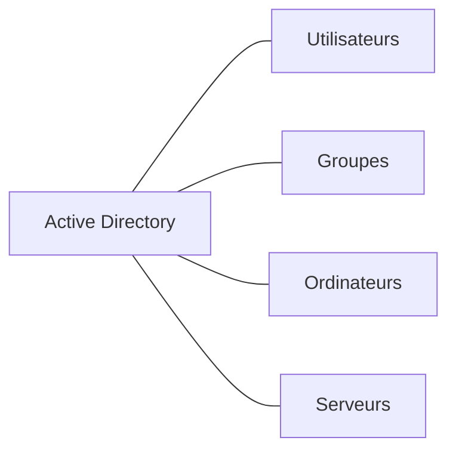

!!! note "Un annuaire"

    Active Directory est avant tout un **service d’annuaire**.

    Il permet de stocker et d’organiser des informations sur les objets du système d’information et de les utiliser pour l’authentification et l’administration.

<quiz>
Quel est l’un des principaux intérêts d’un domaine Active Directory ?

- [ ] Donner automatiquement un accès Internet aux postes
- [x] Centraliser la gestion des identités et des machines du domaine
- [ ] Remplacer le pare-feu
- [ ] Fournir une adresse IP publique aux serveurs
</quiz>

---

### Active Directory Domain Services

Le rôle Windows Server utilisé pour mettre en place l’annuaire est **Active Directory Domain Services**, généralement abrégé **AD DS**.

Un serveur sur lequel AD DS est installé et qui a été promu devient un **contrôleur de domaine** ou **DC** (*Domain Controller*).

Le contrôleur de domaine participe notamment :

- au stockage de l’annuaire ;
- à l’authentification ;
- à l’application des mécanismes liés au domaine ;
- à la localisation des ressources Active Directory avec l’aide du DNS.

Dans le projet SportLudique, le premier contrôleur de domaine assure également le service **DNS** nécessaire au domaine.

---

### Architecture du socle

Le premier contrôleur de domaine est installé sous **Windows Server Core**.

Il possède volontairement **une seule interface réseau**, placée dans le **VLAN Serveurs**.

Il n’est donc **pas directement connecté au VLAN Management**.

L’administration s’appuie sur le serveur d’administration mis en place dans la partie précédente.

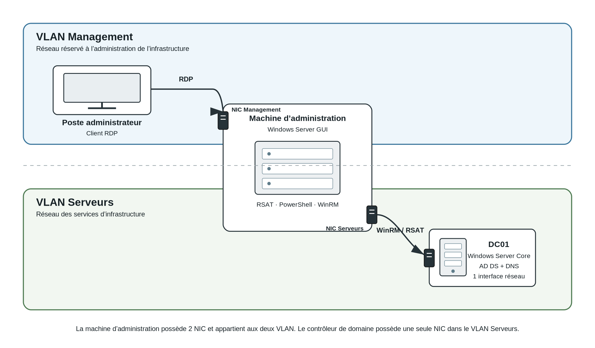


*La machine d’administration possède deux interfaces réseau : une dans le VLAN Management et une dans le VLAN Serveurs. Le contrôleur de domaine possède une seule interface, dans le VLAN Serveurs.*


Le chemin d’administration est donc :

```text
Poste administrateur
        │
        │ RDP
        ▼
Interface Management
du serveur d’administration
        │
        │ même machine
        ▼
Interface VLAN Serveurs
du serveur d’administration
        │
        │ WinRM / outils d’administration
        ▼
Contrôleur de domaine
Windows Server Core
```

!!! important "Le point essentiel"

    Le contrôleur de domaine **n’a pas besoin d’une deuxième carte réseau dans le VLAN Management**.

    C’est le **serveur d’administration** qui possède une interface dans le VLAN Management et une interface dans le VLAN Serveurs.

    Il reçoit la session d’administration sur son interface Management, puis ses outils d’administration communiquent avec le DC depuis son interface située dans le VLAN Serveurs.

---

### Deux interfaces sur le serveur d’administration, une seule sur le DC

Cette architecture permet de distinguer clairement les rôles.

| Machine | Interface Management | Interface Serveurs |
|---|:---:|:---:|
| Poste administrateur | selon architecture | — |
| Serveur Windows d’administration | ✓ | ✓ |
| Contrôleur de domaine | — | ✓ |

Le serveur d’administration constitue donc le **point intermédiaire** entre l’administrateur et les serveurs Windows.

!!! danger "Ce n’est toujours pas un routeur"

    Le serveur d’administration possède deux interfaces, mais il ne doit pas assurer le routage entre le VLAN Management et le VLAN Serveurs.

    Le trafic n’est pas simplement transféré d’une interface vers l’autre.

    L’administrateur ouvre une session RDP sur le serveur d’administration. Ce sont ensuite **les outils exécutés sur ce serveur** qui établissent de nouvelles communications vers le contrôleur de domaine.

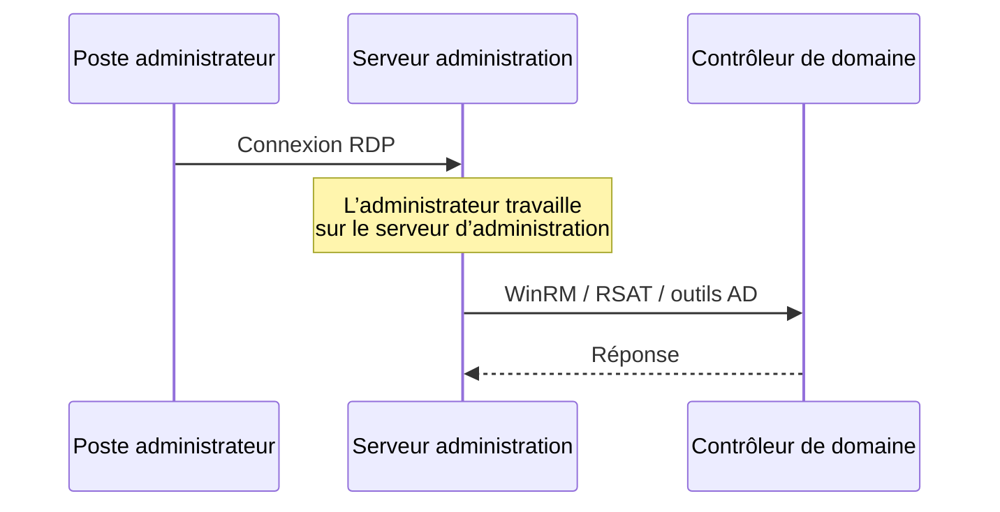

Ce n’est donc pas :

```text
PC ───── paquet routé par ADMIN ─────► DC
```

mais :

```text
PC ── RDP ──► ADMIN

ADMIN ── nouvelle connexion ──► DC
```

<quiz>
Le contrôleur de domaine doit être administré depuis le VLAN Management mais ne possède qu’une interface dans le VLAN Serveurs. Comment l’administration est-elle réalisée ?

- [ ] Le DC doit finalement recevoir une deuxième carte réseau
- [ ] Le serveur d’administration route les paquets du poste vers le DC
- [x] L’administrateur se connecte au serveur d’administration, puis les outils de ce serveur communiquent avec le DC
- [ ] Le DC doit être temporairement déplacé dans le VLAN Management
</quiz>

---

### Pourquoi Windows Server Core ?

Le contrôleur de domaine du socle est installé sous **Windows Server Core**.

Server Core ne fournit pas l’environnement graphique Windows complet habituel.

L’administration doit donc être pensée **à distance**.

Cela permet également de bien distinguer :

```text
le serveur qui fournit le service
              ≠
la machine depuis laquelle on l’administre
```

Le serveur d’administration Windows GUI fournit les outils nécessaires à l’exploitation du domaine.

On peut notamment y utiliser :

- Server Manager ;
- PowerShell ;
- les consoles MMC ;
- les outils RSAT ;
- les outils Active Directory ;
- les outils DNS.

!!! note

    Le but pédagogique n’est pas de rendre l’installation plus pénible.

    Il s’agit de vous obliger à construire un **véritable chemin d’administration** plutôt que d’utiliser systématiquement la console graphique locale du serveur.

---

??? info "Proxmox : Windows Server, VirtIO et QEMU Guest Agent"

    Sur Proxmox, l’installation de Windows Server peut nécessiter des pilotes **VirtIO** pour certains périphériques virtualisés.

    Avec Windows Server 2025, la prise en charge de certains matériels virtualisés peut évoluer, mais il faut toujours **vérifier réellement les périphériques reconnus** dans la VM.

    Ne confondez pas :

    - **VirtIO** : pilotes permettant à Windows d’utiliser les périphériques virtualisés ;
    - **QEMU Guest Agent** : agent permettant des échanges d’informations et certaines opérations entre Proxmox et le système invité.

    Ce point relève de l’intégration de la VM dans Proxmox, pas du fonctionnement d’Active Directory.

---

### WinRM

**WinRM** (*Windows Remote Management*) permet l’administration distante de machines Windows.

Il est notamment utilisé avec PowerShell Remoting et différents outils d’administration.

Les ports généralement associés à WinRM sont :

```text
TCP 5985 → WinRM HTTP
TCP 5986 → WinRM HTTPS
```

Dans notre architecture, les connexions WinRM vers le DC proviennent du **serveur d’administration**, pas directement de tous les postes du réseau.

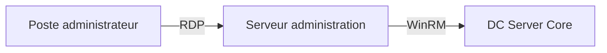

!!! warning

    RSAT et l’administration complète d’Active Directory ne se limitent pas aux seuls ports WinRM.

    WinRM représente ici le mécanisme d’administration distante Windows. Les différents outils AD, DNS ou MMC peuvent utiliser d’autres protocoles.

---

### Nommer le domaine avant de l’installer

Le nom du domaine Active Directory doit être défini **avant la promotion du premier contrôleur de domaine**.

SportLudique utilise le domaine public :

```text
sportludique.fr
```

Chaque site utilise un sous-domaine dédié.

| Site | Domaine Active Directory | NetBIOS |
|---|---|---|
| Chartres | `cha.chartres.sportludique.fr` | `CHA` |
| Tours | `trs.tours.sportludique.fr` | `TRS` |
| Orléans | `orl.orleans.sportludique.fr` | `ORL` |
| Bourges | `brg.bourges.sportludique.fr` | `BRG` |
| Blois | `blo.blois.sportludique.fr` | `BLO` |

Pour Chartres :

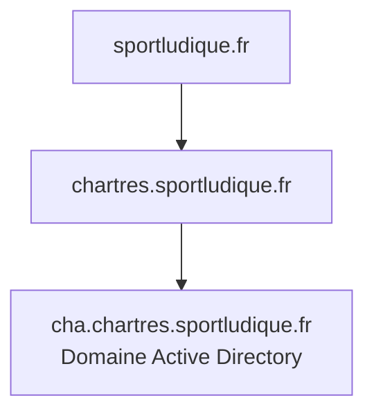

!!! danger "Pas de `.local`"

    N’utilisez pas un domaine tel que :

    `sportludique.local`

    `chartres.local`

    `ad.local`

    Le suffixe `.local` est notamment utilisé par **mDNS**.

    Le domaine Active Directory doit être créé dans l’espace DNS prévu sous `sportludique.fr`.

<quiz>
Quel nom est conforme à la convention Active Directory du site de Chartres ?

- [ ] `chartres.local`
- [ ] `cha.local`
- [x] `cha.chartres.sportludique.fr`
- [ ] `sportludique.ad`
</quiz>

---

### Nom NetBIOS et nom DNS

Un domaine Active Directory possède notamment un nom DNS et un nom NetBIOS.

Pour Chartres :

```text
Nom DNS     : cha.chartres.sportludique.fr
Nom NetBIOS : CHA
```

Un utilisateur peut alors rencontrer différentes formes d’identification.

Par exemple :

```text
CHA\jdupont
```

Le préfixe `CHA` correspond ici au nom NetBIOS du domaine.

Une autre forme courante utilise un nom ressemblant à une adresse de courrier électronique :

```text
jdupont@cha.chartres.sportludique.fr
```

Cette forme est appelée **UPN** (*User Principal Name*).

!!! note

    Le nom DNS du domaine, le nom NetBIOS et l’UPN sont liés à l’identité Active Directory mais ne doivent pas être confondus.

---

### Nommer le contrôleur de domaine

Les conventions de nommage du projet s’appliquent aux serveurs.

| Site | Préfixe |
|---|---|
| Chartres | `CHA-` |
| Tours | `TRS-` |
| Orléans | `ORL-` |
| Bourges | `BRG-` |
| Blois | `BLO-` |

Le premier contrôleur de domaine de Chartres pourra par exemple être nommé :

```text
CHA-DC01
```

Le nom permet immédiatement d’identifier :

```text
CHA  → site de Chartres
DC   → contrôleur de domaine
01   → premier serveur de ce rôle
```

---

### Pourquoi Active Directory a besoin de DNS ?

DNS est une brique fondamentale d’Active Directory.

Un poste ne doit pas simplement connaître l’adresse IP d’un contrôleur de domaine.

Il doit pouvoir **localiser les services du domaine**.

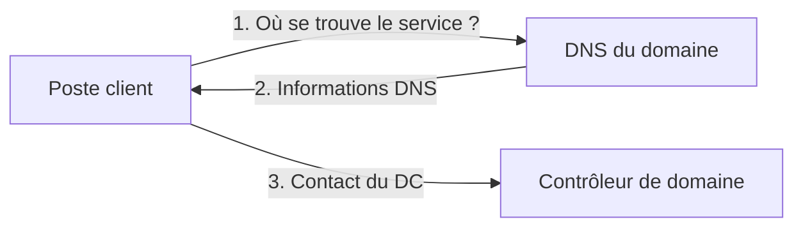

Active Directory publie dans DNS des enregistrements permettant aux clients de localiser différents services.

!!! important

    Dans une infrastructure Active Directory, DNS ne sert donc pas uniquement à transformer :

    `serveur.exemple.fr` → `192.0.2.10`

    Il participe également à la **découverte des services du domaine**.

---

### Les enregistrements SRV

DNS possède différents types d’enregistrements.

Vous connaissez probablement déjà :

```text
A     → nom vers adresse IPv4
AAAA  → nom vers adresse IPv6
CNAME → alias
```

Active Directory utilise également des enregistrements **SRV**.

Un enregistrement SRV permet d’indiquer qu’un serveur fournit un **service particulier**.

Schématiquement :

```text
Quel serveur fournit ce service ?
              │
              ▼
             DNS
              │
              ▼
      enregistrement SRV
              │
              ▼
       serveur à contacter
```

!!! note "Socle"

    Au niveau Socle, vous devez surtout comprendre que les enregistrements SRV permettent aux machines de **localiser les services Active Directory**.

    Leur structure détaillée sera étudiée plus loin si nécessaire.

<quiz>
Pourquoi un poste membre du domaine doit-il utiliser le DNS Active Directory ?

- [ ] Uniquement pour accéder à Internet
- [x] Pour pouvoir notamment localiser les services du domaine
- [ ] Pour recevoir son adresse MAC
- [ ] Pour remplacer le service DHCP
</quiz>

---

### Quel DNS configurer sur les machines ?

Les machines membres du domaine doivent utiliser le **DNS Active Directory**.

Une mauvaise configuration serait par exemple :

```text
Poste du domaine
      │
      └── DNS : 8.8.8.8
```

Le résolveur public connaît Internet, mais il ne connaît pas les informations privées du domaine Active Directory SportLudique.

L’architecture attendue est :

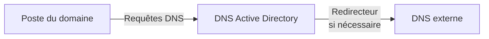

Le serveur DNS AD répond pour les zones qu’il connaît et peut utiliser un **redirecteur** pour les autres requêtes.

!!! danger "Le DNS public n’est pas un DNS de secours pour AD"

    Ajouter `8.8.8.8` ou `1.1.1.1` comme DNS alternatif sur les postes du domaine ne constitue pas une solution de haute disponibilité pour Active Directory.

    Le deuxième DNS d’un poste membre doit, lorsqu’il existe, être lui aussi capable de résoudre correctement le domaine Active Directory.

---

### Ajouter une machine au domaine

Une machine Windows peut être intégrée au domaine lorsque plusieurs conditions sont réunies.

Elle doit notamment :

- disposer d’une configuration IP correcte ;
- pouvoir joindre le réseau du domaine ;
- utiliser le DNS Active Directory ;
- pouvoir résoudre le domaine ;
- disposer d’une heure cohérente ;
- utiliser des identifiants autorisés à réaliser l’opération.

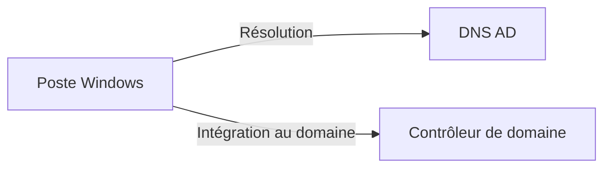

!!! warning "Le ping ne suffit pas"

    Pouvoir faire :

    ```text
    ping 172.x.x.x
    ```

    vers le contrôleur de domaine ne prouve pas que la machine est correctement préparée pour rejoindre le domaine.

<quiz>
Un poste peut joindre l’adresse IP du contrôleur de domaine mais ne parvient pas à rejoindre le domaine. Sa configuration DNS indique `8.8.8.8`. Quelle vérification est prioritaire ?

- [ ] Changer l’adresse MAC du poste
- [x] Configurer le poste pour utiliser le DNS Active Directory
- [ ] Ajouter une deuxième passerelle par défaut
- [ ] Réinstaller Windows
</quiz>

---

### Utilisateurs, groupes et ordinateurs

Active Directory stocke différents types d’objets.

Parmi les plus courants :

- utilisateurs ;
- groupes ;
- ordinateurs ;
- unités d’organisation.

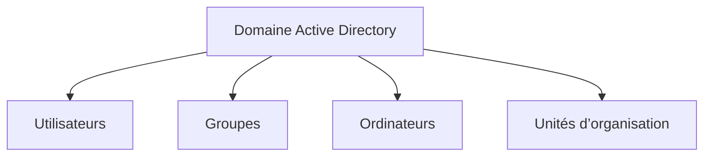

Un compte utilisateur représente une identité.

Un groupe permet notamment de regrouper plusieurs identités afin de faciliter l’attribution de droits.

Un objet ordinateur représente une machine intégrée au domaine.

---

### Les unités d’organisation

Les **OU** (*Organizational Units*) permettent d’organiser les objets Active Directory.

Par exemple :

```text
SportLudique
├── Utilisateurs
│   ├── Direction
│   ├── Informatique
│   └── Utilisateurs
├── Ordinateurs
│   ├── Postes
│   └── Serveurs
└── Groupes
```

!!! warning "Une OU n’est pas un dossier décoratif"

    L’organisation des OU doit répondre à des besoins d’administration.

    Il ne s’agit pas de reproduire mécaniquement tout l’organigramme de l’entreprise.

---

### Groupes et droits

Une bonne pratique consiste à attribuer les permissions à des **groupes** plutôt que directement à chaque utilisateur.

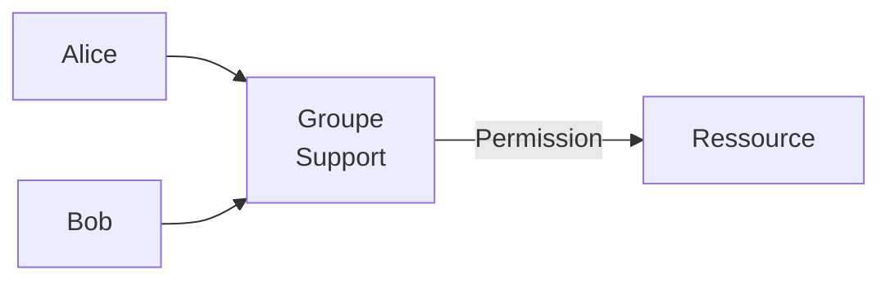

Cela simplifie l’administration :

- arrivée d’un utilisateur → ajout au groupe ;
- changement de fonction → changement de groupe ;
- départ → désactivation ou suppression du compte.

---

### Les stratégies de groupe

Les **GPO** (*Group Policy Objects*) permettent d’appliquer des paramètres aux utilisateurs et aux ordinateurs du domaine.

Elles permettent par exemple de définir certaines configurations de sécurité ou certains paramètres du système.

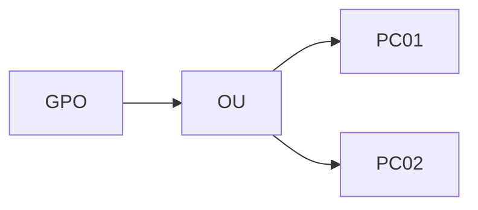

Au niveau Socle, l’objectif est surtout de comprendre que le domaine permet une **administration centralisée** des configurations.

---

### Authentification centralisée

Lorsqu’un utilisateur utilise un compte du domaine, son identité peut être vérifiée par l’infrastructure Active Directory.

Le principe général est :

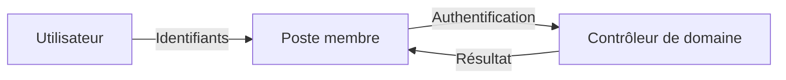

!!! note "Pas encore les tickets"

    Au niveau Socle, vous devez comprendre **qui authentifie qui** et pourquoi le contrôleur de domaine est nécessaire.

    Le fonctionnement détaillé de Kerberos et de ses tickets sera étudié au niveau **Expertise**.

---

### Ce que vous devez être capables d’expliquer

À la fin du Socle, vous devez être capables d’expliquer :

- ce qu’est un domaine Active Directory ;
- le rôle d’AD DS ;
- ce qu’est un contrôleur de domaine ;
- pourquoi le DC est installé en Server Core ;
- pourquoi le DC possède une seule interface dans le VLAN Serveurs ;
- comment le serveur d’administration permet d’administrer ce DC ;
- pourquoi le serveur d’administration n’est pas un routeur ;
- le rôle de WinRM ;
- la convention de nommage du domaine SportLudique ;
- la différence entre nom DNS, NetBIOS et UPN ;
- pourquoi Active Directory dépend de DNS ;
- le rôle général des enregistrements SRV ;
- pourquoi les postes du domaine doivent utiliser le DNS AD ;
- ce que sont utilisateurs, groupes, ordinateurs et OU ;
- le principe d’une GPO ;
- le principe général de l’authentification centralisée.

---

## Concepts avancés

### Le problème d’un seul contrôleur de domaine

Le socle commence volontairement avec un seul DC.

Cela permet de mettre en place et de comprendre l’infrastructure avant d’ajouter de la redondance.

Mais l’architecture possède alors une faiblesse évidente :

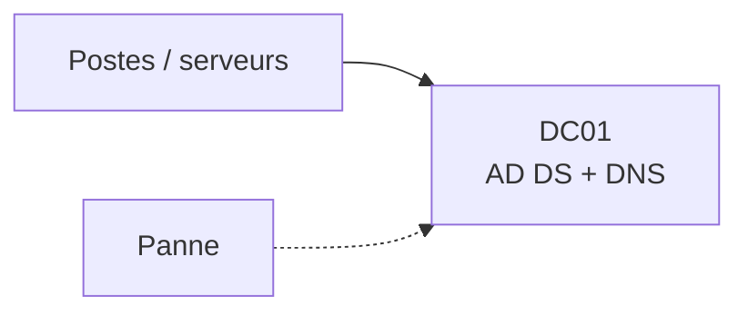

Si ce serveur ou son hyperviseur devient indisponible, les services Active Directory et DNS qu’il fournit sont affectés.

---

### Ajouter un deuxième contrôleur de domaine

Le niveau avancé consiste à ajouter un **deuxième contrôleur de domaine**.

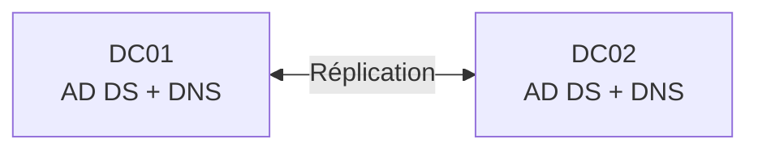

Les contrôleurs de domaine répliquent les informations de l’annuaire.

!!! warning "Pas « principal / secondaire »"

    Active Directory fonctionne en **multi-maître pour la majorité des modifications**.

    Il ne faut donc pas réduire l’architecture à l’ancien modèle :

    ```text
    serveur principal
    serveur secondaire
    ```

---

### Placer les deux DC sur des infrastructures différentes

Deux VM contrôleurs de domaine placées sur le **même hyperviseur** restent dépendantes de cet hyperviseur.

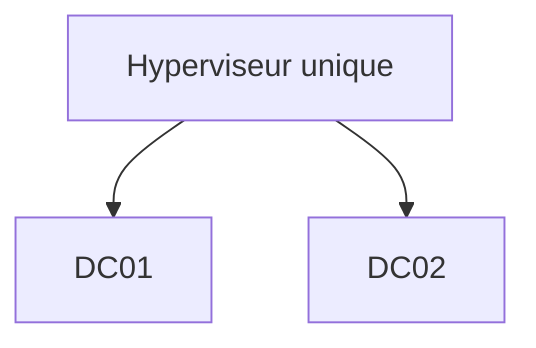

Une panne de l’hyperviseur peut alors rendre les deux DC indisponibles simultanément.

Dans SportLudique, le deuxième contrôleur de domaine doit donc être hébergé sur **l’hyperviseur administré par les étudiants**.

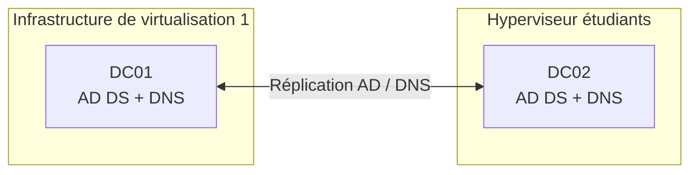

<quiz>
Deux contrôleurs de domaine sont installés sous forme de VM sur le même hyperviseur physique. Quelle limite subsiste ?

- [ ] Les deux DC ne peuvent pas répliquer
- [ ] DNS ne peut fonctionner que sur un seul DC
- [x] La panne de l’hyperviseur peut rendre les deux DC indisponibles
- [ ] Active Directory interdit deux DC virtualisés
</quiz>

---

### Réplication n’est pas sauvegarde

La présence de deux contrôleurs de domaine améliore la disponibilité.

Elle ne remplace pas une stratégie de sauvegarde.

```text
Modification correcte ──► réplication
Suppression accidentelle ──► réplication également
```

!!! danger

    **Réplication ≠ sauvegarde**

    Une donnée supprimée ou modifiée par erreur peut être répliquée sur les autres contrôleurs de domaine.

---

### DNS redondant

Lorsque les deux contrôleurs de domaine assurent également DNS, les clients disposent de plusieurs serveurs DNS capables de résoudre le domaine.

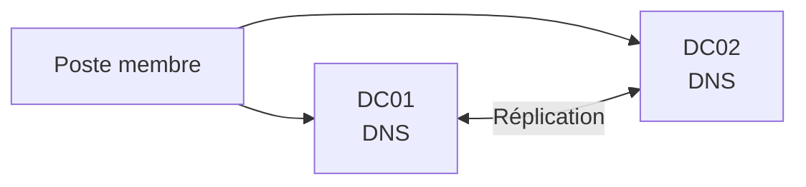

Cette architecture est très différente de :

```text
DNS 1 : DC01
DNS 2 : 8.8.8.8
```

Le deuxième serveur DNS doit lui aussi connaître le domaine Active Directory.

---

### DNS intégré à Active Directory

Les zones DNS utilisées par Active Directory peuvent être **intégrées à l’annuaire**.

Les informations DNS concernées peuvent alors bénéficier du mécanisme de réplication Active Directory.

Cela permet d’éviter de gérer séparément une copie primaire et des copies secondaires traditionnelles pour ces zones.

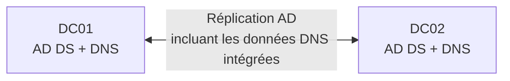

---

### Le catalogue global

Un contrôleur de domaine peut également assurer le rôle de **Global Catalog**.

Le catalogue global contient des informations permettant notamment de rechercher des objets dans une forêt Active Directory.

Dans une infrastructure simple ne contenant qu’un domaine, cette notion peut sembler peu visible.

Elle devient plus importante lorsque l’architecture Active Directory grandit.

---

### Les rôles FSMO

Active Directory fonctionne majoritairement selon un modèle multi-maître.

Certaines opérations doivent cependant rester associées à un contrôleur de domaine particulier.

Ces fonctions sont appelées **rôles FSMO** (*Flexible Single Master Operations*).

Il existe cinq rôles FSMO.

??? info "Les cinq rôles FSMO"

    Au niveau de la forêt :

    - **Schema Master** ;
    - **Domain Naming Master**.

    Au niveau du domaine :

    - **RID Master** ;
    - **PDC Emulator** ;
    - **Infrastructure Master**.

Au niveau avancé, l’objectif n’est pas de mémoriser mécaniquement les cinq noms.

Vous devez surtout comprendre pourquoi :

```text
Active Directory multi-maître
              ≠
absolument toutes les opérations multi-maîtres
```

---

### Organiser les objets pour les administrer

Les OU et les groupes doivent être conçus en fonction des besoins d’administration.

Une arborescence simple et justifiable est préférable à une structure complexe impossible à maintenir.

Exemple :

```text
Domaine
├── Utilisateurs
│   ├── Direction
│   ├── Informatique
│   └── Employés
├── Postes
├── Serveurs
└── Groupes
```

Le choix réel dépendra des besoins de l’organisation et des stratégies à appliquer.

---

### GPO : raisonner sur la portée

Une GPO n’est utile que si l’on comprend **à quels objets elle s’applique**.

Avant de créer une GPO, il faut pouvoir répondre à :

```text
Quel paramètre ?
      ↓
Pour quels objets ?
      ↓
À quel niveau ?
      ↓
Pourquoi ?
```

L’objectif n’est pas de multiplier les GPO, mais d’obtenir une configuration compréhensible et maintenable.

<quiz>
Une GPO doit configurer uniquement les serveurs du domaine. Quelle démarche est la plus cohérente ?

- [ ] Lier systématiquement toutes les GPO à la racine du domaine
- [x] Organiser les objets afin de pouvoir cibler les machines concernées
- [ ] Créer un domaine Active Directory supplémentaire
- [ ] Modifier manuellement chaque serveur
</quiz>

---

### Ce que vous devez être capables d’expliquer

À la fin du niveau avancé, vous devez être capables d’expliquer :

- pourquoi un seul DC constitue une dépendance importante ;
- l’intérêt d’un deuxième contrôleur de domaine ;
- pourquoi les deux DC doivent idéalement dépendre d’infrastructures différentes ;
- le principe de réplication Active Directory ;
- pourquoi réplication et sauvegarde sont deux notions différentes ;
- comment obtenir une meilleure disponibilité DNS ;
- le principe d’une zone DNS intégrée à Active Directory ;
- ce qu’est le Global Catalog ;
- pourquoi des rôles FSMO existent malgré le fonctionnement multi-maître ;
- pourquoi la structure des OU doit être pensée en fonction de l’administration ;
- comment raisonner sur la portée d’une GPO.

---

## Expertise

### Comprendre réellement l’authentification

Au niveau Socle, nous avons résumé l’authentification ainsi :

```text
Utilisateur → poste → contrôleur de domaine
```

Cette représentation est suffisante pour comprendre le rôle général du DC, mais elle masque le mécanisme utilisé.

Dans un domaine Active Directory moderne, **Kerberos** joue un rôle central dans l’authentification.

Pour comprendre Kerberos, il faut introduire la notion de **ticket**.

---

### Pourquoi des tickets ?

Une mauvaise représentation serait d’imaginer que le mot de passe de l’utilisateur est envoyé à chaque serveur auquel il souhaite accéder.

Kerberos utilise au contraire un mécanisme permettant à l’utilisateur authentifié d’obtenir des éléments qu’il pourra présenter pour accéder aux services.

L’idée générale devient :

```text
Je prouve mon identité
        │
        ▼
J’obtiens un moyen de demander
des accès à des services
        │
        ▼
J’obtiens un ticket pour
un service particulier
        │
        ▼
Je présente ce ticket au service
```

---

### Le KDC

Le **KDC** (*Key Distribution Center*) est le service Kerberos chargé de délivrer les tickets.

Dans Active Directory, ce service est assuré par les contrôleurs de domaine.

On distingue notamment deux fonctions :

- **AS** : *Authentication Service* ;
- **TGS** : *Ticket Granting Service*.

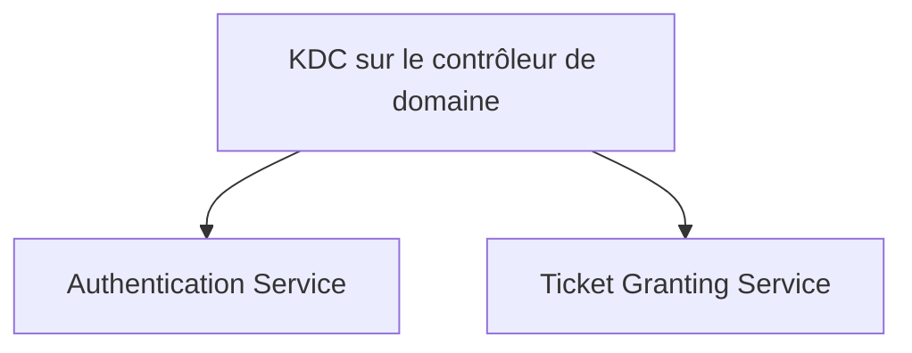

---

### Le TGT

Après l’authentification initiale, l’utilisateur peut obtenir un **TGT** (*Ticket Granting Ticket*).

Ce ticket ne donne pas directement accès à tous les serveurs.

Il permet de demander au KDC des tickets pour des services particuliers.

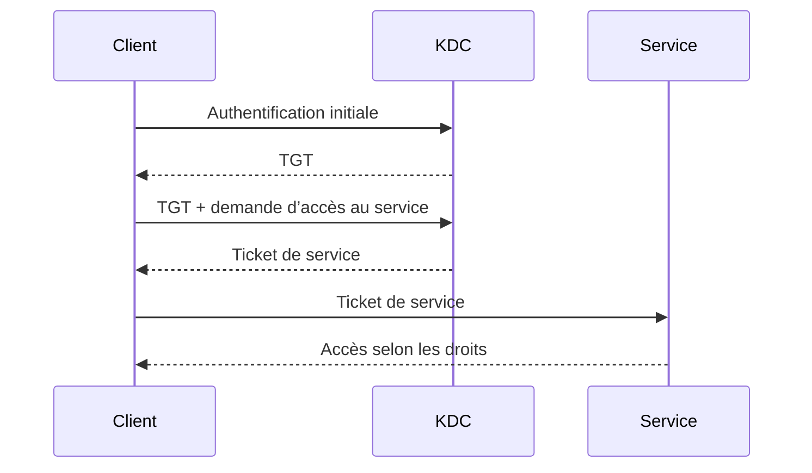

!!! important

    Le TGT n’est pas « le ticket qui ouvre toutes les portes ».

    Il sert à obtenir auprès du KDC les tickets nécessaires pour des services précis.

---

### Ticket de service

Lorsqu’un utilisateur souhaite accéder à un service, son poste demande un ticket correspondant à ce service.

Le client présente ensuite ce ticket au serveur concerné.

On obtient donc trois acteurs essentiels :

```text
Client
  │
  ├──── KDC : obtenir les tickets
  │
  └──── Service : présenter le ticket
```

Cette architecture permet notamment de ne pas transmettre le mot de passe de l’utilisateur à chaque service utilisé.

<quiz>
À quoi sert principalement le TGT dans Kerberos ?

- [ ] À remplacer le serveur DNS
- [ ] À donner directement accès à tous les fichiers du domaine
- [x] À permettre au client de demander des tickets pour différents services
- [ ] À attribuer une adresse IP au client
</quiz>

---

### Kerberos et DNS

Kerberos et Active Directory dépendent fortement d’une résolution DNS correcte.

Avant de contacter les services nécessaires, le client doit être capable de les localiser.

On retrouve donc la chaîne étudiée depuis le Socle :

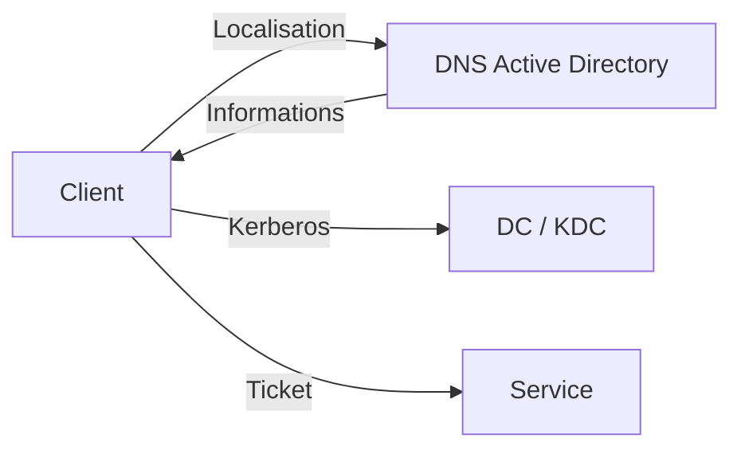

Une mauvaise configuration DNS peut donc produire des symptômes qui ressemblent à des problèmes d’authentification.

---

### Kerberos et l’heure

Kerberos utilise également la notion de temps dans ses mécanismes de sécurité.

Les machines du domaine doivent donc disposer d’horloges correctement synchronisées.

Cela explique pourquoi la synchronisation de l’heure n’est pas un simple détail d’exploitation.

```text
DNS correct
    +
heure cohérente
    +
services AD disponibles
    ↓
conditions nécessaires au bon fonctionnement
de l’authentification du domaine
```

---

### SPN : identifier un service

Kerberos doit pouvoir identifier le service pour lequel un ticket est demandé.

Les **SPN** (*Service Principal Names*) permettent d’identifier des instances de services associées à des comptes Active Directory.

La notion devient importante lorsqu’on cherche à comprendre pourquoi Kerberos fonctionne pour un service mais échoue pour un autre.

??? info "À retenir sur les SPN"

    Au niveau Expertise, retenez surtout :

    - un ticket Kerberos est demandé pour un **service identifié** ;
    - ce service est associé à un **SPN** ;
    - une configuration incorrecte ou dupliquée des SPN peut provoquer des problèmes d’authentification.

---

### LDAP et LDAPS

Active Directory est un **service d’annuaire**. Les applications peuvent interroger cet annuaire avec **LDAP** (*Lightweight Directory Access Protocol*).

LDAP peut notamment servir à :

- rechercher un utilisateur ;
- rechercher un groupe ;
- lire certains attributs de l’annuaire ;
- permettre à une application de s’appuyer sur Active Directory pour l’identification ou l’autorisation.

On rencontre notamment :

```text
LDAP   → TCP 389
LDAPS  → TCP 636
```

Mais il faut distinguer plusieurs notions :

| Mécanisme | Idée générale |
|---|---|
| LDAP | protocole d’accès à l’annuaire |
| LDAPS | LDAP protégé par TLS dès l’établissement de la connexion |
| LDAP + mécanismes de signature/chiffrement | sécurisation possible d’une session LDAP sans simplement raisonner « port 389 = non sécurisé » |

!!! warning "Ne pas retenir une règle trop simpliste"

    `389 = dangereux` et `636 = sécurisé` serait une mauvaise conclusion.

    Il faut s’intéresser au **mécanisme d’authentification**, à la **signature**, au **chiffrement** et à la validation du certificat lorsqu’un canal TLS est utilisé.

#### Pourquoi cette question devient importante avec Windows Server 2025 ?

Les versions récentes de Windows Server renforcent progressivement les exigences de sécurité autour des communications LDAP.

Avec **Windows Server 2025**, il devient particulièrement pertinent de vérifier les applications ou équipements qui utilisent encore des liaisons LDAP insuffisamment protégées.

Avant de connecter une application à Active Directory, vous devez donc vous demander :

```text
Application
    │
    ├── Quel protocole utilise-t-elle ?
    ├── Comment s’authentifie-t-elle ?
    ├── La communication est-elle signée ?
    ├── Est-elle chiffrée ?
    └── Si TLS est utilisé, le certificat est-il valide ?
```

Cela concerne par exemple :

- une application Web utilisant l’annuaire ;
- GLPI ;
- un hyperviseur ;
- un pare-feu ;
- un NAS ;
- un outil de supervision ;
- une application métier.

#### LDAPS et certificats

Pour proposer LDAPS, le contrôleur de domaine doit disposer d’un certificat adapté.

On introduit alors une nouvelle dépendance :

```mermaid
flowchart LR
    APP["Application"]
    DNS["DNS"]
    DC["Contrôleur de domaine<br/>LDAP / LDAPS"]
    CERT["Certificat du DC"]
    PKI["Autorité de certification"]

    APP -->|"Résolution"| DNS
    APP -->|"Connexion LDAP sécurisée"| DC
    CERT --- DC
    PKI -->|"Émet / permet de valider"| CERT
```

Cela permet de faire le lien avec une future infrastructure **PKI / AD CS**.

!!! note "Ce qu’il faut comprendre"

    Utiliser LDAPS ne consiste pas simplement à remplacer `389` par `636`.

    Il faut également que le client puisse **faire confiance au certificat présenté par le contrôleur de domaine**.

<quiz>
Une application utilise LDAP pour interroger Active Directory. Quelle démarche est la plus pertinente ?

- [ ] Autoriser TCP 389 depuis tous les VLAN
- [ ] Remplacer systématiquement 389 par 636 sans autre vérification
- [x] Identifier le mécanisme d’authentification et vérifier la protection de la communication
- [ ] Installer un deuxième contrôleur de domaine
</quiz>

<quiz>
Une application tente une connexion LDAPS vers un contrôleur de domaine mais refuse son certificat. Quel élément faut-il notamment vérifier ?

- [ ] Le serveur DHCP
- [x] La chaîne de confiance et le certificat présenté par le contrôleur de domaine
- [ ] Le nombre d’OU du domaine
- [ ] Le rôle FSMO RID Master
</quiz>

---

### Comptes de service

Certaines applications et certains services doivent eux-mêmes s’exécuter avec une identité.

Créer un compte utilisateur classique avec un mot de passe qui n’expire jamais est une solution simple mais peu satisfaisante.

Active Directory propose des mécanismes plus adaptés aux **comptes de service**.

??? info "gMSA"

    Les **gMSA** (*Group Managed Service Accounts*) permettent notamment à Active Directory de gérer automatiquement certains aspects du mot de passe d’un compte de service.

    Cette notion est particulièrement intéressante lorsque plusieurs serveurs ou services doivent utiliser une identité gérée proprement.

---

### RODC

Dans certaines architectures, un site distant peut avoir besoin d’un contrôleur de domaine local sans que l’on souhaite y placer une copie modifiable classique de l’annuaire.

Un **RODC** (*Read-Only Domain Controller*) fournit une copie en lecture seule de l’annuaire.

```mermaid
flowchart LR
    DC["DC inscriptible<br/>site principal"]
    RODC["RODC<br/>site distant"]

    DC -->|"Réplication"| RODC
```

Le RODC répond à des besoins particuliers.

Il ne doit pas être ajouté simplement pour pouvoir dire que l’architecture contient « un type de DC supplémentaire ».

---

### Diagnostiquer plutôt que redémarrer

Au niveau Expertise, le diagnostic doit relier les différentes briques.

Lorsqu’un utilisateur ne parvient pas à accéder à une ressource du domaine, on peut raisonner sur la chaîne :

```text
Configuration IP
      ↓
DNS
      ↓
Localisation du domaine
      ↓
Synchronisation de l’heure
      ↓
Authentification Kerberos
      ↓
Ticket du service
      ↓
Droits sur la ressource
```

L’objectif est de déterminer **à quelle étape le fonctionnement attendu s’interrompt**.

<quiz>
Un utilisateur ouvre correctement sa session sur le domaine mais l’accès à un service utilisant Kerberos échoue. Quelle conclusion est la plus rigoureuse ?

- [ ] Active Directory est forcément totalement en panne
- [ ] Le mot de passe de l’utilisateur est forcément faux
- [x] L’authentification initiale fonctionne ; il faut poursuivre le diagnostic sur la localisation, le ticket du service et les droits
- [ ] Il faut immédiatement recréer le domaine
</quiz>

---

### Ce que vous devez être capables d’expliquer

À la fin du niveau Expertise, vous devez être capables d’expliquer :

- le rôle général de Kerberos ;
- pourquoi Kerberos utilise des tickets ;
- le rôle du KDC ;
- la différence entre TGT et ticket de service ;
- pourquoi le mot de passe n’est pas envoyé à chaque service ;
- le lien entre DNS et Kerberos ;
- l’importance de la synchronisation de l’heure ;
- le principe d’un SPN ;
- le rôle de LDAP et la différence générale avec LDAPS ;
- pourquoi les comptes de service nécessitent une gestion particulière ;
- le principe d’un gMSA ;
- le rôle possible d’un RODC ;
- comment construire une démarche de diagnostic reliant DNS, Kerberos et les droits.

---

## Synthèse

```mermaid
flowchart LR
    SOCLE["Socle<br/>AD DS + DNS<br/>1 DC administré à distance"]
    ADV["Avancé<br/>2 DC<br/>réplication et résilience"]
    EXP["Expertise<br/>Kerberos<br/>tickets et services"]

    SOCLE --> ADV --> EXP
```

| Niveau | Objectif principal |
|---|---|
| **Socle obligatoire** | Comprendre et déployer un domaine AD DS/DNS administré proprement |
| **Concepts avancés** | Rendre AD/DNS plus disponible et comprendre sa réplication |
| **Expertise** | Comprendre les mécanismes d’authentification et les services avancés |

!!! success "Le point à retenir"

    Un contrôleur de domaine n’a pas besoin d’être directement connecté au VLAN Management pour être administrable.

    Dans l’architecture SportLudique :

    **l’administrateur entre sur le serveur d’administration par le VLAN Management ; le serveur d’administration contacte ensuite le DC par le VLAN Serveurs.**

    Le DC conserve ainsi **une seule interface réseau**, dédiée au réseau des serveurs.
