# 01- Administration de l’infrastructure

L’objectif de cette partie est de mettre en place une **administration cohérente et sécurisée** des équipements et des serveurs du site.

Il ne s’agit pas seulement de savoir se connecter à une machine.

Vous devez être capables d’expliquer :

- **qui** administre ;
- **depuis où** ;
- **vers quelle interface** ;
- **avec quel protocole** ;
- et **pourquoi ce chemin d’administration est autorisé**.

---

## Socle obligatoire

### Administrer n’est pas utiliser

Un serveur fournit un ou plusieurs services aux utilisateurs.

L’administration de ce serveur correspond à une autre fonction.

Par exemple, pour un serveur Web :

- les utilisateurs accèdent au site en **HTTP/HTTPS** ;
- l’administrateur utilise **SSH**, **RDP**, **WinRM** ou une interface d’administration dédiée.

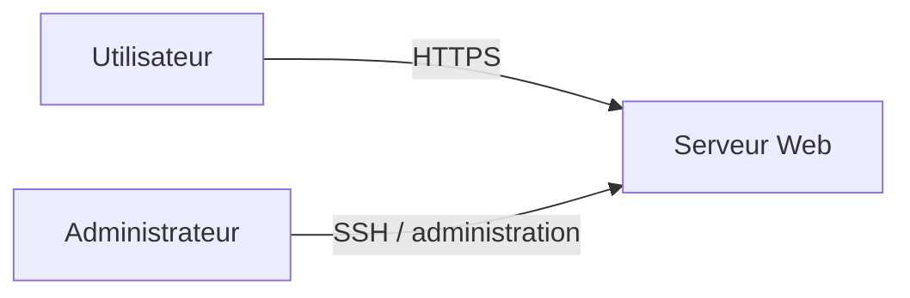

Ces deux flux n’ont ni le même objectif, ni les mêmes droits.

!!! warning "À retenir"

    Le fait qu’un service soit accessible aux utilisateurs ne signifie pas que son interface d’administration doit l’être également.

<quiz>
Un utilisateur consulte une application Web hébergée sur un serveur Linux. Quel flux correspond normalement à l’administration du serveur ?

- [ ] HTTP depuis le VLAN Utilisateurs
- [x] SSH depuis le réseau d’administration
- [ ] DNS depuis le VLAN Serveurs
- [ ] ICMP depuis n’importe quel réseau
</quiz>

---

### Le VLAN Management

Le **VLAN Management** est réservé à l’administration de l’infrastructure.

Il permet notamment d’administrer :

- les switchs ;
- les routeurs ;
- les pare-feu ;
- les hyperviseurs ;
- les serveurs.

Le trafic nécessaire au fonctionnement normal des services ne doit pas être confondu avec le trafic d’administration.

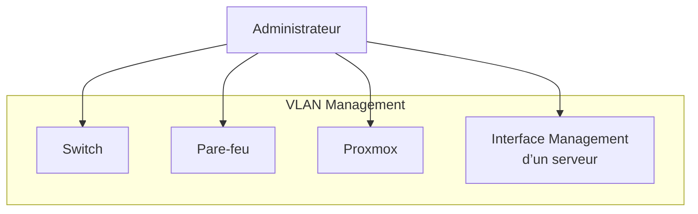

!!! note "Management ne signifie pas confiance absolue"

    Le VLAN Management n’est pas un réseau dans lequel tout doit être autorisé.

    Les flux doivent rester limités aux besoins d’administration.

---

### Interface de service et interface de management

Certains serveurs peuvent posséder plusieurs interfaces réseau.

On peut alors séparer :

| Interface | Fonction |
|---|---|
| Management | administration de la machine |
| Service | fourniture du service aux utilisateurs ou aux autres serveurs |

Exemple pour un serveur Web Linux :

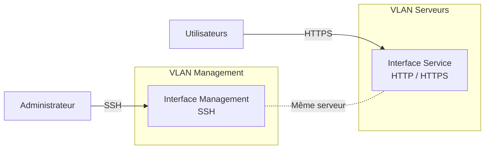

!!! danger "Deux interfaces ne transforment pas le serveur en routeur"

    Un serveur possédant une interface Management et une interface Service ne doit pas automatiquement assurer le routage entre les deux réseaux.

<quiz>
Un serveur Linux possède deux interfaces : une dans le VLAN Management et une dans le VLAN Serveurs. Pourquoi ?

- [x] Pour séparer les flux d’administration des flux du service
- [ ] Pour remplacer le routeur du site
- [ ] Pour permettre aux utilisateurs d’accéder directement au VLAN Management
- [ ] Pour éviter d’utiliser une passerelle par défaut
</quiz>

---

### Configuration réseau minimale d’un serveur

Avant d’installer un service, la configuration de base de la machine doit être cohérente.

On vérifie au minimum :

- l’adresse IP ;
- le masque ou préfixe ;
- la passerelle ;
- les serveurs DNS ;
- le nom de la machine.

Ces informations doivent correspondre au plan d’adressage et aux conventions du site.

!!! example "Réflexe"

    Avant de chercher une panne dans Apache, Active Directory, Zabbix ou un autre service, commencez par vérifier la configuration réseau de la machine.

---

### Le nom de la machine

Chaque machine doit posséder un **hostname cohérent, court et compréhensible**.

Le nom doit permettre d’identifier facilement la fonction de la machine.

Exemples :

```text
srv-web01
srv-zabbix01
srv-glpi01
```

Sous Linux :

```bash
hostnamectl set-hostname srv-web01
```

Un nom de machine ne remplace pas la documentation, mais une convention cohérente facilite fortement l’exploitation de l’infrastructure.

---

### DNS

Les serveurs doivent utiliser les serveurs DNS prévus par l’architecture.

Une résolution DNS correcte est indispensable au fonctionnement de nombreux services.

Sous Linux, on peut tester avec :

```bash
dig serveur.exemple.fr
```

ou :

```bash
nslookup serveur.exemple.fr
```

!!! warning "Adresse IP ≠ DNS"

    Réussir un `ping` vers une adresse IP ne prouve pas que la résolution DNS fonctionne.

<quiz>
Un serveur répond lorsqu’on contacte son adresse IP mais son nom ne peut pas être résolu. Quel élément doit être vérifié en priorité ?

- [ ] Le débit du lien
- [x] La configuration DNS
- [ ] Le mot de passe administrateur
- [ ] Le VLAN voix
</quiz>

---

### Synchronisation de l’heure

Les machines de l’infrastructure doivent disposer d’une heure cohérente.

La synchronisation de l’horloge est importante notamment pour :

- les journaux ;
- les certificats ;
- l’authentification ;
- la corrélation d’événements.

Sous Linux, `chrony` peut être utilisé.

```bash
apt install chrony
```

Vérification :

```bash
chronyc tracking
chronyc sources
```

!!! note

    Lors d’un diagnostic, comparer des journaux provenant de machines dont les horloges sont décalées peut conduire à de mauvaises conclusions.

---

### Administrer Linux avec SSH

SSH permet d’administrer un serveur Linux à distance.

Le principe attendu est :

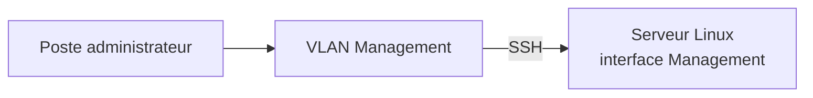

La configuration SSH doit être sécurisée.

On cherchera notamment à :

- éviter l’accès direct au compte `root` ;
- utiliser des comptes d’administration identifiés ;
- privilégier l’authentification par clé lorsque cela est pertinent ;
- limiter les machines et utilisateurs autorisés à se connecter.

Le fichier principal de configuration est généralement :

```text
/etc/ssh/sshd_config
```

!!! danger

    « SSH est chiffré » ne signifie pas « SSH doit être accessible depuis partout ».

---

### Administrer Windows à distance

L’administration des serveurs Windows ne nécessite pas de travailler directement sur leur console.

Un serveur Windows avec interface graphique peut servir de **serveur d’administration**.

L’administrateur se connecte sur cette machine, puis utilise les outils d’administration distante.

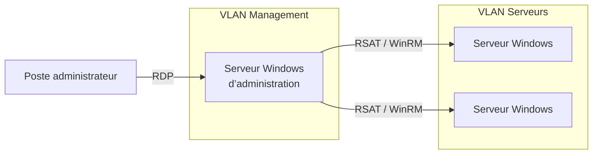

Parmi les outils utilisables :

- Server Manager ;
- consoles MMC ;
- RSAT ;
- PowerShell ;
- WinRM.

Le serveur d’administration constitue ainsi un point de travail dédié à l’exploitation de l’infrastructure Windows.

<quiz>
Pourquoi utiliser un serveur d’administration Windows plutôt que se connecter en RDP directement sur chaque serveur ?

- [x] Pour centraliser le point depuis lequel les opérations d’administration sont réalisées
- [ ] Parce que Windows Server interdit le RDP sur les autres serveurs
- [ ] Pour supprimer le besoin de VLAN Management
- [ ] Pour transformer le serveur d’administration en routeur
</quiz>

---

### Administrer les équipements réseau

Les équipements réseau disposent eux aussi d’un plan d’administration.

Selon l’équipement, l’administration peut utiliser notamment :

- SSH ;
- HTTPS ;
- une console Web ;
- une console série pour certaines opérations locales.

L’interface ou l’adresse d’administration doit appartenir au réseau prévu à cet effet.

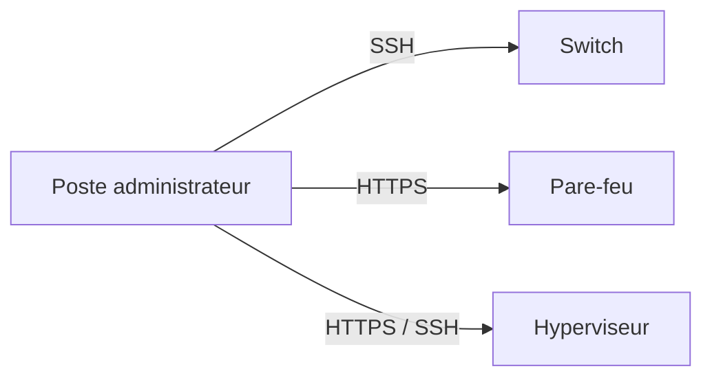

!!! warning

    Telnet ou une interface HTTP non chiffrée ne doivent pas être retenus lorsqu’une solution sécurisée est disponible.

---

### Journalisation locale

Administrer une machine implique aussi de pouvoir comprendre ce qui s’y est passé.

Sous Linux, les journaux peuvent notamment se trouver dans :

```text
/var/log/
```

Exemples :

```text
/var/log/auth.log
/var/log/syslog
/var/log/kern.log
```

Les applications peuvent également disposer de leurs propres journaux.

La rotation des fichiers de logs peut être assurée par `logrotate`.

!!! note

    Un journal n’est utile que si vous savez quel événement vous cherchez et à quelle heure il s’est produit.

---

### Ce que vous devez être capables d’expliquer

À la fin du socle, vous devez être capables d’expliquer :

- la différence entre utilisation et administration d’un service ;
- le rôle du VLAN Management ;
- la différence entre interface de service et interface de management ;
- pourquoi un serveur à deux interfaces n’est pas nécessairement un routeur ;
- les éléments minimaux de configuration réseau d’un serveur ;
- l’importance du DNS et de la synchronisation de l’heure ;
- le rôle de SSH ;
- pourquoi l’accès SSH ne doit pas être ouvert depuis tous les réseaux ;
- le principe d’un serveur d’administration Windows ;
- le rôle de RDP, RSAT et WinRM ;
- pourquoi les équipements réseau doivent disposer d’un chemin d’administration identifié ;
- où rechercher les premiers journaux lors d’un diagnostic.

---

## Concepts avancés

### Réduire les chemins d’administration

Une infrastructure devient difficile à sécuriser lorsque chaque poste peut administrer directement chaque équipement.

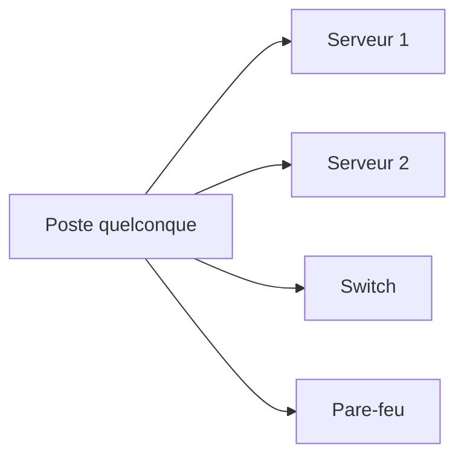

Une meilleure approche consiste à identifier les machines autorisées à réaliser les opérations d’administration.

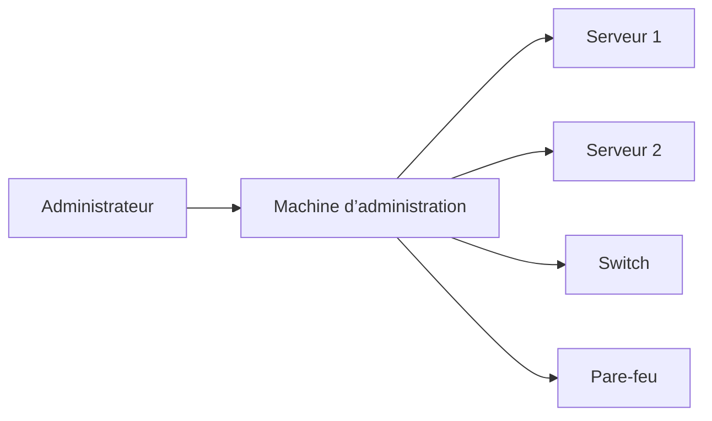

L’objectif n’est pas seulement de simplifier l’administration.

Il s’agit également de **réduire la surface d’exposition du plan d’administration**.

---

### Filtrer le VLAN Management

Le VLAN Management doit être protégé par des règles de filtrage.

Une règle doit pouvoir répondre à quatre questions :

```text
QUI ?
  │
  ▼
VERS QUOI ?
  │
  ▼
AVEC QUEL PROTOCOLE ?
  │
  ▼
POURQUOI ?
```

Exemple :

```text
Serveur d’administration
        │
        │ WinRM
        ▼
Serveurs Windows
```

plutôt que :

```text
Tous les postes
        │
        │ tous les protocoles
        ▼
Tous les serveurs
```

<quiz>
Le VLAN Management contient uniquement des équipements d’administration. Quelle politique est la plus cohérente ?

- [ ] Autoriser tous les flux car ce VLAN est considéré comme sûr
- [x] Autoriser uniquement les flux nécessaires entre les sources et destinations prévues
- [ ] Interdire toute communication vers les serveurs
- [ ] Autoriser uniquement ICMP
</quiz>

---

### Comptes utilisateurs et comptes d’administration

Le compte utilisé au quotidien ne doit pas nécessairement disposer de privilèges d’administration sur l’infrastructure.

On peut distinguer :

```text
Compte utilisateur
        ≠
Compte d’administration
```

Cette séparation limite l’exposition des privilèges lors des usages courants.

!!! example

    Lire ses mails ou naviguer sur le Web avec un compte disposant de droits élevés sur l’infrastructure augmente inutilement les risques.

---

### Administration distante Windows

L’administration distante permet de gérer un serveur sans ouvrir une session graphique directement sur celui-ci.

Avec Windows, on peut notamment utiliser :

- RSAT ;
- Server Manager ;
- PowerShell Remoting ;
- WinRM.

Le principe devient :

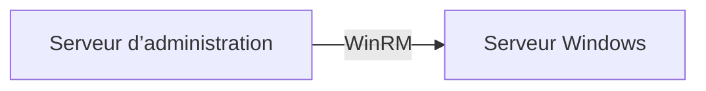

Cela permet notamment d’administrer des serveurs sans interface graphique.

---

### Centraliser les journaux

Les journaux locaux sont indispensables, mais leur consultation machine par machine devient rapidement difficile.

Une infrastructure peut donc transmettre ses journaux vers une plateforme centralisée.

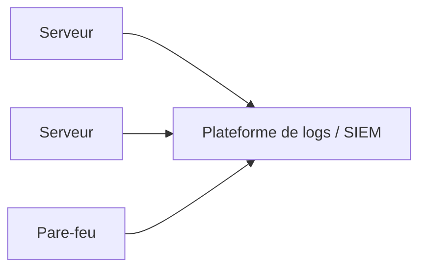

La centralisation facilite :

- la recherche ;
- la comparaison des événements ;
- la corrélation ;
- l’analyse d’un incident.

!!! note

    Cette partie présente uniquement le **principe**.

    La mise en œuvre d’une plateforme de logs ou d’un SIEM constitue une autre brique du projet.

---

### Vous devez être capables d’expliquer

À la fin du niveau avancé, vous devez être capables d’expliquer :

- pourquoi il est préférable de limiter les chemins d’administration ;
- pourquoi le VLAN Management doit être filtré ;
- comment raisonner sur une règle d’administration ;
- l’intérêt de séparer compte utilisateur et compte d’administration ;
- le principe de l’administration distante Windows ;
- l’intérêt de centraliser les journaux.

---

## Expertise

### Le problème des accès privilégiés

Lorsque l’infrastructure grandit, l’administrateur doit accéder à de nombreuses ressources :

```text
Administrateur
    ├── SSH ──► serveurs Linux
    ├── RDP ──► serveurs Windows
    ├── HTTPS ► pare-feu
    ├── SSH ──► switchs
    └── HTTPS ► hyperviseurs
```

Il devient alors nécessaire de mieux contrôler :

- qui se connecte ;
- à quelle ressource ;
- avec quel compte ;
- pendant combien de temps ;
- et ce qui a été réalisé pendant la session.

---

### Le principe du bastion

Un **bastion d’administration** constitue un point de passage contrôlé vers les ressources administrées.

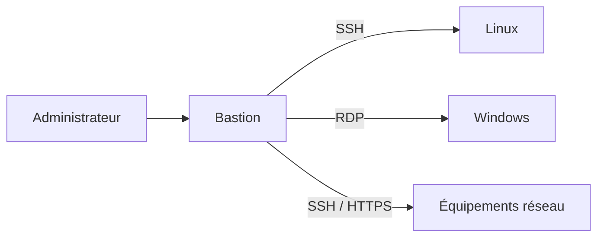

Le bastion permet de réduire les accès directs aux ressources sensibles.

!!! warning

    Installer un bastion ne sécurise pas automatiquement toute l’infrastructure.

    Les règles réseau, les comptes, les droits et la configuration des ressources restent essentiels.

---

### Apache Guacamole : centraliser les accès

Apache Guacamole permet de fournir un accès distant à différentes machines depuis une interface Web.

Il peut notamment centraliser des connexions :

- SSH ;
- RDP ;
- VNC.

Dans une architecture pédagogique, il permet de comprendre le principe d’un **point d’entrée centralisé** vers les machines administrées.

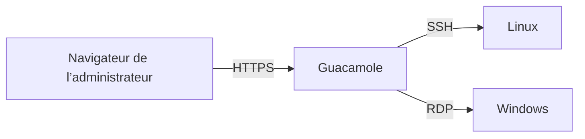

Mais centraliser les connexions ne suffit pas à constituer à lui seul une gestion complète des accès privilégiés.

---

### PAM : Privileged Access Management

Un **PAM** (*Privileged Access Management*) cherche à contrôler et tracer les accès utilisant des privilèges élevés.

La question n’est plus seulement :

> Comment se connecter au serveur ?

mais :

> Qui est autorisé à utiliser quel accès privilégié, dans quelles conditions, et comment cette utilisation est-elle tracée ?

---

### WALLIX Bastion

WALLIX Bastion est un exemple de solution dédiée à la gestion des accès privilégiés.

Dans le cadre du projet, l’objectif n’est pas de devenir expert du produit.

Il s’agit de comprendre les fonctions recherchées dans une solution de PAM :

- contrôle des accès privilégiés ;
- centralisation des accès ;
- traçabilité ;
- gestion des sessions ;
- réduction de l’exposition directe des ressources administrées.

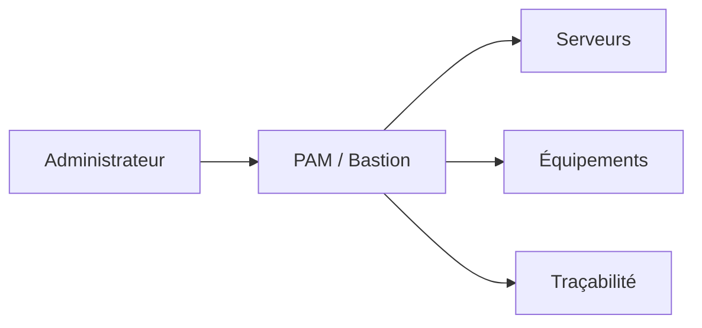

---

### Guacamole et PAM : ne pas confondre

Les deux approches peuvent donner l’impression de faire la même chose car elles centralisent des connexions.

Mais l’objectif n’est pas exactement le même.

| Guacamole | PAM |
|---|---|
| Faciliter l’accès distant centralisé | Contrôler les accès privilégiés |
| Point d’entrée Web | Gouvernance des privilèges |
| SSH / RDP / VNC | Contrôle et traçabilité des sessions privilégiées |
| Simplifier l’accès aux machines | Réduire et contrôler l’exposition des privilèges |

<quiz>
Une équipe installe Guacamole et interdit ensuite les connexions SSH et RDP directes depuis les postes administrateurs. Peut-on conclure que l’infrastructure dispose automatiquement d’un PAM complet ?

- [ ] Oui, car toutes les connexions passent par une interface Web
- [ ] Oui, dès lors que Guacamole utilise HTTPS
- [x] Non, la centralisation des connexions ne couvre pas à elle seule toute la gestion des accès privilégiés
- [ ] Non, car un bastion ne peut jamais utiliser SSH
</quiz>

---

### Concevoir son plan d’administration

Au niveau Expertise, vous devez être capables de proposer une architecture répondant aux questions suivantes :

```text
Qui ?
   ↓
Depuis quelle machine ?
   ↓
Depuis quel réseau ?
   ↓
Vers quelle ressource ?
   ↓
Avec quel protocole ?
   ↓
Avec quels privilèges ?
   ↓
Avec quelle traçabilité ?
```

Il ne suffit plus de dire :

> « Ça marche, je peux me connecter. »

Vous devez être capables de **justifier le chemin d’administration**.

---

## Synthèse

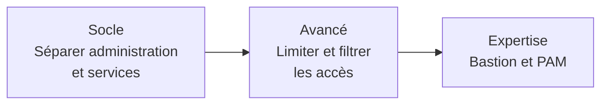

| Niveau | Objectif |
|---|---|
| Socle | disposer d’un plan d’administration fonctionnel et séparé des services |
| Avancé | limiter les chemins d’administration et centraliser certaines fonctions |
| Expertise | contrôler et tracer les accès privilégiés à travers un bastion / PAM |

!!! success "Objectif final"

    Une infrastructure correctement administrée n’est pas une infrastructure dans laquelle l’administrateur peut se connecter partout.

    C’est une infrastructure dans laquelle **chaque accès d’administration est prévu, limité et justifiable**.
