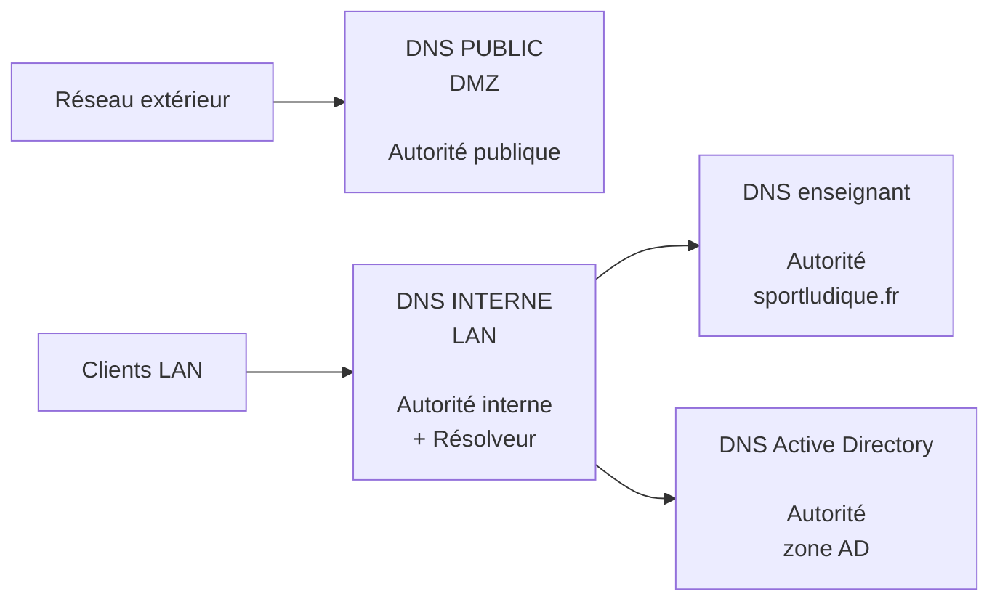
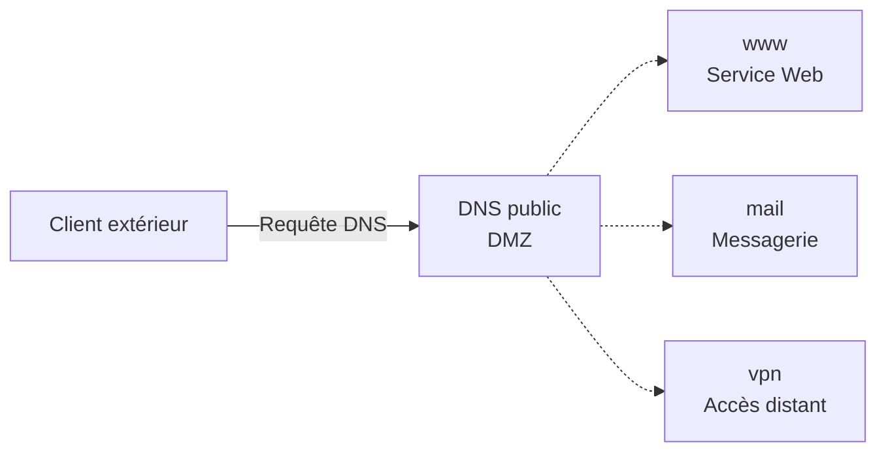
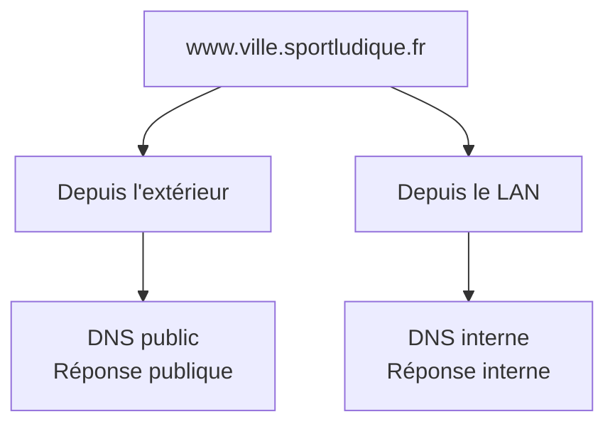
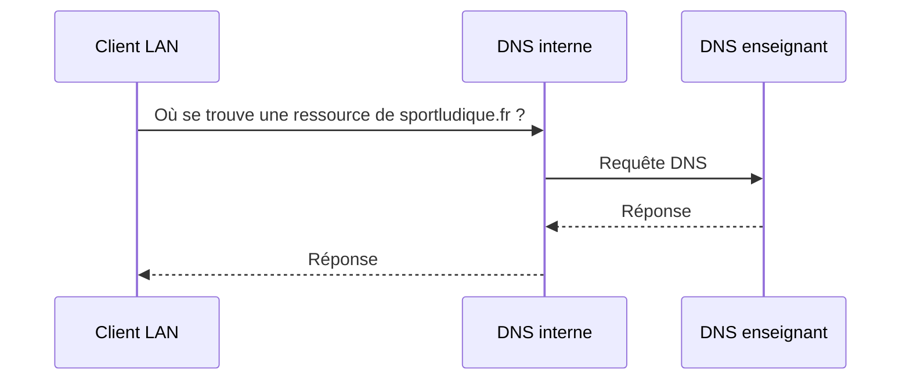
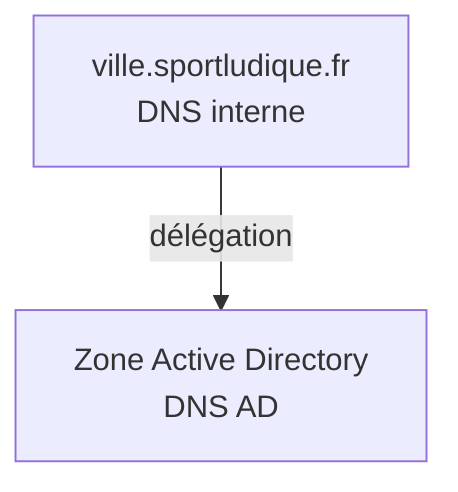
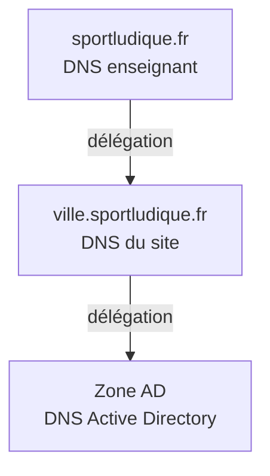

# DNS — Parcours Socle

## Objectifs

Dans ce parcours, vous allez mettre en place l'infrastructure DNS du site SportLudique dont vous avez la responsabilité.

L'objectif n'est pas uniquement de faire fonctionner la résolution de noms : vous devez comprendre **quel serveur possède quelle information** et **quels clients ont le droit d'y accéder**.

À la fin de cette activité, vous devrez être capable de :

- distinguer un **résolveur DNS** d'un **serveur DNS faisant autorité** ;
- créer et administrer une **zone DNS** ;
- publier des enregistrements DNS accessibles depuis l'extérieur ;
- conserver les informations internes dans le réseau de l'entreprise ;
- configurer un **redirecteur DNS** ;
- mettre en place une **délégation DNS** vers Active Directory ;
- tester et expliquer le chemin suivi par une requête DNS.

!!! info "Choix du système"
    Dans le parcours Socle, les services DNS peuvent être mis en œuvre avec **Windows Server ou Linux**.

    L'architecture et les fonctionnalités attendues restent identiques quel que soit le système choisi.

---

## Architecture attendue

Pour ce parcours, vous utiliserez **deux serveurs DNS distincts** :

- un **DNS public**, placé dans la DMZ ;
- un **DNS interne**, accessible depuis le LAN.

Le serveur DNS interne assure également le rôle de **résolveur DNS** pour les utilisateurs du LAN.



!!! question "Avant de commencer"
    Sur votre schéma d'infrastructure, positionnez les différents serveurs DNS et indiquez :

    - leur adresse IPv4 ;
    - le réseau auquel ils appartiennent ;
    - leur rôle ;
    - les zones DNS dont ils sont responsables.

    Faites valider votre architecture avant de commencer l'installation.

---

## 1. Le DNS public

Le serveur DNS public est placé dans la **DMZ**.

Il fait autorité sur la zone :

```text
ville.sportludique.fr
```

Il doit pouvoir être interrogé depuis le réseau extérieur.

Son rôle est de publier **uniquement les informations nécessaires pour accéder aux services publics de votre site**.

### Que doit contenir la zone publique ?

Vous devrez progressivement ajouter les enregistrements correspondant aux services que vous rendrez accessibles.

Par exemple :

```text
www.ville.sportludique.fr
mail.ville.sportludique.fr
vpn.ville.sportludique.fr
```

!!! warning "Ne publiez pas toute votre infrastructure"
    Le serveur DNS public n'a pas vocation à contenir les noms de vos postes de travail, contrôleurs de domaine, serveurs d'administration ou autres équipements internes.

    Demandez-vous toujours :

    **« Un utilisateur extérieur a-t-il besoin de connaître ce nom pour accéder au service ? »**

#### Illustration : ce que voit l'extérieur



Le serveur DNS public **fait autorité** : il possède directement les informations correspondant à sa zone.

---

### Créer la zone publique

Installez le rôle ou le service DNS sur le serveur de la DMZ.

Créez ensuite une **zone de recherche directe** correspondant à votre site :

```text
ville.sportludique.fr
```

Votre serveur doit être configuré comme serveur principal pour cette zone.

Créez au minimum les enregistrements nécessaires pour identifier :

- le serveur DNS lui-même ;
- le serveur Web public de votre infrastructure.

!!! example "Exemple"
    Pour un site fictif utilisant `chartres.sportludique.fr`, on pourrait obtenir :

    ```text
    ns.chartres.sportludique.fr
    www.chartres.sportludique.fr
    ```

    Vous devez naturellement adapter les noms et les adresses à **votre propre infrastructure**.

---

### Tester votre serveur d'autorité

Depuis une machine située à l'extérieur de votre LAN, interrogez **explicitement** votre serveur DNS public.

Vous pouvez utiliser :

=== "Linux"

    ```bash
    dig @IP_DNS_PUBLIC www.ville.sportludique.fr
    ```

    ou :

    ```bash
    nslookup www.ville.sportludique.fr IP_DNS_PUBLIC
    ```

=== "Windows"

    ```powershell
    nslookup www.ville.sportludique.fr IP_DNS_PUBLIC
    ```

Vérifiez que l'adresse obtenue correspond bien à celle prévue dans votre architecture.

!!! question "À vérifier"
    Votre DNS public répond-il parce qu'il a recherché l'information auprès d'un autre serveur ou parce qu'il **fait autorité** sur cette zone ?

---

## 2. Le DNS interne

Les utilisateurs du LAN ont des besoins différents de ceux d'un utilisateur extérieur.

Ils doivent notamment pouvoir :

- résoudre les noms des ressources internes ;
- résoudre les noms de SportLudique ;
- utiliser les services Active Directory ;
- résoudre les noms nécessaires à l'accès aux ressources extérieures.

Vous allez donc mettre en place un second serveur DNS dans le **réseau interne**.


Les postes du LAN utiliseront **ce serveur comme serveur DNS**.

!!! warning "Configuration des clients"
    Ne configurez pas plusieurs serveurs DNS sans réfléchir à leur rôle.

    Un « deuxième DNS » configuré sur un poste n'est pas un serveur utilisé uniquement lorsque le premier **ne connaît pas la réponse**.

---

### Les informations internes

Le DNS interne doit permettre aux utilisateurs du LAN de résoudre les noms des services qui ne doivent pas être publiés sur le DNS public.

Vous utiliserez également la zone :

```text
ville.sportludique.fr
```

mais son contenu pourra être différent de celui de la zone publique.



Vous disposez ainsi de **deux serveurs indépendants**, chacun possédant sa propre version de la zone.

Dans le parcours Socle, cette séparation est obtenue simplement en utilisant **deux serveurs DNS différents**.

!!! info "À retenir"
    Le serveur public et le serveur interne peuvent faire autorité sur une zone portant le même nom.

    Ce sont les clients qui n'interrogent pas le même serveur suivant leur emplacement.

---

## Le DNS interne comme résolveur

Votre DNS interne ne connaît pas toutes les zones DNS.

Lorsqu'un utilisateur demande par exemple une ressource appartenant à :

```text
sportludique.fr
```

votre serveur doit être capable de transmettre la requête au serveur DNS mis à disposition par l'enseignant.



Configurez le mécanisme de **redirection** nécessaire.

!!! question "Réfléchissez"
    Pourquoi les postes du LAN interrogent-ils votre DNS interne plutôt que directement le DNS de l'enseignant ?

---

## Vérifier la résolution

Configurez un poste du LAN pour qu'il utilise votre serveur DNS interne.

Vérifiez successivement la résolution :

1. d'un nom présent dans votre zone interne ;
2. d'un nom appartenant au domaine `sportludique.fr` mais absent de votre zone ;
3. d'un nom correspondant à une ressource extérieure.

Pour chaque test, identifiez :

- le serveur interrogé par le client ;
- le serveur qui possède réellement l'information ;
- le chemin suivi par la requête.

!!! tip "Ne vous contentez pas du ping"
    Utilisez des outils permettant d'interroger directement le DNS :

    ```bash
    dig nom_a_tester
    ```

    ou :

    ```text
    nslookup nom_a_tester
    ```

    Un `ping` peut utiliser une information déjà présente dans un cache et ne permet pas d'observer précisément le fonctionnement du DNS.

---

## Active Directory et DNS

Active Directory dépend fortement du DNS.

Les contrôleurs de domaine publient notamment de nombreux enregistrements permettant aux machines de trouver les différents services du domaine.

Il serait inutile et difficile de maintenir manuellement tous ces enregistrements sur votre DNS interne.

La gestion de l'espace DNS utilisé par Active Directory sera donc confiée au **serveur DNS Active Directory**.



Votre DNS interne reste responsable de sa zone, mais il indique qu'une partie de l'espace DNS est sous la responsabilité d'un autre serveur.

C'est une **délégation DNS**.

---

### Déléguer la zone Active Directory

Créez la délégation correspondant à la zone utilisée par votre domaine Active Directory.

Le serveur DNS interne doit être capable d'indiquer quel serveur DNS est responsable de cette zone.

!!! question "À expliquer"
    Après la délégation :

    - quel serveur fait autorité sur `ville.sportludique.fr` ?
    - quel serveur fait autorité sur la zone Active Directory ?
    - le DNS interne connaît-il lui-même tous les enregistrements créés par Active Directory ?

Vous devez être capable de représenter cette répartition sous la forme :



---

### Tester la délégation

Depuis un poste membre du LAN, interrogez un nom appartenant à la zone Active Directory.

Le poste doit toujours utiliser **votre DNS interne** comme serveur DNS.

Observez ensuite le résultat.

Vous devez être capable d'expliquer pourquoi le DNS interne peut fournir une réponse alors que l'enregistrement recherché est géré par le serveur DNS Active Directory.

---

## Vérifier la séparation interne / externe

Vous devez maintenant vérifier que les deux environnements sont correctement séparés.

### Depuis le LAN

Testez :

```text
www.ville.sportludique.fr
```

puis plusieurs noms correspondant à vos ressources internes.

### Depuis l'extérieur

Effectuez les mêmes requêtes en interrogeant le DNS public.

Comparez les résultats.

Complétez le tableau suivant :

| Nom testé | Depuis le LAN | Depuis l'extérieur | Résultat attendu ? |
|---|---|---|---|
| `www.ville.sportludique.fr` | | | |
| ressource interne | | | |
| ressource AD | | | |
| service public | | | |

!!! question "Conclusion"
    Expliquez pourquoi deux clients utilisant exactement le même nom DNS peuvent obtenir des informations différentes.

---

## Vérifier la sécurité du résolveur

Votre serveur DNS public est accessible depuis l'extérieur afin de répondre aux requêtes concernant vos services publics.

Cela ne signifie pas qu'il doit accepter de **résoudre n'importe quel nom pour n'importe quel client**.

Depuis le réseau extérieur, testez une requête concernant un domaine qui n'appartient pas à votre infrastructure.

Votre DNS public ne doit pas devenir un **résolveur DNS ouvert** utilisable par n'importe quelle machine.


!!! warning "Serveur d'autorité public ≠ résolveur public"
    Votre serveur DNS public doit répondre pour les zones dont il est responsable.

    Il n'a pas à fournir un service de résolution récursive à l'ensemble d'Internet.

---

## Validation de votre infrastructure

Avant de considérer le service DNS comme opérationnel, vérifiez l'ensemble des points suivants :

- le DNS public est accessible depuis l'extérieur ;
- il fait autorité sur la zone publique de votre site ;
- il ne publie pas les informations purement internes ;
- il ne fournit pas inutilement un service de résolution récursive depuis l'extérieur ;
- les clients du LAN utilisent le DNS interne ;
- le DNS interne contient les informations réservées au LAN ;
- le DNS interne assure la résolution pour les clients ;
- les requêtes concernant `sportludique.fr` peuvent atteindre le DNS de l'enseignant ;
- la zone Active Directory est gérée par le DNS Active Directory ;
- la délégation vers cette zone fonctionne.

---

## Présenter votre architecture

Mettez à jour le schéma de votre infrastructure.

Il doit faire apparaître clairement :

- le **DNS public** ;
- le **DNS interne** ;
- le **DNS Active Directory** ;
- le serveur DNS de l'enseignant ;
- les zones gérées par chaque serveur ;
- les flux DNS autorisés entre les différentes zones réseau.

Vous devez être capable de répondre sans consulter votre configuration aux questions suivantes :

!!! question "Questions de validation"

    **1.** Quelle différence faites-vous entre un résolveur DNS et un serveur DNS faisant autorité ?

    **2.** Pourquoi votre infrastructure possède-t-elle un DNS public et un DNS interne ?

    **3.** Pourquoi les deux serveurs peuvent-ils contenir des informations différentes pour `ville.sportludique.fr` ?

    **4.** Quel serveur DNS est configuré sur les postes du LAN ?

    **5.** Comment une requête concernant `sportludique.fr` atteint-elle le serveur DNS de l'enseignant ?

    **6.** Pourquoi la zone Active Directory est-elle gérée par le DNS AD ?

    **7.** À quoi sert la délégation mise en place ?

    **8.** Pourquoi votre DNS public ne doit-il pas devenir un résolveur DNS ouvert ?