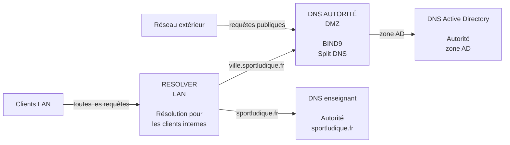
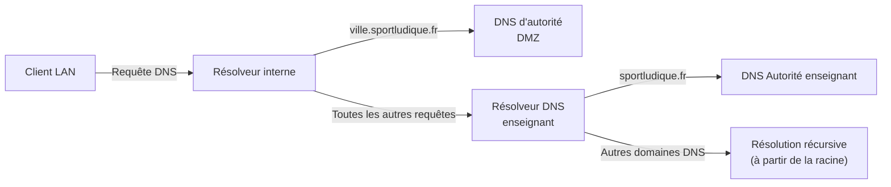
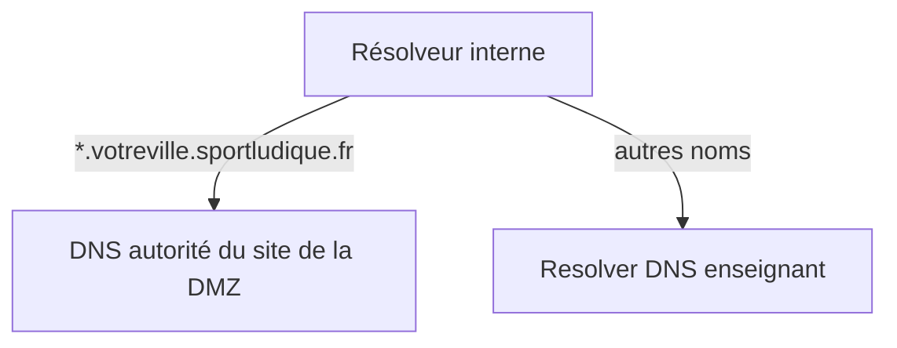
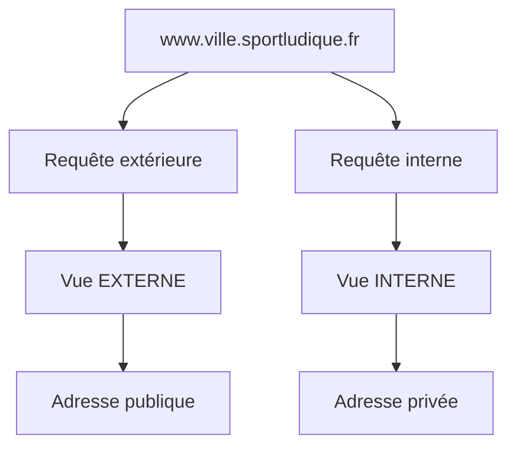
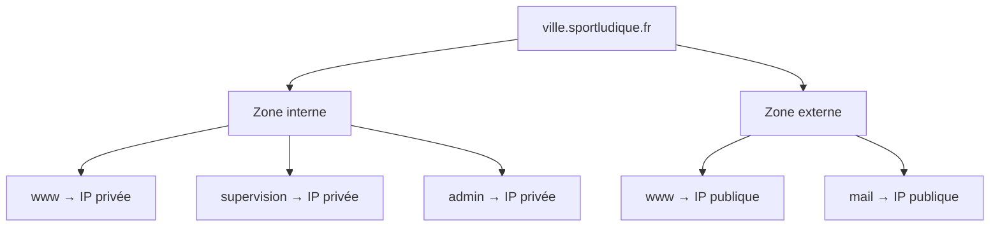
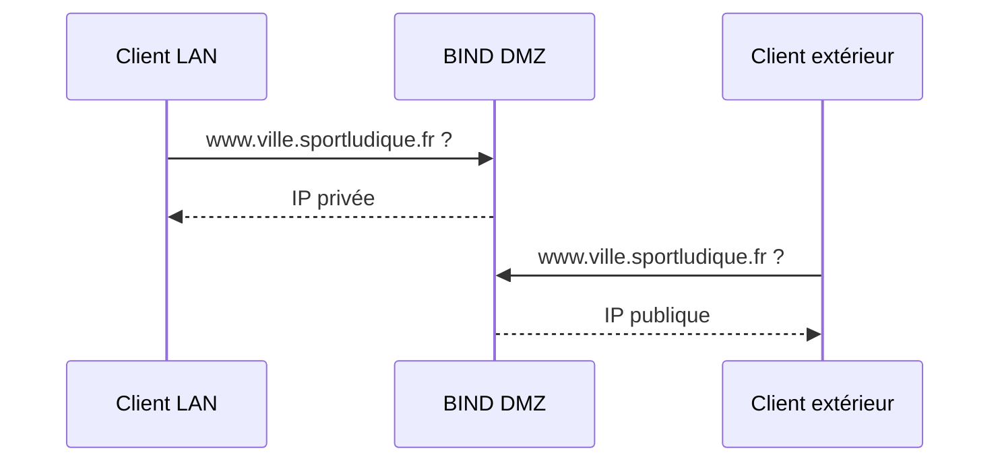
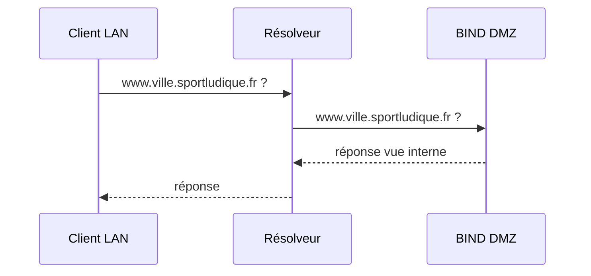
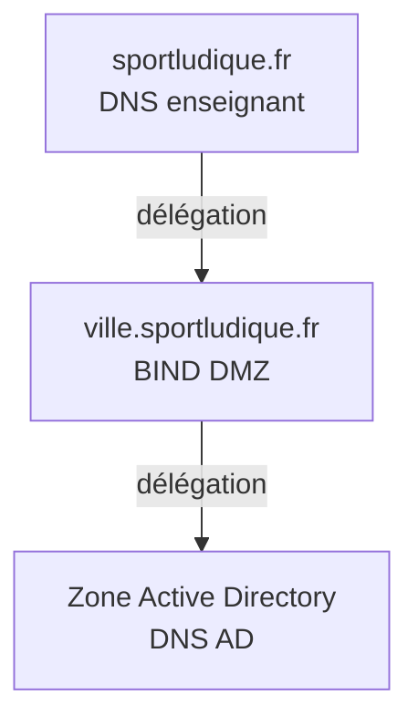
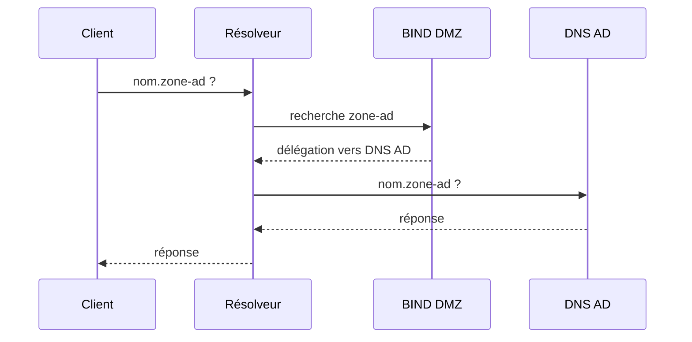

# DNS — Parcours Avancé

## Objectifs

Dans ce parcours, vous allez mettre en place une architecture DNS séparant clairement les différents rôles du service.

Contrairement au parcours Socle :

- le **résolveur DNS interne** est un serveur dédié ;
- le **serveur DNS d'autorité** est placé dans la DMZ ;
- le serveur d'autorité fournit des réponses différentes aux clients internes et externes grâce au **Split DNS** ;
- les principaux services DNS sont mis en œuvre sous **Linux**.

L'objectif est de construire une architecture proche de celle rencontrée dans une infrastructure professionnelle et surtout d'être capable d'en expliquer le fonctionnement.

À la fin de cette activité, vous devrez être capable de :

- configurer un résolveur DNS interne ;
- configurer un serveur DNS d'autorité avec **BIND9** ;
- mettre en œuvre des **vues DNS** ;
- distinguer les informations publiques et internes ;
- configurer des redirections conditionnelles ;
- déléguer la gestion de la zone Active Directory ;
- diagnostiquer le chemin suivi par une requête DNS.

---

## Architecture attendue

Votre infrastructure comportera plusieurs rôles DNS distincts.



!!! question "Avant toute installation"
    Complétez votre schéma d'infrastructure en indiquant :

    - les adresses IPv4 des différents serveurs ;
    - les réseaux auxquels ils appartiennent ;
    - les rôles DNS assurés ;
    - les zones gérées par chaque serveur ;
    - les flux DNS nécessaires.

    Faites valider votre architecture avant de commencer sa mise en œuvre.

---

## Le résolveur DNS interne

Les postes du LAN utilisent un **résolveur DNS dédié**.

Celui-ci ne fait pas autorité sur la zone de votre site.

Son rôle est de recevoir les requêtes des clients et de rechercher le serveur capable d'y répondre.



!!! warning "Séparation des rôles"
    Dans ce parcours, ne transformez pas le résolveur en serveur d'autorité pour `ville.sportludique.fr`.

    Le serveur d'autorité de votre site se trouve dans la **DMZ**.

---

### Installer le résolveur

Le résolveur DNS interne doit être mis en œuvre sous **Linux avec `Unbound`**.

Unbound assurera :

- la résolution DNS pour les clients du LAN ;
- la mise en cache des réponses ;
- la redirection des requêtes concernant `ville.sportludique.fr` vers le serveur DNS d'autorité situé dans la DMZ ;
- la redirection de toutes les autres requêtes vers le **résolveur DNS de l'enseignant**.

Le serveur DNS d'autorité situé dans la DMZ sera quant à lui mis en œuvre sous **Linux avec `BIND9`**.
Configurez le service afin que :

- les postes du LAN puissent l'interroger ;
- les machines extérieures au réseau autorisé ne puissent pas utiliser votre résolveur ;
- le serveur puisse traiter les requêtes nécessaires aux utilisateurs.

!!! info "Unbound"
    Unbound est spécialisé dans la résolution DNS.

    Son utilisation permet de matérialiser clairement la séparation entre le rôle de **résolveur** et celui de **serveur d'autorité** (géré avec Bind9).

---

### Rediriger certaines zones

Toutes les requêtes ne doivent pas nécessairement suivre le même chemin.

Votre résolveur connaît certains serveurs DNS particuliers.

Pour la zone :

```text
ville.sportludique.fr
```

les requêtes doivent être transmises au serveur DNS d'autorité situé dans votre DMZ.

Pour :

```text
sportludique.fr
```

elles doivent pouvoir atteindre le serveur DNS mis à disposition par l'enseignant.



Configurez les **redirections conditionnelles** nécessaires.

!!! question "À expliquer"
    Pourquoi ne configure-t-on pas simplement le DNS de l'enseignant comme unique redirecteur pour toutes les requêtes ?

---

### Tester le résolveur

Depuis un poste du LAN, vérifiez que le résolveur répond correctement.

Utilisez notamment :

```bash
dig nom_a_tester
```

Vous pouvez également interroger explicitement un serveur :

```bash
dig @IP_DU_SERVEUR nom_a_tester
```

Effectuez plusieurs tests permettant de distinguer :

- une requête destinée au DNS de votre site ;
- une requête destinée au DNS de l'enseignant ;
- une requête concernant un autre domaine.

Vous devez être capable d'indiquer **quel serveur est interrogé à chaque étape**.

---

## Le serveur DNS d'autorité

Installez **`BIND9`** sur un serveur Linux situé dans la **DMZ**.

Ce serveur fait autorité sur :

```text
ville.sportludique.fr
```

Mais contrairement au parcours Socle, vous n'allez pas utiliser deux serveurs d'autorité différents pour séparer les informations publiques et internes.

Un **seul serveur BIND** fournira deux visions différentes de la zone.

C'est le principe du **Split DNS**.

---

### Comprendre le Split DNS

Considérons la requête :

```text
www.ville.sportludique.fr
```

La réponse attendue peut dépendre de l'origine de la requête.



Le nom demandé est **strictement identique**.

C'est le serveur DNS qui choisit la zone à utiliser en fonction de l'adresse source de la requête.

!!! info "Deux vues, deux contenus"
    BIND permet de définir plusieurs **views**.

    Chaque vue peut contenir sa propre version de :

    ```text
    ville.sportludique.fr
    ```

    Vous aurez donc deux fichiers de zone :

    ```text
    zone externe → informations publiques
    zone interne → informations internes
    ```

---

### Les vues BIND

Une vue BIND suit le principe suivant :

```text
requête reçue
      │
      ▼
adresse IP source
      │
      ├── réseau interne ? ──► vue interne
      │
      └── autre origine ? ───► vue externe
```

La directive essentielle permettant de sélectionner les clients est :

```text
match-clients
```

Vous allez créer deux vues :

```text
inside
outside
```

!!! warning "L'ordre est important"
    BIND teste les vues selon leur configuration.

    Une requête doit correspondre à la vue prévue.

    Une règle trop générale placée au mauvais endroit peut donc empêcher les clients d'atteindre la bonne vue.

---

### Préparer les ACL

Il est préférable de commencer par identifier clairement les réseaux considérés comme internes.

Dans la configuration BIND, créez une ACL regroupant les réseaux autorisés à utiliser la vue interne.

Exemple :

```bind
acl "local-networks" {
    127.0.0.1;
    ADRESSE_RESEAU_LAN/MASQUE;
    ADRESSE_RESEAU_DMZ/MASQUE;
};
```

!!! warning "Ne recopiez pas l'exemple"
    Remplacez les réseaux par ceux correspondant réellement à votre site.

    Vous devez être capable de justifier chaque réseau présent dans cette ACL.

---

### Créer la vue interne

La vue interne doit être utilisée lorsque la requête provient des réseaux définis dans votre ACL.

Le principe est :

```bind
view "inside" {

    match-clients {
        local-networks;
    };

    zone "ville.sportludique.fr" {
        type master;
        file "/etc/bind/db.ville.sportludique.fr.interne";
    };
};
```

Le fichier :

```text
/etc/bind/db.ville.sportludique.fr.interne
```

contient la version **interne** de votre zone.

Vous y placerez les enregistrements nécessaires au fonctionnement des services depuis le LAN.

---

### Créer la vue externe

Les autres clients doivent utiliser la vue externe.

Le principe est :

```bind
view "outside" {

    match-clients {
        any;
    };

    zone "ville.sportludique.fr" {
        type master;
        file "/etc/bind/db.ville.sportludique.fr.externe";
    };
};
```

Cette zone ne doit contenir que les informations nécessaires depuis l'extérieur.

!!! warning "Attention à l'exposition d'informations"
    La vue externe ne doit pas devenir une copie complète de votre DNS interne.

    Vérifiez chaque enregistrement avant de l'y ajouter.

---

### Deux fichiers de zone

Vous disposez maintenant de deux fichiers distincts.

```text
db.ville.sportludique.fr.interne
db.ville.sportludique.fr.externe
```

Ils décrivent **la même zone DNS**, mais pour deux populations différentes.

Par exemple :



!!! question "À expliquer"
    Pourquoi est-il indispensable que la zone externe ne contienne pas tous les enregistrements présents dans la zone interne ?

---

### Attention aux zones par défaut de BIND

L'utilisation des `view` modifie l'organisation habituelle de la configuration BIND.

Les zones utilisées par BIND doivent être placées dans le contexte approprié.

Vous pouvez notamment rencontrer une erreur si certaines zones sont déclarées **hors des vues** alors que vous utilisez des `view`.

!!! danger "Ne corrigez pas au hasard"
    Si BIND refuse de démarrer après l'ajout des vues :

    ```bash
    sudo named-checkconf
    ```

    Lisez le message retourné avant de modifier la configuration.

    Une erreur de démarrage de BIND est généralement beaucoup plus utile qu'un serveur qui « ne répond pas ».

---

### Vérifier les fichiers de zone

Avant chaque redémarrage du service, vérifiez votre configuration.

### Configuration générale

```bash
sudo named-checkconf
```

### Zone interne

```bash
sudo named-checkzone ville.sportludique.fr \
/etc/bind/db.ville.sportludique.fr.interne
```

### Zone externe

```bash
sudo named-checkzone ville.sportludique.fr \
/etc/bind/db.ville.sportludique.fr.externe
```

Puis seulement après validation :

```bash
sudo systemctl restart bind9
```

!!! tip "Une bonne habitude"
    **Vérifier → corriger → redémarrer → tester**

    Évitez la méthode :

    **modifier → redémarrer → modifier au hasard → redémarrer → prier**

---

### Tester le Split DNS

C'est une étape essentielle.

Vous devez démontrer que **le même serveur DNS** répond différemment suivant l'origine de la requête.

### Depuis le LAN

Interrogez :

```bash
dig @IP_DNS_AUTORITE www.ville.sportludique.fr
```

Notez la réponse.

### Depuis le réseau extérieur

Effectuez exactement la même requête en utilisant le résolveur DNS de l'enseignant :

```bash
dig @IP_RESOLVER_DNS_ENSEIGNANT www.ville.sportludique.fr
```

!!! danger "N'utilisez pas les résolveurs DNS publics"
    N'utilisez pas de résolveur DNS public comme `8.8.8.8` (Google) ou `1.1.1.1` (Cloudflare) pour tester les noms du projet SportLudique.

    Le domaine `sportludique.fr` utilisé dans le projet **n'a pas été acheté et n'existe pas dans le DNS public d'Internet**.

    Il est géré uniquement par l'infrastructure DNS pédagogique mise à disposition par l'enseignant. Les résolveurs DNS publics ne peuvent donc pas connaître les zones et délégations utilisées dans le projet.

Comparez les deux résultats.



!!! success "Validation"
    Si le même serveur répond avec deux informations différentes selon l'origine de la requête, votre **Split DNS fonctionne**.

---

## Comprendre un piège important

Dans le fonctionnement normal de votre infrastructure, un poste du LAN n'interroge pas directement le serveur d'autorité.

Il interroge :

```text
Client → Résolveur → DNS d'autorité
```

Le serveur BIND situé dans la DMZ voit donc comme **adresse source de la requête DNS celle du résolveur**.



!!! question "Et les machines de la DMZ ?"
    Jusqu'à présent, nous avons étudié la résolution DNS pour les postes du LAN.

    Mais les serveurs placés dans la **DMZ** ont eux aussi besoin de résoudre des noms : mises à jour, dépôts logiciels, services externes, etc.

    **Quel resolver DNS (`/etc/resolv.conf`) allez-vous configurer sur les machines de la DMZ ?**

    Plusieurs possibilités semblent envisageables :

    - utiliser le résolveur Unbound situé dans le LAN ;
    - utiliser directement le serveur BIND de la DMZ ;
    - utiliser le résolveur DNS de l'enseignant.

    Pour chaque solution envisagée, étudiez :

    - les **flux réseau** qu'elle impose entre LAN, DMZ et extérieur ;
    - l'accès aux noms internes et externes ;
    - le rôle que devrait alors assurer chaque serveur DNS ;
    - les conséquences en matière de **filtrage et de sécurité**.

    **Proposez et justifiez la solution que vous retenez avant de modifier votre configuration.**

---

## Active Directory

Le DNS Active Directory doit rester responsable de sa propre zone.

Votre serveur BIND ne doit pas reproduire manuellement les nombreux enregistrements créés par Active Directory.

Vous allez donc déléguer cet espace DNS au serveur DNS AD.



---

### Une difficulté supplémentaire liée aux vues

Votre serveur possède désormais **deux versions** de :

```text
ville.sportludique.fr
```

Vous devez donc réfléchir à la vue dans laquelle la délégation Active Directory doit être visible.

!!! question "Avant de configurer"
    Un utilisateur extérieur doit-il pouvoir découvrir l'existence et l'adresse de votre serveur DNS Active Directory ?

La délégation vers la zone AD doit être accessible aux clients qui en ont besoin sans exposer inutilement cette infrastructure à l'extérieur.

Configurez les enregistrements nécessaires dans la zone appropriée.

---

### Tester la délégation

Depuis le LAN, effectuez une requête concernant un nom appartenant à la zone Active Directory.

Le chemin attendu est désormais :



Vous devez être capable d'expliquer le rôle de chacun des trois serveurs DNS dans cet échange.

---

### Vérifier les flux réseau

Une configuration DNS correcte ne suffit pas si les flux nécessaires sont bloqués par vos pare-feux.

Identifiez les communications DNS réellement nécessaires entre :

- LAN → résolveur ;
- résolveur → DNS d'autorité DMZ ;
- résolveur → DNS enseignant ;
- résolveur → DNS Active Directory ;
- extérieur → DNS d'autorité DMZ.

!!! question "Pare-feu"
    Un serveur DNS utilise principalement le port `53`.

    Ne partez cependant pas du principe que « DNS = UDP uniquement ».

    Recherchez dans quelles situations DNS utilise également **TCP/53** et adaptez votre filtrage.

---

## Validation du parcours

Votre infrastructure doit maintenant permettre :

- aux clients du LAN d'utiliser un résolveur dédié ;
- au résolveur de transmettre les requêtes vers les serveurs appropriés ;
- au serveur BIND de la DMZ de faire autorité sur `ville.sportludique.fr` ;
- au serveur BIND de fournir une **vue interne** et une **vue externe** ;
- de fournir une adresse privée ou publique selon l'origine de la requête lorsque cela est nécessaire ;
- de conserver les enregistrements internes invisibles depuis l'extérieur ;
- de laisser le DNS Active Directory gérer sa propre zone ;
- d'empêcher l'utilisation du serveur d'autorité comme résolveur DNS ouvert.

Mettez à jour votre schéma d'infrastructure afin d'y faire apparaître les rôles et les flux DNS.

---

## Diagnostic

Avant de demander de l'aide, vérifiez systématiquement :

```bash
sudo named-checkconf
```

puis :

```bash
sudo named-checkzone ville.sportludique.fr \
/etc/bind/db.ville.sportludique.fr.interne
```

et :

```bash
sudo named-checkzone ville.sportludique.fr \
/etc/bind/db.ville.sportludique.fr.externe
```

Vérifiez ensuite l'état du service :

```bash
sudo systemctl status bind9
```

et les journaux :

```bash
sudo journalctl -u bind9
```

Enfin, testez **directement** le serveur concerné :

Pour interroger explicitement un serveur DNS :

=== "dig"

    ```bash
    dig @IP_SERVEUR_A_INTERROGER nom_a_tester
    ```

=== "nslookup"

    ```bash
    nslookup nom_a_tester IP_SERVEUR_A_INTERROGER
    ```

!!! warning "Diagnostiquez par étapes"
    Si une résolution complète ne fonctionne pas, ne modifiez pas simultanément le résolveur, BIND, Active Directory et le pare-feu.

    Testez chaque maillon séparément.

    ---

# Questions de validation

Vous devez être capable de répondre aux questions suivantes sans consulter vos fichiers de configuration :

1. Pourquoi le résolveur et le serveur d'autorité sont-ils séparés dans votre architecture ?
2. Pourquoi le serveur d'autorité est-il placé dans la DMZ ?
3. Comment BIND choisit-il entre la vue interne et la vue externe ?
4. Pourquoi deux fichiers peuvent-ils décrire la même zone DNS ?
5. Quelle adresse source BIND voit-il lorsqu'une requête arrive par votre résolveur ?
6. Pourquoi la zone Active Directory est-elle déléguée ?
7. Pourquoi cette délégation ne doit-elle pas nécessairement être visible depuis l'extérieur ?
8. Quelle différence faites-vous entre redirection et délégation ?
9. Pourquoi le DNS utilise-t-il UDP **et** TCP ?
10. Pourquoi un serveur DNS secondaire améliore-t-il la disponibilité sans remplacer le serveur primaire pour l'administration de la zone ?
