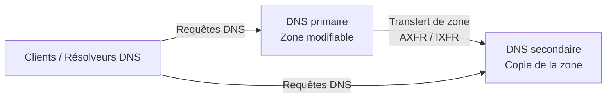
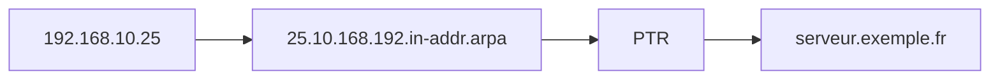
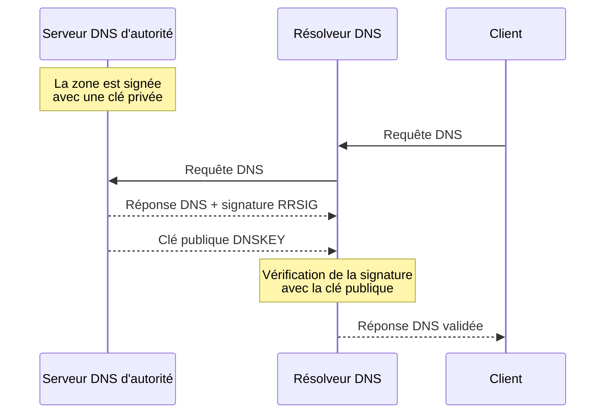
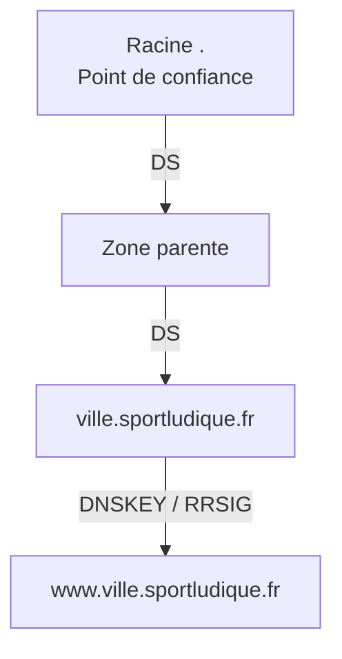

# DNS — Approfondissements

Une fois l'infrastructure DNS précédente entièrement fonctionnelle, vous pouvez approfondir trois mécanismes importants :

- la **résilience** du service DNS grâce aux serveurs secondaires ;
- la **résolution inverse** avec les enregistrements `PTR` ;
- la **sécurisation des données DNS** avec DNSSEC.

---

## 1. Résilience du service DNS

Votre serveur DNS d'autorité fonctionne.

Mais une question reste posée :

> **Que se passe-t-il si ce serveur devient indisponible ?**

Avec un seul serveur faisant autorité sur une zone, celui-ci constitue un **point unique de défaillance**.


La solution consiste à disposer de plusieurs serveurs capables de répondre de manière autoritaire pour la même zone.

!!! info "Recommandations de l'ANSSI"
    Pour assurer la **résilience** du service DNS, l'ANSSI recommande de disposer de plusieurs serveurs DNS faisant autorité et de **diversifier leur hébergement** afin qu'une même panne ou un même incident ne puisse pas rendre l'ensemble du service indisponible.

    En production, les serveurs DNS secondaires peuvent ainsi être hébergés sur des **sites géographiquement distincts** et sur des infrastructures différentes.

### Serveur primaire et serveur secondaire

Le **serveur primaire** contient la version modifiable de la zone.

Un **serveur secondaire** possède une copie de cette zone et peut lui aussi répondre aux requêtes DNS.



!!! info "Le secondaire n'est pas uniquement un serveur de secours"
    Le serveur primaire et le serveur secondaire sont tous les deux **serveurs d'autorité** pour la zone et peuvent répondre aux requêtes DNS.

    La distinction **primaire / secondaire** concerne principalement la gestion et la synchronisation des données de la zone.

---

### Le numéro de série du SOA

Vous avez déjà rencontré l'enregistrement `SOA` (*Start Of Authority*).

Il contient notamment le **numéro de série de la zone**.

Exemple :

```dns
@   IN  SOA ns1.ville.sportludique.fr. admin.ville.sportludique.fr. (
        2026092801 ; serial
        3600       ; refresh
        900        ; retry
        1209600    ; expire
        3600       ; minimum
)
```

Le numéro de série permet notamment au serveur secondaire de déterminer si sa copie de la zone est toujours à jour.

!!! warning "Modification de la zone : pensez au numéro de série"
    Lorsque vous modifiez manuellement une zone DNS, pensez à **incrémenter le numéro de série (`serial`)** de l'enregistrement `SOA`.

    Nous utiliserons la convention :

    ```text
    AAAAMMJJNN
    ```

    avec :

    - `AAAA` : année ;
    - `MM` : mois ;
    - `JJ` : jour ;
    - `NN` : numéro de modification effectuée dans la journée.

    Par exemple :

    ```text
    2026092801
    ```

    correspond à la **première modification du 28 septembre 2026**.

    Une seconde modification effectuée le même jour donnera :

    ```text
    2026092802
    ```

    Une zone modifiée avec un numéro de série inchangé peut ne pas être récupérée par le serveur secondaire.

---

### Les transferts de zone

Deux mécanismes principaux existent.

#### AXFR

`AXFR` correspond à un **transfert complet de la zone**.

```text
DNS primaire ───── zone complète ─────► DNS secondaire
```

Il est notamment utilisé lors de la première récupération de la zone.

#### IXFR

`IXFR` correspond à un **transfert incrémentiel**.

Seules les modifications intervenues depuis la version connue par le serveur secondaire sont transférées lorsque cela est possible.

```text
DNS primaire ───── modifications ─────► DNS secondaire
```

Cela évite de transférer inutilement l'intégralité d'une zone lorsqu'une faible partie de son contenu a changé.

!!! info "Pour votre culture"
    Les termes `AXFR` et `IXFR` sont présentés ici pour comprendre le fonctionnement des **transferts de zone DNS**.

    **Vous n'avez pas à retenir ces deux acronymes.**

    En revanche, vous devez comprendre qu'un serveur DNS secondaire récupère une copie de la zone depuis le serveur primaire et que ce transfert doit être **limité aux serveurs autorisés**.

---

### Tester un transfert de zone

Avec `dig`, une demande de transfert complet peut être effectuée avec :

```bash
dig @IP_DNS_PRIMAIRE ville.sportludique.fr AXFR
```

!!! danger "Un transfert de zone n'est pas public"
    Cette commande montre également pourquoi les transferts doivent être contrôlés.

    Un serveur DNS secondaire doit pouvoir récupérer la zone.

    Cela ne signifie pas que **n'importe quelle machine** doit pouvoir obtenir une copie complète de celle-ci.

    Les transferts doivent être limités aux serveurs explicitement autorisés.

---

### Mise en œuvre

Ajoutez un serveur DNS secondaire à votre architecture.

Vous devrez :

- déclarer la zone sur le serveur secondaire ;
- autoriser le transfert uniquement vers ce serveur ;
- vérifier la synchronisation de la zone ;
- modifier un enregistrement sur le primaire ;
- incrémenter le numéro de série ;
- vérifier que la modification apparaît sur le secondaire.

!!! question "Validation"
    Arrêtez temporairement le serveur DNS primaire.

    La zone reste-t-elle résolvable ?

    Quel élément de votre architecture permet désormais d'assurer la **disponibilité** du service DNS ?

---

## 2. Résolution inverse

Jusqu'à présent, vous avez principalement utilisé le DNS dans ce sens :

```text
nom → adresse IP
```

Par exemple :

```text
www.chartres.sportludique.fr → 172.28.x.x
```

Cette résolution utilise notamment un enregistrement `A` pour IPv4.

Le DNS permet également d'effectuer l'opération inverse :

```text
adresse IP → nom
```

C'est la **résolution inverse**.

Elle est notamment utilisée pour :

- rendre les **logs** plus lisibles en associant un nom à une adresse IP ;
- faciliter la **supervision** et l'identification des équipements ;
- afficher des noms d'hôtes lors de certains diagnostics réseau, par exemple avec `traceroute` ;
- identifier plus facilement l'origine d'une connexion ou d'un événement lors d'un **diagnostic** ;
- certains contrôles réalisés par les **serveurs de messagerie**.

!!! example "Exemple avec traceroute"
    Sans résolution inverse, un équipement intermédiaire peut apparaître uniquement sous la forme :

    ```text
    172.28.160.1
    ```

    Si un enregistrement `PTR` existe, un outil comme `traceroute` peut afficher un nom plus explicite :

    ```text
    rtr-chartres.sportludique.fr (172.28.160.1)
    ```

---

### L'enregistrement PTR

La résolution inverse utilise des enregistrements de type `PTR`.

Prenons l'adresse `192.168.10.150`, associée au nom `www.chartres.sportludique.fr`.

La résolution directe utilise un enregistrement `A` :

```dns
www     IN A     192.168.10.150
```

Pour la résolution inverse, DNS utilise le domaine `in-addr.arpa` et écrit les octets de l'adresse dans l'ordre inverse :

```text
192.168.10.150 → 150.10.168.192.in-addr.arpa
```

L'enregistrement `PTR` correspondant est par exemple :

```dns
150     IN PTR     www.chartres.sportludique.fr.
```

!!! warning "Attention au point final"
    Le point final indique que `www.chartres.sportludique.fr.` est un **nom DNS pleinement qualifié**.



### Exemple avec deux réseaux en /25

Considérons les deux réseaux suivants :

| Réseau | Plage d'adresses utilisables |
|---|---|
| `192.168.10.0/25` | `192.168.10.1` à `192.168.10.126` |
| `192.168.10.128/25` | `192.168.10.129` à `192.168.10.254` |

Nous souhaitons gérer séparément la résolution inverse de ces deux réseaux.

Deux fichiers de zone inverse seront donc utilisés :

```text
db.192.168.10.0
db.192.168.10.128
```

Exemple pour le premier réseau :

```dns
$ORIGIN 0-127.10.168.192.in-addr.arpa.

10    IN PTR    srv1.exemple.tld.
20    IN PTR    srv2.exemple.tld.
```

Et pour le second :

```dns
$ORIGIN 128-255.10.168.192.in-addr.arpa.

150   IN PTR    www.exemple.tld.
200   IN PTR    mail.exemple.tld.
```

!!! warning "Pourquoi deux zones ?"
    Le réseau `192.168.10.0/24` a été découpé en **deux réseaux `/25` distincts**.

    Si leur résolution inverse est administrée séparément, chacun dispose donc de sa **propre zone inverse** et de son **propre fichier de zone**.

    La délégation de zones inverses sur une frontière différente de `/8`, `/16` ou `/24` nécessite cependant un mécanisme particulier appelé **délégation inverse sans classe** (*classless reverse DNS*).

---

### Tester une résolution inverse

Avec `dig` :

```bash
dig -x 192.168.10.25
```

Vous pouvez également interroger explicitement un serveur :

```bash
dig @IP_SERVEUR_DNS -x 192.168.10.25
```

Avec `nslookup` :

```bash
nslookup 192.168.10.25 IP_SERVEUR_DNS
```

!!! question "À vous de jouer"
    Créez la zone inverse correspondant à l'un de vos réseaux et ajoutez plusieurs enregistrements `PTR`.

    Vérifiez ensuite la résolution :

    - **nom → adresse IPv4** ;
    - **adresse IPv4 → nom**.

    Les deux résultats sont-ils automatiquement liés ?

---

## 3. DNSSEC

DNS permet maintenant :

- de publier vos services ;
- de séparer les informations internes et externes ;
- de déléguer des zones ;
- d'assurer la résolution inverse ;
- de rendre le service plus disponible avec plusieurs serveurs.

Il reste cependant une question :

> **Comment un résolveur peut-il vérifier que les données DNS reçues sont authentiques et n'ont pas été modifiées ?**

DNSSEC (*Domain Name System Security Extensions*) apporte des mécanismes cryptographiques permettant cette vérification.

---

### Ce que protège DNSSEC

`DNSSEC` permet de garantir :

- **l'authenticité** des informations DNS en vérifiant leur provenance ;
- leur **intégrité**, en permettant de détecter une modification des données.

DNSSEC **ne chiffre pas** les requêtes ni les réponses DNS et n'apporte donc pas la **confidentialité**.

??? info "Rappel cybersécurité — DIC"
    On retrouve ici les propriétés fondamentales étudiées en cybersécurité :

    - **Disponibilité** : le service doit rester accessible ;
    - **Intégrité** : une modification non autorisée doit pouvoir être détectée ;
    - **Confidentialité** : l'information ne doit être accessible qu'aux systèmes autorisés.

    Le serveur DNS secondaire étudié précédemment contribue à la **disponibilité**.

    DNSSEC agit principalement sur **l'intégrité et l'authenticité** des données DNS.

    Il n'assure pas leur **confidentialité**.

---

### Signer et vérifier

Le principe général repose sur la cryptographie asymétrique.

La zone DNS est **signée avec une clé privée**.

Le résolveur peut utiliser la **clé publique correspondante** pour vérifier la signature.



!!! info "Qui fait quoi ?"
    - le **serveur d'autorité** signe les données DNS avec sa **clé privée** ;
    - il publie la clé publique correspondante dans un enregistrement **`DNSKEY`** ;
    - les signatures sont publiées dans des enregistrements **`RRSIG`** ;
    - le **résolveur validant** utilise ces informations pour vérifier l'authenticité et l'intégrité de la réponse ;
    - le **client** reçoit ensuite la réponse du résolveur.

La vérification est réalisée par le **résolveur DNS**, et non directement par le poste client. Il n'y a donc rien à configurer coté client.

---

### Les principaux enregistrements DNSSEC

Trois types d'enregistrements sont particulièrement importants :

| Type | Rôle |
|---|---|
| `DNSKEY` | publie les clés publiques utilisées pour vérifier les signatures |
| `RRSIG` | contient la signature cryptographique d'un ensemble d'enregistrements |
| `DS` | permet à la zone parente d'établir la confiance avec une zone enfant |

---

### La chaîne de confiance

Signer une zone ne suffit pas.

Encore faut-il pouvoir déterminer si la clé utilisée pour vérifier cette signature est elle-même digne de confiance.

DNSSEC construit donc une **chaîne de confiance** entre les différentes zones DNS.



L'enregistrement `DS` (*Delegation Signer*) placé dans la **zone parente** permet d'établir la confiance envers la clé de la zone enfant.

---

### Et dans SportLudique ?

Le domaine `sportludique.fr` utilisé dans le projet est **simulé dans l'infrastructure pédagogique** et n'est pas enregistré dans le DNS public d'Internet.

Nous ne pouvons donc pas établir une véritable chaîne de confiance depuis la racine DNS publique comme pour un domaine Internet réel.

L'objectif est donc principalement de comprendre :

- la signature d'une zone ;
- les enregistrements `DNSKEY` ;
- les signatures `RRSIG` ;
- le rôle de l'enregistrement `DS` ;
- la chaîne de confiance ;
- le rôle d'un résolveur validant comme **Unbound**.

!!! info "Pour aller encore plus loin"
    Une zone DNSSEC réellement exploitée doit également gérer le **renouvellement des signatures et des clés**.

    DNSSEC n'est donc pas simplement une option que l'on active une fois : son exploitation nécessite une gestion dans le temps.

---

### Observer DNSSEC

Avec `dig`, l'option suivante permet de demander les informations DNSSEC :

```bash
dig nom_de_domaine +dnssec
```

Lorsqu'une réponse signée est retournée, vous pourrez notamment observer les enregistrements `RRSIG`.

Un résolveur validant vérifie ensuite ces signatures et la chaîne de confiance avant de considérer les données comme valides.

## 4. Chiffrement des requêtes DNS

Le protocole DNS classique échange généralement les requêtes **sans chiffrement**.

Il existe aujourd'hui plusieurs mécanismes permettant de protéger les échanges entre un client et son résolveur DNS.

| Protocole | Principe | Port |
|---|---|---:|
| **DNS classique** | DNS sur UDP ou TCP | `53` |
| **DoT** — DNS over TLS | DNS transporté dans une connexion TLS | `853/TCP` |
| **DoH** — DNS over HTTPS | DNS transporté dans HTTPS | `443/TCP` |

!!! info "DNSSEC et chiffrement DNS : deux objectifs différents"
    **DNSSEC** permet de vérifier **l'authenticité et l'intégrité des données DNS**.

    **DoT** et **DoH** permettent de protéger la **confidentialité des échanges** entre le client et le résolveur.

    Ces mécanismes sont donc **complémentaires**.


!!! warning "Attention au périmètre"
    DoT ou DoH protège la communication **jusqu'au résolveur utilisé**.

    Cela ne signifie pas que l'ensemble des échanges DNS réalisés ensuite par ce résolveur est automatiquement chiffré.