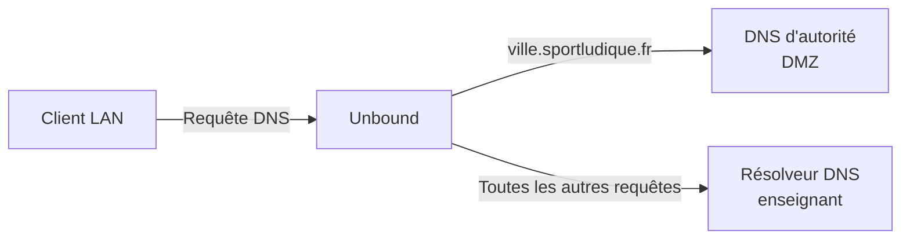

# DNS — Aide à la configuration

Cette page regroupe quelques paramètres utiles lors de la configuration des serveurs DNS du projet.

Elle ne constitue pas une configuration complète à recopier : **adaptez les paramètres au rôle du serveur et à votre architecture**.

---

## Bind9

Le fichier :

```text
/etc/bind/named.conf.options
```

contient les options générales de BIND.

### Exemple de base

```conf
options {
    directory "/var/cache/bind";

    listen-on { any; };
    listen-on-v6 { none; };

    dnssec-validation no;
};
```

### Écoute IPv4 et IPv6

Pour écouter sur les interfaces IPv4 :

```conf
listen-on { any; };
```

Dans notre infrastructure pédagogique, nous travaillons uniquement en IPv4. Il est donc possible de désactiver l'écoute IPv6 :

```conf
listen-on-v6 { none; };
```

!!! warning "IPv6"
    BIND peut écouter également en IPv6.

    Si votre serveur n'utilise pas IPv6, vérifiez ce paramètre lors du diagnostic : une écoute ou une configuration IPv6 non souhaitée peut rendre les tests plus difficiles à interpréter.

---

### Validation DNSSEC

BIND peut effectuer la validation DNSSEC lorsqu'il joue le rôle de résolveur.

Dans l'infrastructure pédagogique, `sportludique.fr` n'appartient pas au DNS public et ne dispose pas d'une chaîne de confiance DNSSEC publique.

Pour les configurations où cette validation pose problème :

```conf
dnssec-validation no;
```

!!! warning "Ce n'est pas une bonne pratique générale"
    Nous désactivons ici la validation DNSSEC en raison des particularités de **notre infrastructure DNS simulée**.

    Sur un résolveur DNS utilisé en production pour résoudre Internet, désactiver DNSSEC n'est pas une recommandation générale.

---

### Récursion

Sur un **résolveur**, la récursion peut être activée :

```conf
recursion yes;
```

et limitée aux réseaux autorisés :

```conf
allow-query {
    127.0.0.1;
    172.16.0.0/16;
};
```

!!! danger "Pas de résolveur ouvert"
    Un résolveur récursif ne doit pas accepter les requêtes de n'importe quelle machine sur Internet.

---

### Serveur d'autorité

Un serveur exclusivement destiné à faire autorité sur des zones n'a pas vocation à devenir un résolveur récursif ouvert.

Vous pouvez notamment utiliser :

```conf
recursion no;
```

Le rôle du serveur doit donc déterminer sa configuration :

| Rôle | Récursion |
|---|---|
| Résolveur interne | Oui, pour les clients autorisés |
| DNS d'autorité | Non |
| DNS d'autorité exposé en DMZ | Non |


## Unbound

Unbound est utilisé comme **résolveur DNS interne**.

La configuration peut être répartie dans plusieurs fichiers du répertoire :

```text
/etc/unbound/unbound.conf.d/
```

### Configuration générale

Exemple :

```conf
server:
    val-permissive-mode: yes

    hide-version: yes
    hide-identity: yes

    do-ip4: yes
    do-ip6: no

    verbosity: 1
```

!!! info "Quelques paramètres utiles"
    - `val-permissive-mode: yes` : une erreur de validation DNSSEC ne bloque pas la réponse ;
    - `hide-version: yes` : ne communique pas la version d'Unbound ;
    - `hide-identity: yes` : ne communique pas l'identité du serveur ;
    - `do-ip4: yes` : utilise IPv4 ;
    - `do-ip6: no` : désactive IPv6 ;
    - `verbosity: 1` : conserve un niveau de journalisation faible.

!!! warning "DNSSEC"
    `val-permissive-mode: yes` **ne désactive pas DNSSEC**.

    Unbound peut toujours effectuer la validation, mais une erreur de validation ne provoque pas le rejet de la réponse.

    Ce comportement est utilisé ici pour faciliter le fonctionnement de notre **infrastructure DNS pédagogique simulée**.

---

### Interfaces et clients autorisés

Unbound ne doit pas nécessairement écouter sur toutes les interfaces.

Exemple :

```conf
server:
    interface: IP_RESOLVER_LAN
    interface: 127.0.0.1

    access-control: RESEAU_LAN allow
```

`interface` définit les adresses sur lesquelles Unbound accepte les requêtes.

`access-control` définit les réseaux autorisés à utiliser le résolveur.

!!! danger "Pas de résolveur ouvert"
    N'autorisez pas arbitrairement tous les réseaux à utiliser votre résolveur DNS.

    Les ACL doivent correspondre aux besoins de votre architecture.

---

### Serveur d'autorité d'une zone

Lorsqu'un serveur DNS particulier fait autorité sur une zone, Unbound peut être configuré avec une `stub-zone`.

Exemple :

```conf
stub-zone:
    name: "ville.sportludique.fr."
    stub-addr: IP_DNS_AUTORITE_DMZ
```

Les requêtes concernant cette zone sont alors dirigées vers le serveur DNS d'autorité indiqué.

---

### Redirecteur par défaut

Dans notre architecture, toutes les autres requêtes doivent être transmises au **résolveur DNS de l'enseignant** :

```conf
forward-zone:
    name: "."
    forward-addr: IP_RESOLVER_ENSEIGNANT
```

On obtient donc :



---

### Vérification

Avant de redémarrer Unbound :

```bash
sudo unbound-checkconf
```

Puis :

```bash
sudo systemctl restart unbound
```

Vérifiez enfin :

```bash
systemctl status unbound
```